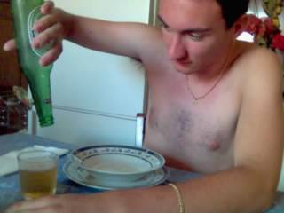

Era un'estate piuttosto calda e la birra era già finita.

Sto assettato fore 'o bar\
con davanti tre Cynar\
tre Sambuche, due Martini\
ventiquattro Gingerini

Ho bevuto tre Negroni\
quattro cascie di Peroni\
'nu cartone 'e vino russo\
due bottiglie di Petrusso

Vedo tutto un po' appannato\
ed il mondo rivoltato\
la bottiglia che si è rotta:\
'o barista a capa sotta

Il liquore sta scorrendo\
e per terra è tutto un lago\
mentre un dubbio mi tormenta:\
— Ma pe' ccaso sto' 'mbriaco? -

Copyright Tony Tammaro inc.\
