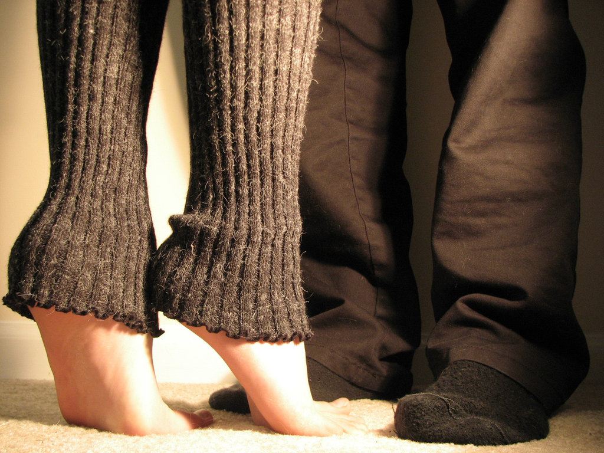

man, i've had a few\
but they wouldn't quite blow me like you\
you gave me your name and signed\
with a halo around my eye\
and it hit me like never before\
that love is a powerful force\
yes, it struck me that love is a sport\
so i pushed you a little bit more\
love, you're news to me\
you're a little bit more than i thought you'd be\
a mole in my well-fed lawn\
you're a nightmare beating the dawn\
oh, it hit me like never before\
that love is a powerful force\
yes, it struck me that love is sport\
so i pushed you a little bit more\
Blue, blue, black and blue\
red blood sticks like glue\
true love is cruel love\
red blood's a power-fuel\
sweet love, tasty blood\
my heart overfloods

<iframe src="http://www.youtube.com/embed/A0as2GKhmuA" loading="lazy" allowfullscreen></iframe>

oh you hit me!\
yeah, you hit me really hard\
man, you hit me!\
yeah you hit me right in the heart\
lord, i've had my deal\
but i never quite knew how it feels\
when love makes you wake up sore\
with fists that are ready for more\
and it hit me that love is a game\
like in war no one can be blamed\
yes, it struck me that love is a sport\
so i pushed you a little bit more\
oh, blue, blue, black and blue\
red blood sticks like glue\
true love is cruel love\
red blood's a power fuel\
sweet love tasted blood\
my heart overfloods

man, you hit me!\
yeah you hit me really hard\
baby, you hit me!\
yeah you punched me right in the heart\
and then you kissed me...\
and then you hit me...\
oh, you haunt me with your violent heartbeat at night\
oh, you strike me with your silence baby, tonight\
why you haunt me with your violence baby, come hit me!\
you haunt me with your violent heartbeat...\
(Cardigans)
