Che viaggetto ragazzi! Dal 26 al 31 dicembre - spese folli ma n'è valsa la pena!\
Siamo arrivati nel pomeriggio, e senza sapè ne legge ne scrive ci siamo visitati per benino il parco Guell.\

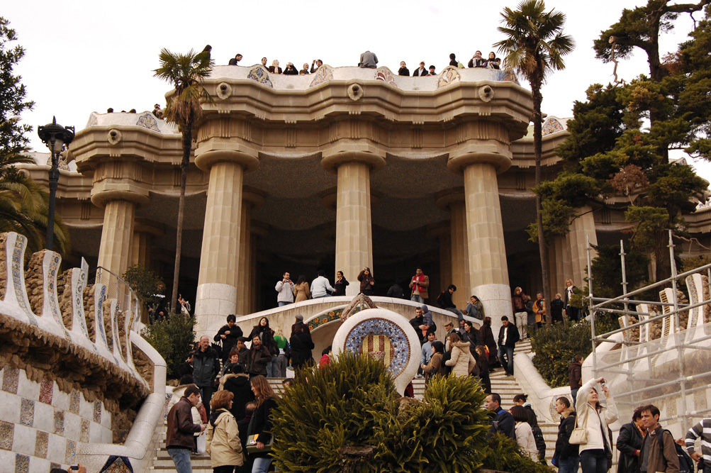

Siamo ridiscesi a piedi fino all'albergo. Ero già esausto... ma no! Direttamente alla Rambla. Passeggiata. Camminare camminare camminare. Peccato che i chioschi degli animali e dei fiori erano tutti chiusi. Infine si giunge al mare, presso il monumento di Colombo.\

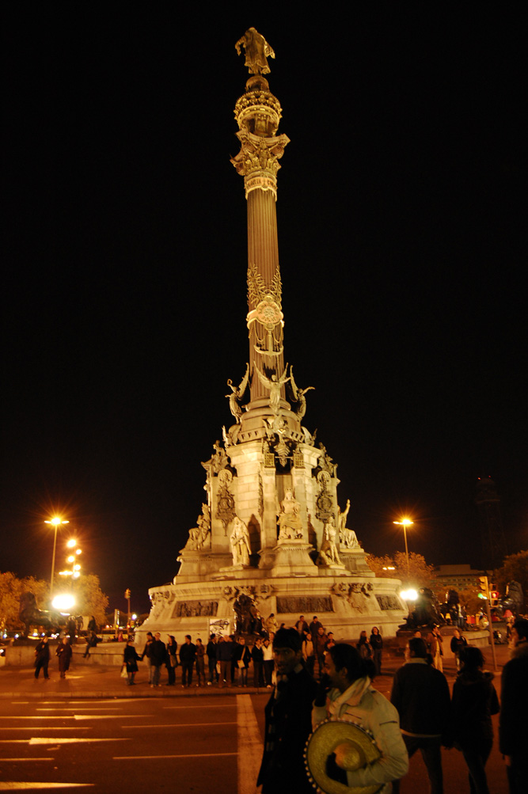

In questa città c'è praticamente un'ora di fuso orario. I ritmi di vita sono tutti spostati in avanti. Ecco a voi un clamoroso tramonto in ritardo.\

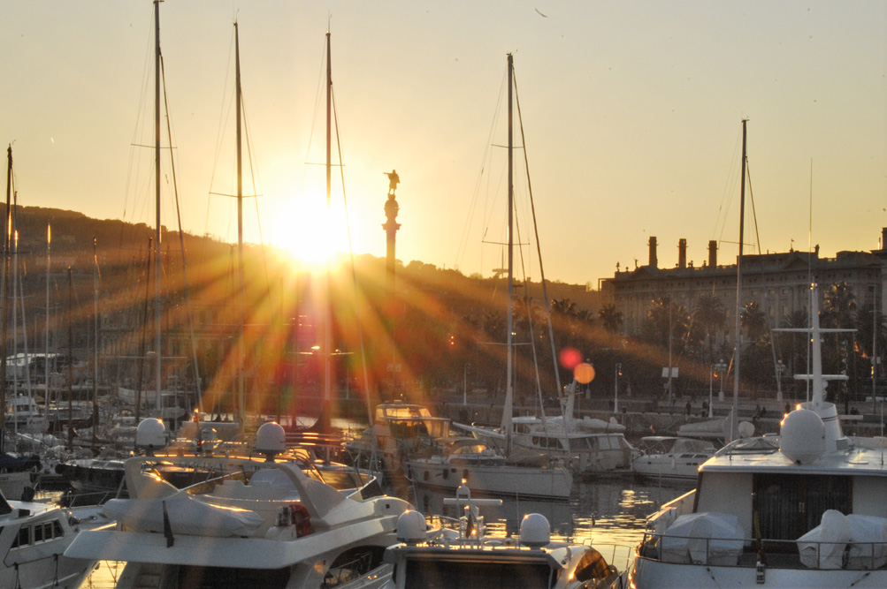

Sono ripetutamente andato in sollucchero. Architettura in dosi massicce. Che goduria.

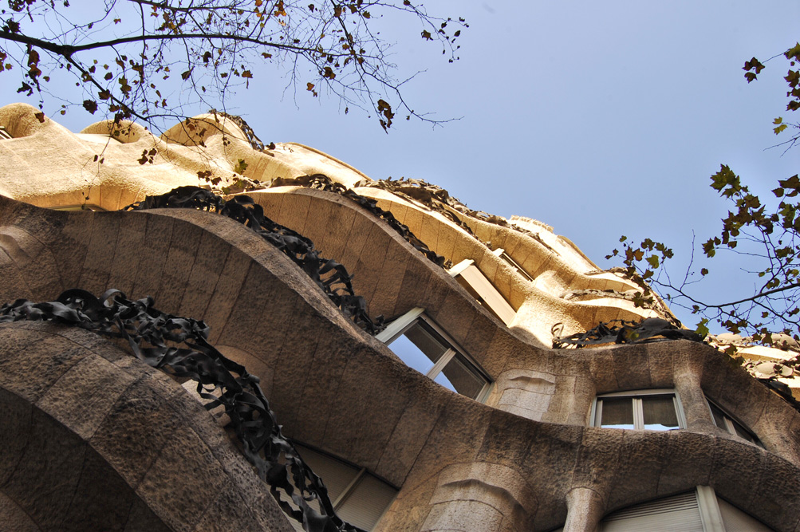

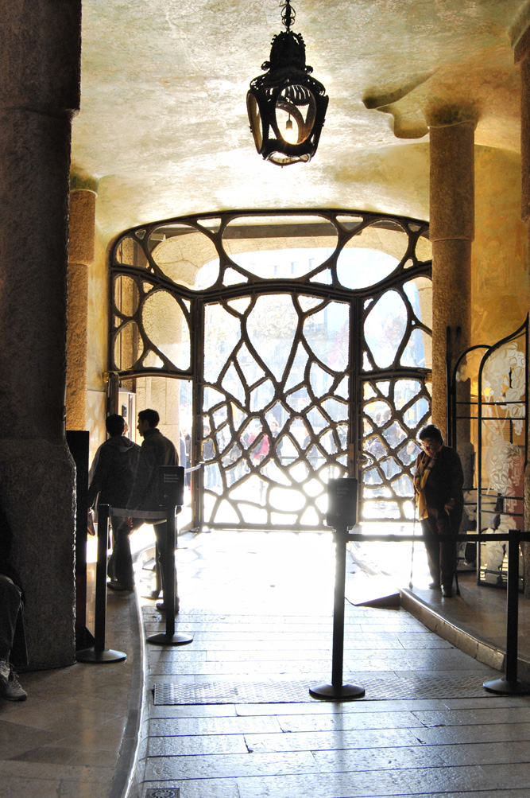

Casa Milà.

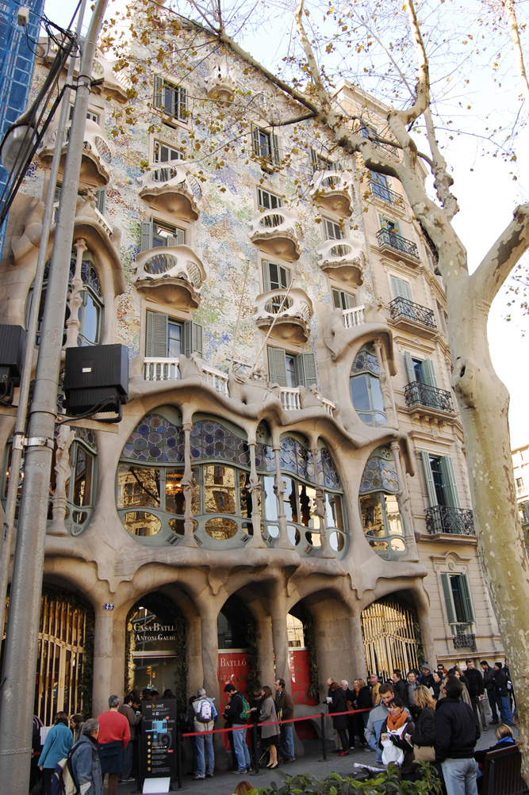

Casa Batllò. (Non credevo ai miei occhi)

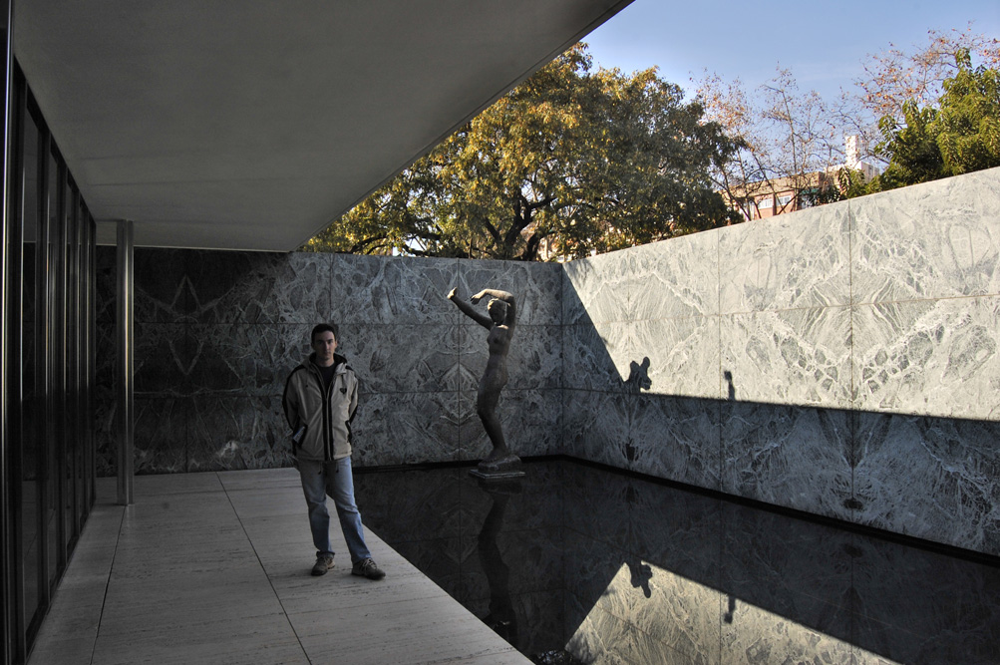

Sì, è proprio il padiglione di Mies Van Der Rohe!

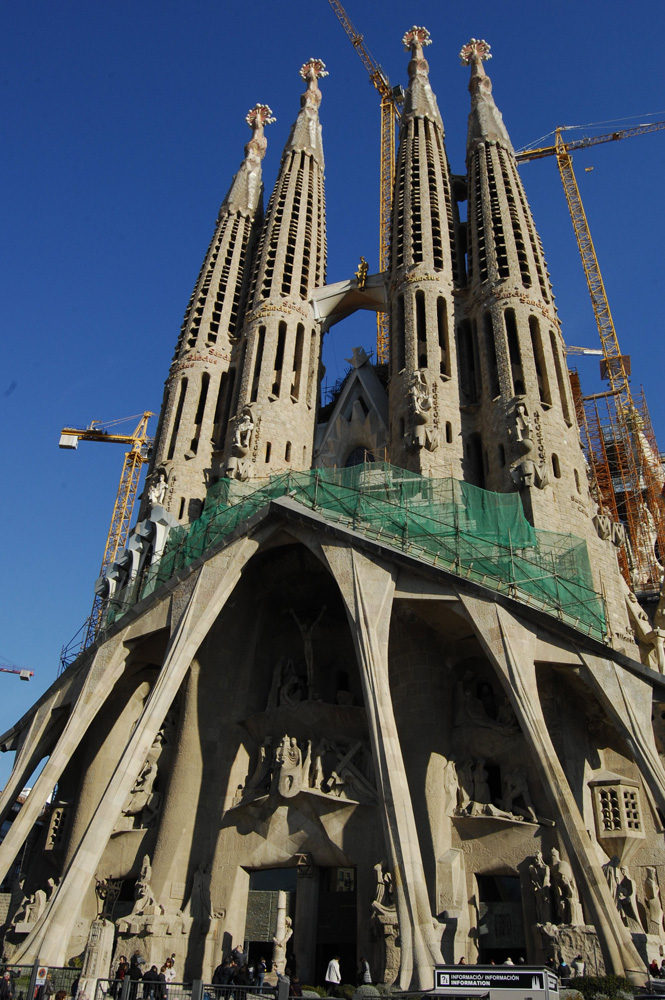

Non poteva mancare la Sagrada Familia. Una volta visitata e vissuta dall'interno la bellezza è risultata quasi eccessiva!\

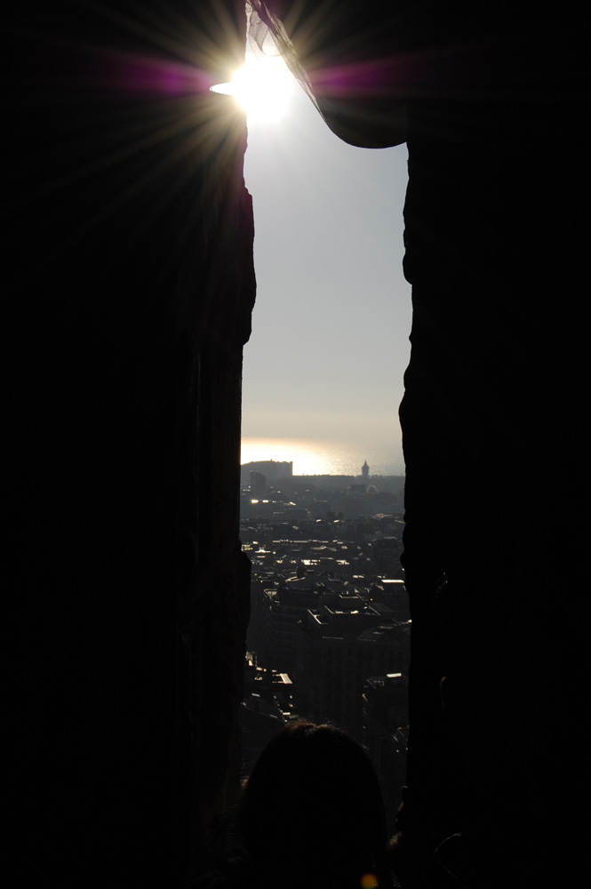

Da una delle torri.

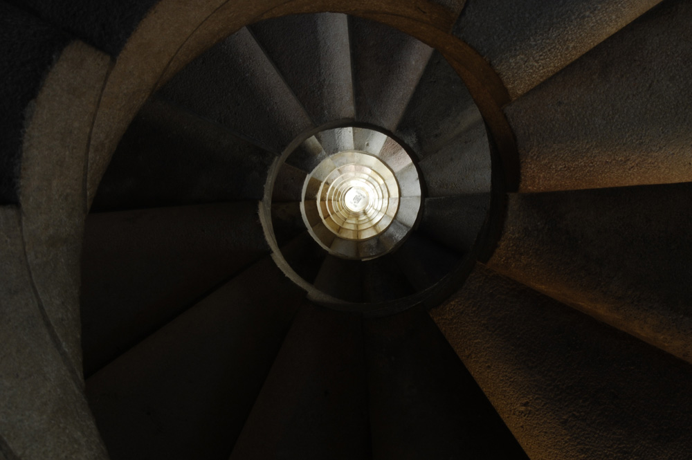

El Nautilus. Senza parole.

Ma parliamo delle gente.\

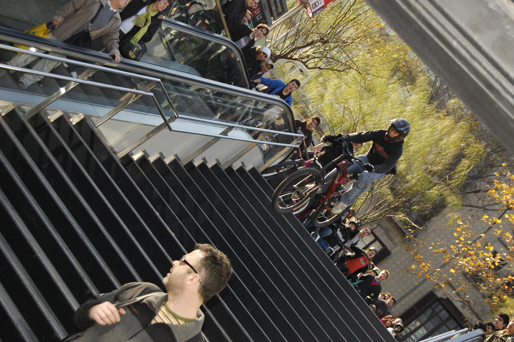

Questi per esempio fanno acrobazie nella metro. Sicuramente quel ragazzo ha più chances di me nel prendere il treno quando fa tardi.

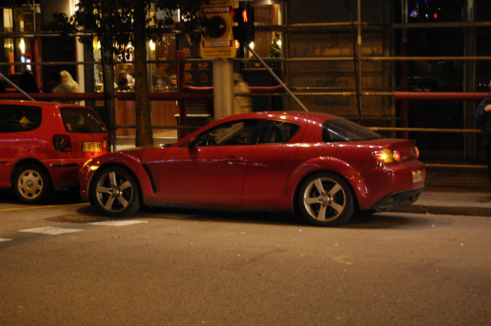

...e chi apprezza le buone automobili.

Ma soprattutto, parliamo dei nostri cari hermanitos:

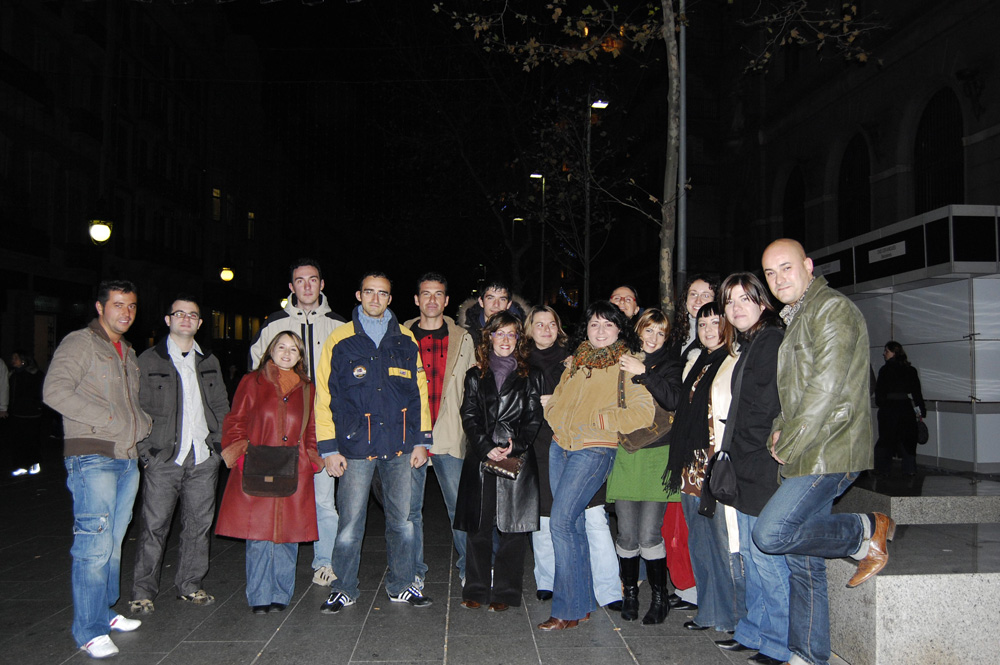

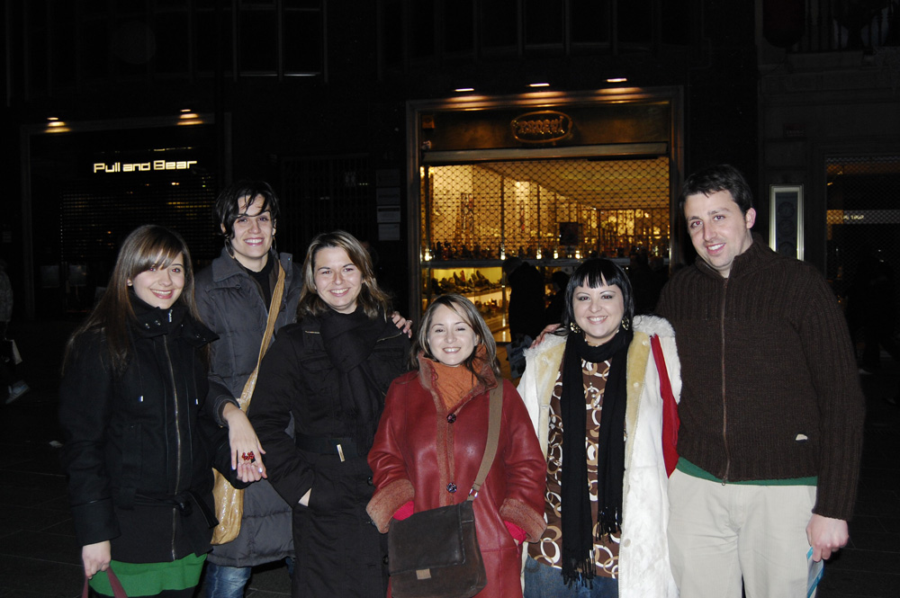

Voi più di tutto il resto avete reso questo viaggio indimenticabile. Siete fantastici! Grazie di cuore! Rivediamoci presto!!!!

Infine, per il concorso "Foto del mese" presentiamo l'immagine vincitrice all'unanimità, scelta come simbolo di questo viaggio:\

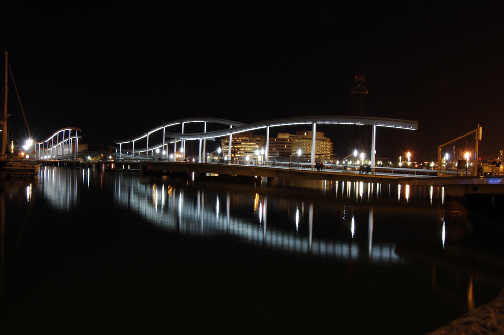
