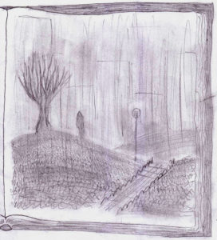

Non c’era dubbio, finora era stata una pessima giornata.

Non solo aveva litigato con l’amico.

Non solo aveva perso ogni tipo di mezzo di trasporto fra casa e università.

Non solo se la stava facendo a piedi dalla stazione fino a casa, ma stava pure per mettersi a piovere.

Volgendo i suoi occhi scuri al cielo sopra di sé, Chris allungò istintivamente il passo. Si andava preparando un temporale coi fiocchi. Tutte le nuvole del mondo pareva si stessero radunando proprio sulla sua testa, ingoiando man mano tutta la luce e imprimendo cupe vibrazioni all’atmosfera e alla terra.

Improvvisamente un lampo cadde in un tratto di terreno non troppo distante. Chris sussultò e poi rimase quasi stordito dalla potenza del tuono. Dopo qualche istante in cui era rimasto senza fiato inspirò e avvertì il forte odore di ozono dovuto alla scarica elettrica che aveva modificato la struttura molecolare dell’ossigeno.

Nello stesso momento in cui si rendeva conto che se voleva tornare a casa asciutto doveva accelerare il passo, e di molto, realizzò anche che qualunque sforzo sarebbe stato ormai vano. Già alcune gocce si schiantavano a terra intorno a lui con gravità inusuale. Ma non erano che le prime…

In pochi istanti si trovò zuppo fradicio. Talmente pioveva a dirotto che la visibilità era ridotta a poco più che zero. L’impatto delle gocce era quasi doloroso, soffocante. Chris pregò silenziosamente che qualche macchina non sopraggiungesse all’improvviso investendolo. Per sicurezza prese a camminare nella banchina al lato della strada, immergendo completamente i piedi fino alle caviglie nell’acqua fangosa, dato che in pochi minuti si era già riempita di un frettoloso flusso di pioggia che defluiva dalle strade.

Quasi non oltrepassò il viale d’accesso di casa quando si accorse che ce l’aveva quasi fatta. Si confortò al pensiero del riparo caldo e accogliente che l’attendeva fra le mura domestiche.

Il vento ululava al di sotto del frastuono incessante della pioggia sull’asfalto. Fu quindi senza troppa convinzione che udì sussurrare il suo nome, un suono poco al di sotto della soglia uditiva media che sembrava giungere proprio da dietro le sue spalle, e al tempo stesso venir da lontano.

Ci ripensò un po’, quando lo udì di nuovo. Sembrava la voce stessa del vento e dell’acqua, non c’era niente a cui attribuire la provenienza di quel suono. Chris si voltò intorno ma con quel tempo era già difficile capire dove si stesse mettendo i piedi.

Al margine del suo campo visivo scorse un movimento. O credette di vederlo. Si voltò in quella direzione. Scorgeva il vecchio albero in cima alla collina, ma tutto sembrava immobile. Eppure…

Si incamminò verso la cima della collina, giustificandosi dicendosi che d’altronde era zuppo fino alle ossa e che qualche metro in più non gli avrebbe certo fatto venire un raffreddore peggiore di quello che comunque gli sarebbe sicuramente venuto…

Interruppe il filo dei suoi pensieri quando giunse sulla sommità, vicino al vecchio albero. Mentre il temporale sembrava peggiorare, quasi infuriandosi di fronte alla temerarietà del ragazzo, qualcosa ai margini della coscienza lo avvertì che durante un temporale un albero era di certo un luogo quantomeno da evitare.

Fece per allontanarsi immediatamente, ma vide qualcosa che lo trattenne. C’era qualcosa, anzi qualcuno, poco distante, fermo sotto la pioggia. Sembrava stesse guardando verso di lui, nonostante si distinguessero solo vagamente i contorni della silhouette. Guardando quella misteriosa figura (cosa ci faceva sotto quella pioggia e perché guardava lui?) Chris udì di nuovo il vento dire il suo nome alla pioggia, ma ebbe la certezza che il richiamo provenisse da quella figura. Fece per avvicinarsi, ma dopo un istante quella si voltò e sparì nella pioggia.

“Aspetta” disse Chris mettendosi a correre. Giunse sul crinale della collina. “Fermati!!” urlò mentre si fermava per guardarsi intorno, e accettare che di chiunque si fosse trattato,

o lo aveva sognato, o più probabilmente l’aveva perso. Stava per voltarsi per tornare infine verso casa quando udì un formicolio sulla nuca, come se qualcuno lo stesse guardando alle spalle. Chris fece per voltarsi, ma prima che l’impulso nervoso raggiungesse i muscoli delle gambe, fu investito da un lampo accecante e tramortito da un boato di mille lampadine esplose e che lo attraversò e bruciò come una foglia secca. La sua coscienza schizzò via, sostituita dalle tenebre più profonde.

Non fece in tempo neanche a ripensare a quanto fosse pericoloso stare presso un albero durante un temporale.
