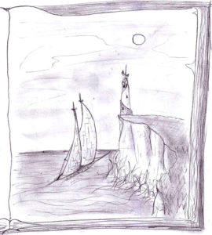

“Dov’è che dobbiamo andare?” chiese Smiurl mentre percorrevano uno dei canyon dei Labirinti meridionali, ormai da diverse ore.

“A dire il vero, non lo so…” rispose Kriss.

“Come ‘non lo so’?” esclamò Smiurl

“Non so il luogo preciso… So solo che dobbiamo andare a sud e attraversare il mare”

“Sai, questo dovrebbe rappresentare un problema” disse Corolla, alzando un dito.

“Ti riferisci al fatto che non abbiamo un mezzo di trasporto?” chiese Kriss.

“A parte quello…” fece Corolla “Il fatto è che non sembra esserci proprio niente al di là del Mare del Sud”

“Conosciamo soltanto questo continente…” disse Theo.

“Beh, non vuol dire che non ce ne siano altri, in tutto il pianeta, no?” disse Ef.

“Non a nostro avviso” disse semplicemente Corolla “Comunque…”

“…pensi che se Kriss sia attratto verso una particolare destinazione sia il caso di andare a verificare…” la anticipò Ef.

“Già” disse Corolla “E’ proprio così. Visto tutto quello che è successo finora, tu faresti lo stesso, vero?”

“Non posso che assentire…” convenne la telepate.

“Ma quanto dovremo camminare?” tornò a chiedere Smiurl.

“Smiurl!” fece Kriss, ironico “Pare che gli agi di Ayonn ti abbiano rammollito!”

“Questa è una stupidaggine bella e buona! Smiurl non si ‘rammollisce’!” esclamò lui risentito, mentre gli altri ridacchiavano. Poi aggiunse:

“Mi chiedevo solo quanto durerà il nostro viaggio.”

“La distanza fra qui e il mare equivale circa alla distanza di Ayonn dalla Rocca. E’ poco più in là di ciò che si vede all’orizzonte…” disse Corolla con tono di chi dà un’informazione di poco peso.

“Come fai a saperlo?” disse Kriss. “La vostra orda arrivava fin laggiù?”

Corolla si oscurò.

“E’ solo un dettaglio…” disse lei tornando a guardare dinanzi a sé.

Kriss non sapeva cosa pensare. Guardò Efeliah. Era concentrata. Sicuramente stava scrutando la mente di Corolla, pensò Kriss. Lei lo guardò e fece un espressione equivalente a una alzata di spalle. Kriss sospirò e tornò a rivolgersi a Corolla.

“C’è qualcosa che non va?” le chiese.

“No, niente” fece lei senza guardarlo. Theo, che procedeva davanti a loro girò un attimo la testa di novanta gradi per guardare con la coda dell’occhio.

Poi tornò ad occuparsi di aprire la strada.

“Avanti, si vede che stai nascondendo qualcosa!” disse Kriss.

“Lasciami stare!” strillò lei con inaspettata violenza. Si fermarono, ammutoliti. Udirono l’eco dell’urlo ripercuotersi diverse volte sulle pareti del canyon.

Lei lo fisso. Aveva gli occhi lucidi, e Kriss si sentì bruciare sotto quell’espressione risentita: gli occhi di Corolla parevano fiammeggiare. Non fece in tempo a scusarsi che lei si allontanò con un moto di stizza, scomparendo al di là delle anse del canyon.

Kriss guardò gli altri. Theo non ricambiò lo sguardo. Guardava a terra. Smiurl sembrava non capire, esattamente come lui. Ef lo guardò contristata.

“Andiamo, fra poche ore farà buio” disse Theo, riprendendo a camminare.

“E Corolla?” fece Kriss.

“Non preoccupartene” gli rispose lui in tono alquanto strano.

Continuarono a camminare, e Kriss ebbe per tutto il tempo la sensazione di essere osservato. Più volte si voltò a destra e sinistra credendo di aver scorto dei movimenti sulle pareti del canyon. Ma trovava solo nuda roccia.

Ormai il giorno era al tramonto. Giunsero in una specie di spiazzo, fra più gole.

“Ci accampiamo qui” disse Theo. Da quando Corolla li aveva lasciati, erano rimasti molto silenziosi. La sua assenza gravava sul loro morale.

Si fermarono presso un focolare di pietre rotonde. Doveva essere stato lasciato lì dall’ultimo che avesse percorso quella via prima dell’ascesa al potere da parte di Joe il tiranno.

Montarono le tende e poi alla luce del crepuscolo accesero il fuoco. Trovarono dei pezzi di legno lì intorno. Comunque ne avrebbero potuto fare a meno. Theo aveva preso, ad Ayonn, delle specie di tubi che potevano essere accesi sfregandoli come fiammiferi, che bruciavano lentamente, come delle torce. Solo che duravano molto di più. E non avevano bisogno di accendini.

Cucinarono un po’ di carne che avevano portato dalla città. Finito il pasto, sedettero in silenzio. Nessuno se la sentiva di parlare. Né di andare a dormire.

Alla fine, contro ogni aspettativa, fu Theo a parlare.

“E’ ora di raccontarti la nostra storia”

“Nacqui nella città di Øder, solitaria e superba sui monti omonimi. Anche Corolla è di quella città. Ma fra me e lei c’è una grande differenza. Io sono figlio di operai, montanari da generazioni. La mia gente non conosceva altro che duro lavoro, ma erano nati per questo. Amavano le montagne più di ogni altra cosa.

“Conducevamo vite solitarie, curando gli ettari di terra a noi assegnati.

Lei invece, è una nobile, l’ultima di Øder. Primogenita fra i figli del nostro Re, è di diritto l’erede al trono. I suoi geni hanno ereditato molte qualità che da secoli perduravano nella famiglia regale. Anche loro erano nati per questo.

“Era amata dal popolo. Intelligente e bella, aveva numerosi pretendenti. Naturalmente non ne sceglieva nessuno. Non c’erano altri nobili suoi pari. Sarebbe stata la Regina di Øder, probabilmente il sovrano migliore che la nostra città avesse mai avuto.

Ma tutto questo non sarebbe accaduto.

“Øder non aveva mai conosciuto la guerra. Alta e sola, era evitata dalle orde che sempre più irrefrenabili appestavano le colonie di Noi-Hert.

“Fu così che fummo colti di sorpresa: l’orda ci attaccò senza preavviso. Fu un bagno di sangue. Erano molto numerosi, ma alla fine della battaglia erano ridotti a poche decine di uomini. Io fui preso prigioniero, per le mie doti fisiche. Ne uccisi due dozzine, prima di farmi prendere. Volevano persuadermi a passare dalla loro. Sarei morto, piuttosto che accettare. Ma qualcosa mi fece cambiare idea.”

“Ci barricammo nel palazzo reale, io e la servitù, praticamente gli unici sopravvissuti” era la voce di Corolla. Si era avvicinata silenziosamente mentre Theo parlava.

“Nel palazzo c’era la maggior parte dei tesori di Øder. L’obiettivo dell’orda era quello. Ridotti a meno della metà, non potevano assediare il palazzo. Proposi uno scambio. La libertà della servitù e dei prigionieri per il tesoro reale. Accettarono. Solo dopo aver perso altri dieci uomini, però. Ebbero infatti l’impudenza di scalare il palazzo per schiacciare altri uomini e donne indifesi. Ma non avevano considerato me. Tutti la progenie reale viene addestrata nel corpo oltre che nella mente. Quei rozzi barbari non potevano competere con me.

“Liberarono la servitù.

“Di Øder non rimaneva nulla: alte fiamme salivano al cielo e illuminavano di bagliori spettrali le montagne circostanti, come un’enorme ferita. Mio padre era stato fa i primi a cadere in battaglia.

“Non avevo più una casa. Figuriamoci il trono. Mi guardai intorno, e vidi che il capo dell’orda mi stava alle spalle, e mi osservava ridacchiando. Descrisse senza alcuna pietà la situazione in cui mi trovavo, e mi propose di unirmi a loro. Non avevo in effetti altra scelta.

“Dove sarei potuta andare? Non avrei potuto disperdermi

insieme a quel manipolo di camerieri, maggiordomi e inservienti. Vidi Theo, quindi decisi di accettare la proposta, giurando in fondo al cuore che l’avrei fatta pagare cara all’orda, al suo capo.

“Nel corso degli anni partecipammo a innumerevoli battaglie, assalti e quant’altro, ma l’occasione tanto agognata non si presentò mai. Eravamo intrappolati in quella feccia, senza via d’uscita se non la morte, quando sei sbucato tu dal nulla.”

Fece una pausa. Kriss la guardò. Poi disse:

“E’ per questo che mi avete aiutato?”

“No. Ti abbiamo aiutato perché era giusto farlo.” Disse Theo.

“Infatti l’orda è andata incontro al suo destino, indipendentemente da te. L’hanno pagata, tutti quelli che erano rimasti, e soprattutto il capo. Ricordi: non era molto sorpreso di vederci, in punto di morte. Avrà pensato che avessimo organizzato noi l’imboscata” disse Corolla “E il simbolo più grande della sua sconfitta è proprio la spada che ora è divenuta tua”

Kriss spostò lo sguardo sulla spada, piantata a terra a poca distanza da loro. Tornò a guardare Corolla. Lei disse, tenendo lo sguardo fisso sul fuoco:

“Quando ero bambina, ogni pomeriggio andavo nello studio di mio padre. Lui mi prendeva sulle ginocchia, e mi faceva giocare con le sue cose.” Emise un lungo sospiro “Ricordo che la cosa che preferivo di più: era un vecchio mappamondo di Noi-Hert. Mi divertivo a scegliere un posto a caso sul quale mio padre doveva inventare favole, improvvisandole…” le cadde la voce.

Kriss aveva rievocato tutto questo dal passato.

“Ti prego di scusarmi” disse.

“Non potevi saperlo” disse lei, cercando di sorridere.

Kriss guardò Ef. Stava piangendo.

La mattina seguente uscirono dai Labirinti. Davanti a loro si schiuse una vasta pianura che digradava lentamente fino ad incontrare il mare, in lontananza. Per la prima volta Kriss poté ammirare un paesaggio non prevalentemente brullo: grandi prati giacevano davanti a loro a perdita d’occhio, e più lontano si intravedeva anche qualche albero.

D’impulso, si mise a correre. E così corse, nel sole, contro l’impeto del vento che saliva verso di loro, senza pensare a nulla. Si fermò in cima a una collinetta. Alzò le braccia, come fossero ali. C’erano solo il tepore dei raggi e la voce del vento. Si sentì tutt’uno con loro, come fosse parte del pianeta.

Avvertì lo sguardo degli altri sulla sua schiena, e la presenza mentale di Ef, ma c’era qualcos’altro. Un senso di disagio appena percettibile, un attimo più in là del limite delle sue percezioni.

Si spezzò l’incanto, e tornò ad essere il Kriss sul prato insieme agli altri. Guardò Ef, che sul volto aveva ancora un’espressione perplessa.

“Non capisco proprio cosa generi il tuo turbamento” disse mentre riprendevano la marcia.

“Se è per quello neanch’io…” fece lui.

“Devo arrendermi all’evidenza: solo attendendo potremo –forse– avere delle risposte” riprese lei.

“Credo che abbia a che fare con il richiamo…” disse Kriss, lo sguardo perso nel vuoto.

“Quello che ti ha condotto finora?” chiese Corolla.

“Sì. Ora ci sta portando a sud, e non ho la più pallida idea del motivo” disse Kriss.

“Sempre che lì ci sia qualcosa…” intervenne Smiurl.

“Deve esserci.” Disse Kriss, guardando fisso l’orizzonte. “Deve.”

Procedendo più in fretta del previsto, poco prima del tramonto arrivarono ad accamparsi presso un boschetto di alberi, simili a conifere terrestri, in prossimità della costa.

Un paio di chilometri più a sud avevano avvistato una città, in una baia, ma non avevano potuto raggiungerla prima del calare del sole. Sembrava essere abbandonata a sé stessa, ma c’erano diverse navi all’ancora in buone condizioni, e questo lasciava supporre che dopo tutto doveva esserci ancora qualcuno a mantenerle in quello stato.

Trascorsa una notte piuttosto inquieta, venne l’alba.

Si ritrovarono intorno al fuoco acceso da Theo per cucinare la colazione.

“Ho un brutto presentimento” disse Smiurl lamentandosi. “Stanotte ho fatto sogni per niente belli…”

“Non ti preoccupare, quelli li abbiamo fatti anche noi. Si tratta di tensioni mentali che accumuliamo e che trovano sfogo nei momenti più a loro ‘congeniali’… In realtà non dovrebbe esserci alcun pericolo” disse Ef, indicando poi con un cenno del capo la città poco distante.

Quella cupa presenza li aveva influenzati tutti. Non aveva nessun effetto particolare, sulla mente, come ne aveva lo scudo di Ayonn, ma osservandola sembrava di percepirvi qualcosa di malvagio, di innaturale. Era una vista quantomeno spiacevole.

“Hai detto bene: dovrebbe” fece Theo.

“Faremo meglio a stare in guardia. Non sappiamo cosa ci aspetta” aggiunse Corolla.

“Ora andiamo” disse Kriss alzandosi, dopo aver terminato di mangiare.

Dopo un’ora circa giunsero dinanzi alla strada principale che tagliava in due la cittadina.

Case di legno marcio giacevano come relitti di epoche passate, con le finestre inchiodate. Un vago puzzo acre si insinuava nelle narici rendendo il posto repellente.

“Non vorrete davvero entrare in questo posto?” esclamò Smiurl incredulo.

Nessuno si degnò di rispondergli. Solo Ef gli lanciò uno sguardo di incoraggiamento.

Kriss procedeva in testa, e in fila indiana percorrevano la strada. Il panorama continuava ad essere monotono e deprimente: non c’era un edificio che stesse ancora del tutto in piedi, e la rovina sembrava essersi insinuata in ogni angolo, con l’aiuto del tempo.

Niente s’azzardava a rompere il silenzio, opprimente. Solo i loro passi riuscivano a smuovere un poco quell’aria. Dopo un po’ Kriss si chiese come mai non ci fossero neanche le strida dei gabbiani.

Proseguendo verso il mare il senso di disagio non accennava a scemare. Anzi, Kriss aveva come la sensazione (alquanto spiacevole) di essere osservato. Girò intorno lo sguardo, strizzando gli occhi sotto il sole abbagliante. Nulla osò muoversi.

Mentre guardava a sinistra in una specie di bar scorse (o credette di scorgere) un movimento con la coda dell’occhio. Scrutò il fondo della strada, ma sembrava di nuovo tutto fermo. Si diressero lì.

Sulla destra c’era un edificio alto tre piani, in legno, finora l’unico che serbasse una vaga forma di decoro fra i rottami che popolavano quella calda e assolata baia.

Era costruito con legni diversi, con tavole disposte più o meno a casaccio. Un timone pendeva come un arto amputato sopra l’ingresso: sembrava essere il Frankestein edilizio di un marinaio pazzo che avesse squartato una mezza dozzina di navi armato di una sola ascia…

La porta era socchiusa, e dall’interno provenivano, a tratti, dei bagliori, come se vi fossero uno o più fuochi accesi. Si accostarono all’ingresso, sotto un porticato sghembo. Un fetido odore di pesce proveniva dall’interno.

Facendosi coraggio, Kriss afferrò la maniglia ed entrò, seguito subito dagli altri.

La porta dava su un locale quadrangolare. Lungo il perimetro c’era una specie di porticato, entro il quale regnava l’oscurità. Dal centro dell’alto soffitto pendeva un lampadario forse d’osso con decine e decine di candele accese, che comunque poco potevano contro quello stanzone di fitte ombre. Della luce filtrava anche da un lucernario, obliqua, andando a sparire dentro il porticato del secondo piano.

Davanti a loro c’era una specie di bancone da bar rialzato. Avanzarono guardinghi fra le ombre, cercando di non inciampare nelle corde che serpeggiavano ai loro piedi e nelle sedie rovesciate a terra.

Con tremendo e sadico scricchiolio la porta si chiuse alle loro spalle, contribuendo in un certo qual modo all’oscuramento del locale.

Istintivamente Kriss mise mano all’impugnatura della spada. Solo Ef rimase apparentemente tranquilla. Ad un certo punto disse:

“Non siamo soli”

La sua voce fu coperta da un coro di urla e imprecazioni. Innumerevoli piccole torce riempirono i portici di ogni piano, ammassandosi in quegli angusti spazi.

Poi, dal nulla, iniziarono a sciamare anche intorno a loro. Nel tenue bagliore che ora si era diffuso poterono scorgerne i possessori. Erano tutti minuscoli uomini, poco più grossi di Smiurl. Erano tutti vecchi: facce raggrinzite, occhi vacui, crani pelati screpolati dal sole, schiene che si incurvavano, contorte… E tutti avevano una perfida espressione dipinta sul volto: piena di disprezzo, odio e sdegno verso di loro.

Kriss continuava a stringere convulsamente l’elsa della spada quando uno di quei nani, forse il più vecchio, o il più cattivo, o il più brutto, o tutte e tre le cose insieme salì dietro al bancone seguito poi da altri cinque che si fermarono alle sue spalle.

Li osservò con occhi maligni, due spilli di ghiaccio giallastro che ardevano di cupa, scarlatta follia nelle loro profondità.

Infine parlò, e disse con voce terribile: “ ’Oukurtzen los’ ”

“Eh?” fece Kriss, incerto se avere timore o orrore di quel rifiuto umano.

“E’ una lingua che tu non puoi comprendere” disse Ef nella sua mente “Neanche Corolla, Theo e Smiurl la conoscono. Io però percepisco i suoi pensieri, e vi assicuro che non sarà eccessivamente gentile…”

Il nano aveva ripreso a blaterare dall’alto. Un’altra frase incomprensibile.

“Voi maledetti” udirono la voce piatta di Ef nelle loro menti “Avete… profanato… violato… il territorio di ‘Edzzen’. Emissari del ‘degno-di-atroci-sofferenze-e-morte’, o spie nemiche, o… ambasciatori di re lontani… lo stesso siete destinati a perire…”

Kriss spalancò gli occhi.

“Questi sono pazzi!” esclamò.

“Cosa te lo fa pensare?” chiese Theo sarcastico.

L’oratore non sembrò gradire particolarmente la loro interruzione, e dopo averli fulminati con uno sguardo dei suoi occhiacci, riprese, più cattivo di prima, interpretato da Ef:

“Morirete! Sì! Morirete oggi stesso! Mangeremo le vostre… lingue e poi vi impiccheremo nella … nave regia… e i pesci faranno sparire le vostre putride membra…”

“Ma si è visto?” disse Kriss.

“Sembra lo schizzo di un cadavere effettuato da un bambino di tre anni…” disse Corolla, sprezzante. Kriss non poté fare a meno di ridacchiare.

“Ridi della tua fine?” disse il mostro prontamente tradotto da Ef, a un livello di ira finora sicuramente mai raggiunto in occasioni precedenti.

“Allora muori ora!” esclamò con un gesto teatrale, alzando una mano al cielo.

Kriss ne aveva abbastanza. Mentre sentiva che stava per perdere il controllo di sé, fu cosciente di un nano che si scagliava appeso a una specie di cima contro di lui, con un coltello seghettato fra i denti che brillava alla luce delle torce. Con un unico movimento, fluido, estrasse fulmineo la spada e roteando su sé stesso la usò a mo’ di mazza contro l’aspirante suo assassino. Questo roteò via, strillando di dolore.

Kriss fissò furibondo, con occhi fiammeggianti, il presunto capo di quel manipolo di nani malefici, con la spada in mano, che nella penombra brillava e baluginava in modo impossibile per un metallo. Mentre ancora il capo dei nani lo osservava ammutolito, Theo prese da dietro la schiena i due magli, facendoli roteare dinanzi a sé, imitato da Corolla e Smiurl.

“Ef! La porta!” gridò Kriss, appena prima che altri nani ricevessero il furioso ordine di farli a pezzi.

Corolla e Smiurl la seguirono per coprirla, mentre Kriss e Theo rimasero a chiudere la ritirata. Attacchi piovevano da tutte le parti, anche dall’alto. Nella lotta Kriss vedeva quei volti, stravolti da sofferenze che col passare degli anni si erano sedimentate in follia e odio verso tutto. Ogni tonfo era un nemico in meno, e le urla coprivano ogni gemito.

Dopo un lunghissimo minuto riuscirono a sfondare la porta, fuggendo poi per la strada deserta. Subito una fiumana di nani si riversò alle loro calcagna. Erano inseguitori maledettamente veloci. Smiurl era in testa a tutti, saltando come un pazzo.

“Ci prenderanno!” esclamò Theo.

“Dobbiamo trovare un nascondiglio” pensò Ef.

Svoltarono fra i vicoli guadagnando qualche istante.

“E se…” fece Kriss.

“Certo!” esclamò Ef “Theo, vieni: le navi” . Il gigante la seguì. Aveva compreso il piano di fuga. Anche Corolla sembrava aver compreso.

“Che sta succedendo?” disse Smiurl, senza riuscire a stare fermo.

“Dobbiamo fare da diversivo! Andiamo!”

“Diversivo? Proprio noi?!” gemette Smiurl un attimo prima di ricominciare a correre dietro a Corolla e Kriss.

“Lassù!” strillò Corolla indicando un promontorio che sorgeva poco distante. Le case iniziavano a diradarsi, man mano che la pendenza del terreno aumentava.

“Ci raggiungeranno!” esclamò Kriss, voltandosi un attimo a guardare la marea di inseguitori.

Abbandonarono gli ultimi edifici alle loro spalle, e subito il fronte dei nani si allargò dietro di loro cercando di accerchiarli continuando a rincorrerli su per la salita. Smiurl, sempre più terrorizzato, sorpassò strillando Kriss e Corolla con un unico balzo.

La roccia si protendeva sul mare, e su la sua punta estrema sorgeva un faro. La sua stabilità era assicurata da massicce travi di acciaio che scendevano oblique dalla parte inferiore dello spuntone di roccia giù fino al fianco della scogliera e sul fondale.

Continuarono a correre in quella direzione.

“Non vorrai…?” esclamò Kriss guardando Corolla che fissava il faro. Con la coda dell’occhio notò una imbarcazione con delle vele immense, luminose, staccarsi dal molo e procedere parallela alla costa verso il promontorio.

“Siamo qui” udì la voce di Ef nella mente. Ancora non capiva come avrebbero potuto mettersi in salvo.

Giunsero finalmente presso l’ingresso del faro mentre i primi nani stavano per gettarsi su di loro. Sbatterono la porta alle loro spalle sbarrandola e cercando di bloccarla ponendo quanti più oggetti possibile davanti ad essa. La stanza era rimasta praticamente vuota, e dall’unica feritoia fortunatamente fornita di inferriata volti maligni sbirciavano all’interno mentre la porta veniva tempestata di colpi.

Una scala costeggiava le mura circolari del faro salendo a spirale fino alla sua sommità. Si precipitarono tutti verso l’alto, non avendo fra l’altro molta altra scelta.

Arrivarono presso la lampada che ora era spenta e immobile, sulla cima del faro. Si guardarono intorno freneticamente, cercando una via d’uscita, ma le pareti di vetro non offrivano speranza alcuna.

All’improvviso videro Smiurl spiccare un salto e sparire in un botola sul soffitto. Subito udirono la sua voce:

“Da questa parte!”

Corolla fece un cenno a Kriss:

“Prima tu” e gli offrì un appoggio incrociando le mani sotto il suo piede. Quindi bloccò alla meglio la botola con uno stiletto e con un agile balzo afferrò la mano che Kriss le stava tendendo e fu sul tetto del faro. L’improvviso impatto del vento la fece vacillare, ma si sostenne afferrando la ringhiera come già avevano fatto gli altri.

“E adesso? Cosa facciamo?” strillò Kriss per farsi sentire sopra l’urlo del vento.

“Non l…” Corolla non poté terminare la frase: un forte schianto venne dal pianterreno e sporgendosi videro che i nani erano riusciti a sfondare la porta e stavano facendosi strada all’interno.

“Presto!” strillò Smiurl, terrorizzato, saltellando da un piede all’altro.

“Sotto di voi, sul mare” udirono Ef nelle loro menti. Si sporsero dalla parte opposta, verso il precipizio e videro l’imbarcazione che Kriss aveva scorto durante la fuga ferma

proprio sotto di loro.

Corolla guardò Kriss, sperando di ottenere da lui la soluzione, che nel frattempo fissava trasognato l’alberatura della nave.

Un altro schianto li riscosse: stavano sfondando anche la botola che dava nel locale della lampada. Corolla accorse sull’apertura del tetto insieme a Smiurl per cercare di respingere il più a lungo possibile gli inseguitori, ora che si trovavano in una posizione di vantaggio… se non si considerava il fatto che erano a molte decine di metri d’altezza e che non avevano via d’uscita.

Kriss nel frattempo continuava a osservare la nave, in parte nascosta dalla roccia, proprio sotto i suoi piedi.

Guardando fisso nel vuoto dinanzi a sé, iniziò a indietreggiare lentamente, fino a portarsi a fianco a Corolla, sull’altro lato del tetto.

Corolla si voltò a guardarlo, mentre lui continuava a fissare il vuoto. Improvvisamente si mosse, con due rapide falcate attraversò il tetto, mise un piede sulla ringhiera e si scaglio nel vuoto.

Corolla rimase allibita: lo vide sparire verso il basso senza mandare un urlo. Si sporse anche lei e vide che cadeva verso la nave, andando poi a scivolare sulla vela più grande disposta a mo’ di scivolo, atterrando poi su una massa di corde, vele ripiegate e qualche materasso.

Si girò verso Smiurl, che non si era accorto di nulla preso com’era a vibrare affondi col suo pugnale attraverso l’apertura per respingere il nemico. Camminò decisa verso di lui, lo afferrò, e il nano non fece in tempo a dire:

“Ma che stai fac…” che si ritrovò scagliato nel vuoto. Il suo urlo si spense solo quando fu afferrato da Kriss sul ponte della nave.

Ora toccava a lei. Si girò per prendere la rincorsa ma si bloccò alla vista di un nano più grande degli altri che era riuscito a issarsi sul tetto. Ora la fissava minaccioso con espressione orrida almeno quanto quella degli altri.

Sfoderò con un ghigno sadico due pugnali dalla vita, e si mise in guardia, pronto a scagliarsi contro di lei.

Corolla fintò verso destra mentre il nano caricava e schivò a sinistra, sfoderando una daga. Il nano emise un ringhio gutturale e la guardò ancora più furente. Si aggiravano guardandosi fissi negli occhi lungo la ringhiera circolare.

Nel frattempo gli altri attendevano spasmodici sul ponte della nave, guardando in alto verso di lei.

D’improvviso il nano caricò. Corolla piroettò su sé stessa, protendendo la daga, ma il suo colpo andò a vuoto. Inoltre uno dei pugnali del nano la colpì di striscio sulla schiena proprio dove era stata ustionata nel municipio di Ayonn. Un urlo di dolore le sfuggi e perse l’equilibrio, andando a cadere addosso alla ringhiera, lasciandosi sfuggire anche la sua arma. Vide, in un attimo, la nave sotto di sé, poi si girò e vide che il nano si stava di nuovo avventando contro di lei. Con un grande sforzo si scansò all’ultimo momento, così che quello andò a sbattere col viso sul metallo della ringhiera.

Corolla colse l’occasione al volo: con le ultime forze prese una breve rincorsa, e sfruttando la schiena del nano come appoggio si precipitò nel vuoto oltre la ringhiera.

Cadde a testa in giù, e l’ultima cosa che vide prima di scivolare sulla vela per andare a sbattere piuttosto malamente sul ponte fu l’espressione del nano ora circondato da molti suoi simili, a metà fra il pazzo e il furioso.

Corolla riprese i sensi mezz’ora dopo. La prima cosa che vide furono i volti ansiosi degli altri, tutti chini sul suo letto.

“Ehi, sto bene…” disse cercando di sorridere.

Vedendola svegliarsi tirarono un sospiro di sollievo.

“Sei stata fantastica! Ef ci ha descritto quello che non potevamo vedere!” disse Kriss.

“Ti ha anche fasciato la ferita… Starai meglio presto…” disse Smiurl.

“Oh, molto del merito è dei medicinali che ho trovato a bordo…” disse Ef “Sono in ottimo stato, e sono sicura che avranno un effetto prodigioso nonostante siano rimasti inutilizzati per anni.”

“Come questa nave” disse Theo. “Non avevo mai visto niente del genere” proseguì “E’ a energia solare: le vele alimentano i motori elettrici! Motori elettrici! Avevamo esempi molto, molto limitati di questa tecnologia a Øder!”

“…e chi sta al timone?...” chiese Corolla.

“Oh, è bastato inserire la rotta nel computer di bordo…” rispose Theo.

“Non affaticarti, Corolla, devi riposarti, così starai subito meglio” disse Smiurl, premuroso, che a quanto pare aveva rivestito il ruolo di infermiere improvvisato sotto la direttiva di Ef.

La nave continuava a seguirli insistentemente, rimanendo comunque lontana a causa della velocità dei motori elettrici alimentati da centinaia di metri quadri di vele solari, che splendevano di riflessi ora azzurro verdastri, ora gialli quando si frapponevano sospinte dal vento fra il sole e l’osservatore. Non avevano niente a che fare con le vele classiche: il loro compito non era infatti quello di raccogliere il vento. Si orientavano automaticamente verso il sole, come dei girasoli.

“Pensi possano raggiungerci?” chiese Kriss, a Theo che stava scrutando il vascello degli inseguitori con un cannocchiale. Ormai si trovavano in mare aperto e la costa a settentrione era scomparsa da un po’.

“No… Non ce la faranno mai alla velocità attuale. Ci stiamo lentamente allontanando da loro, e non credo possano farci nulla…”

Kriss emise un sospiro di sollievo. Non gli piaceva affatto il pensiero di trovarsi di nuovo faccia a faccia con quelle orride creature.

Si avventurò all’interno della nave. Il ponte aveva perlopiù una funzione panoramica, essendo la nave quasi del tutto automatizzata: c’erano numerose panchine e seggiole fissate a terra o alle balaustre per ammirare il paesaggio. A poppa soltanto c’era una cabina con un timone vecchio stile, che poteva, volendo, essere usato per governare. Per il resto era occupata dai computer e da schermi.

Scese sottocoperta, e passò accanto alla cabina dov’era Corolla, che ora sembrava assopita, guardata a vista da Smiurl.

Passò oltre, e sbirciò all’interno delle porte lungo il corridoio. C’erano altre tre cabine, ognuna dotata di servizi. Sembrava una lussuosa nave da crociera, uno yacht per ricconi.

Proseguì, giungendo alla fine del corridoio. Scese la scaletta fissata a una botola nel pavimento e si ritrovò in una specie di sala da pranzo: a poppa c’era la cucina, e presso il centro c’erano alcuni tavoli con le sedie, e il panorama sotto e sopra l’acqua poteva essere ammirato da degli oblò verticali alti dal pavimento fino al soffitto. Kriss vide che l’acqua del mare era straordinariamente cristallina, e affacciandosi all’oblò cercò di penetrare nell’abisso con la vista, ma il fondale doveva essere molto lontano: non si distingueva nulla. Proprio mentre si stava girando, però, vide o credette di vedere un movimento con la coda dell’occhio. Si voltò, ma non c’era nulla.

Vide una bella porta, verso prua, dove terminava la sala da pranzo. Era a due battenti, decorata con fregi dorati. Un battente era socchiuso. Lo scostò ed entrò.

Indietreggiò barcollando, colto dalla vertigine: la nave sembrava non avere fondo e sotto i suoi piedi c’era direttamente il blu profondo del mare. Anche le pareti laterali e la prua erano trasparenti, e si poteva godere di una panoramica eccezionale. Ma l’unica cosa che si poteva apprezzare ora erano i riflessi del sole che filtravano un po’ attraverso la superficie dell’acqua, creando giochi di luce, veli colorati che sembravano tremolare un attimo per poi sparire subito dopo ingoiati dalla turbolenza dell’acqua.

Addossati alla parete dov’era la porta di ingresso c’erano vari schermi: mostravano dati e immagini del fondale e video della fauna marina.

All’angolo estremo di prua c’era Ef, seduta a terra, con le spalle verso Kriss.

Lui le si avvicinò, e vide che aveva gli occhi chiusi. “Chissà cosa sta facendo” pensò e poi fece per andarsene, ma lei improvvisamente disse:

“Rimani”

Lui si bloccò, la guardò un attimo e poi si sedette accanto a lei.

“Sto ascoltando” disse Ef nella sua mente.

“Cosa?”

“Il mare, le sue profondità…” il suo pensiero si perse come un mormorio fra le onde alla luce del tramonto. Riprese:

“Il mare, su Noi-Hert, è molto più popoloso della terraferma. Ci sono pesci di ogni tipo, invertebrati, microrganismi, e mastodontici mammiferi… Ascoltare le loro menti è come udire un coro sconfinato di vibrazioni su ogni tono della scala musicale, dal più piccolo al più grande ognuno partecipa creando infine un unico grande campo di energia mentale, proprio come quello degli umani, ma che si estende al di sotto del livello del mare… Se tu potessi vederlo, sarebbe uno spettacolo superbo.”

“E… non puoi cercare di trasmettermelo?”

“La tua, sebbene sia eccezionale, non è una mente di natura ricettiva come la quasi totalità di quelle che ho potuto osservare su Noi-Hert… A volte hai degli sbalzi energetici e capti immagini esterne, ma non sei fatto per questo. Nel tuo cervello l’energia fluttua in maniera a me incomprensibile: l’unica speranza che hai di capire cosa vi si nasconde e quella di seguire questo richiamo che ti ha sospinto finora…”

“Oh, a me non interessa più di tanto cos’ho in testa. Vorrei solo tornare a casa…”

A quel pensiero un’ondata di malinconia lo pervase, e i suoi occhi divennero lucidi.

Ef gli mise un braccio intorno alle spalle e gli sussurrò a voce bassa nell’orecchio, proiettando sulla sua mente un senso di pace:

“Forse troverai risposta anche a questo. Non sappiamo cosa ci aspetta. Vedrai che tutto andrà per il meglio…”

Ma lei stessa non capiva come potesse dirgli proprio quelle cose quando era ad anni luce di distanza dal suo pianeta e a millenni dal suo tempo. Chiuse gli occhi, e continuò ad abbracciarlo mentre lui scrutava fisso dinanzi a sé le profondità oceaniche di quel misterioso pianeta. capti immagini esterne, ma non sei fatto per questo. ura ricettiva come la quasi totalità di quelle che ho potuto osservare su

“Sembra si stia avvicinando una tempesta” disse Smiurl, pochi metri sopra le loro teste.

“Già… Speriamo bene.” Rispose Theo.

Guardando a dritta si scorgeva, all’orizzonte, una minacciosa, sottile linea grigio bruna dividere l’azzurro del mare da quello del cielo.

L’alba successiva furono svegliati dai marosi che sollevavano e sballottavano incessantemente l’imbarcazione.

“Non riesco a capire come abbiamo potuto essere raggiunti da…” udì la voce di Theo mentre saliva la scaletta per recarsi sul ponte.

Arrivato in coperta, poté verificare a cosa si stava riferendo: il cielo era completamente oscurato da una massiccia coltre di nubi, ininterrotta, da un orizzonte all’altro, tutt’intorno a loro. Sembrava di essere sepolti sotto una titanica coperta di lana grigia.

Scarsa era la luce che riusciva a penetrare quella spessa coltre di nubi. Solo dei lampi, sempre più frequentemente, squarciavano l’oscurità gettando onde spettrali sulla nave e sulla superficie delle acque.

“Hai provato con il computer?...” chiese speranzoso Kriss.

“C’è poco che il computer possa fare: senza luce la carica dei motori presto si esaurirà, e potremmo anche perdere le vele se si alza il vento…” Theo si rabbuiò ancora di più, pronunciando queste parole…

“Quindi… siamo in balia delle onde!” strillò Smiurl che saltellava sempre più agitato da una parte all’altra.

“Cosa sta succedendo?...” era la voce di Corolla che si affacciava in quel momento sul ponte. Si teneva avvolta una coperta intorno al corpo e con l’altra mano si teneva allo stipite per non cadere.

“Non dovresti stare in piedi! Devi riposarti!” la rimproverò Ef.

“E che vuoi riposare, con il letto che sembra un cammello con la diarrea…” rispose lei “Mi sento benissimo, e sono stufa di starmene appartata a far niente!”

“Ma se non sono neanche trascorse ventiquattr’ore dalla nostra fuga!” disse Kriss.

Corolla fece per rispondere, ma non trovava le parole. Alla fine sbottò e disse:

“Ah! Al diavolo!” e sparì di nuovo sottocoperta.

“Portate sotto coperta tutto quello che potrebbe volare via durante la tempesta” disse Theo, e si avviò verso la cabina di pilotaggio.

C’era ben poco sul ponte che non fosse saldamente fissato.

Dopo alcuni minuti si ritirarono nelle loro cabine, mentre le vele solari venivano riposte all’interno degli alberi dal computer azionato da Theo.

La nave era abbandonata agli elementi, e lo scheletro della sua alberatura biancheggiava spettrale quando un lampo saettava da una nuvola all’altra, illuminando la sua lenta e sempre più precipitosa discesa dalle creste delle enormi onde, per ore, finché la nave sparì fra due onde particolarmente grandi, per non risalire mai più.

Udì ancora quella voce, insistente, ansiosa, quasi impaurita, chiamare il suo nome senza pronunciarlo. Poteva quasi vederla, una specie di alone rosa pulsante di luce.

Si rese conto che si stava svegliando.

Improvvisamente gli tornarono alla mente gli ultimi istanti sulla nave: la furia tremenda del mare che sembrava non volesse calmarsi mai più, l’attimo di panico quando l’acqua si era riversata all’interno della nave ormai quasi capovolta, e poi il buio.

Si alzò di scatto, ma nell’oscurità sbatté la testa violentemente contro un corpo metallico. Una fitta lancinante lo raggiunse, e si portò la mano alla fronte imprecando silenziosamente. Si rizzò a sedere lentamente, protendendo le mani sopra di sé.

Portò repentinamente la mano al fianco sinistro, constatando che la spada non c’era più, come anche il pugnale.

Avvertì uno scatto metallico e un ronzio, dopodiché quella che doveva essere la porta scorse di lato, rivelando nel suo vano la sagoma di una figura oscura, e una forte luce proveniente dalle sue spalle.

“Portatelo con gli altri” disse una voce cupa, non umana.

Delle mani lo afferrarono, gli legarono i polsi e lo bendarono, poi presero a trascinarlo in una direzione a lui sconosciuta.

Dopo alcuni minuti di cammino si sentì sbattere a sedere. Qualcuno lo sbendò. Abituati gli occhi alla luce, vide che su altre sedie come la sua c’erano tutti i suoi compagni. Sospirò di sollievo vedendo che non mancava nessuno.

Si trovavano in un vasto salone la cui parete frontale era costituita da un’enorme vetrata da cui si osservava il fondo marino, illuminato. Numerose apparecchiature e strumenti e schermi erano disposti lungo le pareti e in tutto il locale tranne nell’area dove si trovavano le loro “sedie”.

Una figura dava loro le spalle: stava facendo qualcosa, accostata a una scrivania piena di tasti e luci. Indossava un camice bianco. Non poteva essere un uomo: dalla testa gli scendevano delle appendici di cartilagine bluastre dietro la schiena.

Comunque ogni dubbio si dissipò quando si voltò: anche il volto era dello stesso colore blu scuro, verdastro. Non aveva un solo pelo sul volto, e non aveva né naso ne orecchie: solo dei fori in loro corrispondenza. Gli occhi erano sproporzionatamente grandi, e la bocca non aveva labbra. Aveva poi le dita dei piedi e delle mani palmate.

Osservandoli bene fece una strana espressione, che Kriss non comprese. La voce di Ef risuonò nelle loro menti:

“Ci trova disgustosi, repellenti…”

“E’ bello lui…” pensò Kriss.

“Penso che potrete tornarci utili…” disse lo sconosciuto con la sua voce gutturale e biascicata, dopodiché fece un cenno e comparvero altri suoi simili che li presero di peso e li trascinarono via. Per Theo ne occorsero due, nonostante fossero tutti più alti di loro e dotati di una forza straordinaria: uno aveva afferrato Kriss come un pupazzo di legno.

La voce di Ef suonò stavolta allarmata:

“Sembra vogliano fare degli esperimenti su di noi… Quello deve essere il loro capo, o uno studioso…”

Udirono alle loro spalle la voce di prima.

“Prima la femmina, la più chiara. Alla sonda psi”

Kriss vide che portavano Ef in un’altra stanza. Poco dopo loro furono gettati in una cella metallica, e subito la porta si chiuse alle loro spalle.

Appena ripreso l’equilibrio Kriss si gettò sulla porta prendendola a calci e pugni, strillando:

“Ef! Efeliah! Dobbiamo salvarla!”

Si fermò quando udì la voce di Ef:

“Vogliono sondare la mia mente, vi hanno riconosciuto delle facoltà non comuni. E’ uno strumento piuttosto rozzo, direi, potrebbe danneggiarmi… Non so quanto potrò resistere… E appena finito con me inizieranno con voi…”

“Dobbiamo uscire di qui!” disse Kriss.

“Non possiamo lasciare Ef nelle mani di questi uomini-pesce…” disse Corolla.

“I mutanti marini…” disse Smiurl, assorto.

“Cosa?” fece Kriss.

Smiurl non rispose subito. Dopo qualche istante prese a dire:

“Mio nonno mi raccontava la storia del nostro popolo, quando ero un bambino… C’è un particolare che mi è tornato alla mente proprio ora: diceva che la nostra razza era stata generata dai terrestri tramite manipolazione del genoma di uomini normali. Ma insieme alla nostra ne sarebbero state create anche altre: una di queste era quella dei misteriosi mutanti marini, che noi credevamo essere una leggenda…”

Corolla l’interruppe:

“Vuoi dire che questi mostri sono incroci creati in provetta?”. Smiurl si incupì e subito lei si rese conto che doveva averlo offeso.

“Scusami…” disse.

“Lascia stare, non fa nulla…” rispose Smiurl “Comunque sì, sono esseri dal dna modificato, e scommetto che come la mia gente sono in grado di riprodursi.”

“La storia diceva, poi…” continuò Smiurl “…che quegli uomini senza morale volevano creare degli esseri intelligenti che potessero vivere in ambienti ostili, come il fondo del mare… Sfruttare le energie e le risorse nascoste del pianeta, questo era il loro scopo. Si dice che avessero costruito una città sottomarina dalla quale si poteva accedere al ‘fuoco sotto la terra sotto il mare’…”

“Convertire l’energia termica del mantello terrestre in energia elettrica…” disse Kriss.

“Cosa?” fece Corolla.

“Se è come dice Smiurl, e se questa è la città sottomarina, non può essere che una centrale geotermica… O forse dovrei dire ‘talassotermica’…” fece Kriss.

“I mutanti possono vivere sott’acqua come nell’aria, e sono dotati di una forza straordinaria…” aveva ripreso a citare Smiurl.

I loro pensieri furono interrotti dalla voce di Ef.

“Stanno per cominciare ad aggredire le mie difese mentali. Non credo di poter resistere a lungo…” una sensazione di sofferenza accompagnava quelle parole.

Kriss, percependo il dolore della telepate, si adirò. Prese a passeggiare su e giù nell’angusta cella. I suoi passi risuonavano secchi sul metallo.

“Non abbiamo armi…” disse Theo osservandolo, quasi indovinando i suoi pensieri.

“E sono forti” riconfermò Smiurl, abbattuto.

Kriss espirò con forza, non riusciva a sopportare il senso di impotenza. Corolla lo guardava con comprensione, non sapendo neanche lei cosa fare.

“Maledizione!” urlò Kriss, piantandosi davanti alla porta. Chiuse gli occhi, e strinse i pugni.

Pensò a Ef che stava soffrendo, e che avrebbe potuto morire, o peggio, da un momento all’altro. Pensò a come gli era sempre stata vicina. Come era stata vicina a ognuno di loro.

La rabbia si stava impadronendo di lui. Pensò a quella porta maledetta che sembrava impossibile da aprire. Pensò di avere con sé la spada, o il maglio di Theo, avrebbero forse potuto cercare di forzarla.

Non poteva finire così. Ora riusciva a percepire la sofferenza di Ef crescere, la sua mente irrigidirsi nello sforzo di resistere. Non avvertiva più niente intorno a lui, era solo, nel nulla, con la sua rabbia e la voce di Ef nella testa.

Fu un attimo: senza neanche rendersene conto si mise ad urlare, e la sua mano scattò come fosse stata la sua spada, andando a colpire la porta con tutta la forza della disperazione.

Un boato pervase la stanza. Kriss aprì gli occhi e vide che la porta era finita contro la parete opposta schiacciando due guardie. Il metallo era contorto nel punto dove aveva colpito. Gli girava la testa, e vedeva tante luci colorate passargli davanti agli occhi, ma dopo qualche istante iniziò a riprendersi. Mosse lentamente la mano e la guardò: sanguinava ma era ancora utilizzabile.

Non poteva credere a ciò che vedeva. Rimase ancora qualche secondo immobile a cercare di capire come fosse successo, poi si riscosse quando gli altri uscirono e presero le armi delle due guardie.

“Vieni Kriss!” era Smiurl.

Theo stava esaminando le armi: erano dei pungoli elettrici. Avevano due punte acuminate, gli elettrodi, fra le quali scorreva una vistosa scossa elettrica se si premeva il pulsante. Li diede entrambi a Corolla. Lui raccolse un lungo tubo di metallo che doveva essere stato divelto dalla porta.

“Andiamo” disse.

Ripercorsero il corridoio dal quale erano venuti, ed aprirono la porta dietro la quale avevano visto sparire Ef.

Un altro corridoio si aprì dinanzi a loro. Si accostarono alle porte, una ad una, finché non udirono i gemiti di Ef e le voci di alcuni mutanti.

Theo spalancò la porta e si precipitò all’interno. Il suo tubo calò fulmineo sul cranio del primo che gli si parò davanti, sfondandolo. Corolla lanciò un pungolo a uno dei mutanti, inchiodandolo al muro con micidiale precisione, poi si avventò su un terzo e gli piantò il pungolo alla gola facendogli perdere i sensi quando la corrente fluì nel suo corpo.

Kriss afferrò l’arma di uno dei caduti mentre i suoi amici ancora si battevano, e strisciò fino alle spalle del loro capo, che guardava impietrito la scena.

“Presto saranno qui e morirete…” disse lui. Un allarme prese a suonare.

“Non importa!” urlò Kriss “Liberala immediatamente se non vuoi che ti pianti quest’affare nelle branchie!”

Il mutante ebbe un attimo di esitazione in cui probabilmente pensò che, in ogni caso, gli conveniva ubbidire, dopodiché assentì.

Kriss vide i sensori collegati al cranio e al corpo di Ef, stesa su una specie di tavolo operatorio, ritrarsi fulminei nei loro alloggiamenti. Lei sospirò. Dopo qualche istante aprì gli occhi, e lentamente si mise a sedere.

“Ne stanno arrivando altri” disse, semplicemente.

“Ci servono le armi…” disse Theo.

“Dobbiamo trovare un modo per andarcene!” ribadì Corolla.

Kriss premette di nuovo il pungolo nella schiena del mutante.

“Dove sono le nostre armi?!”

“Non lo so…” rispose.

“Diccelo!” esclamò conficcandogli gli elettrodi nella carne. Il mutante gemette di dolore, poi disse, ansimante:

“Forse, nella zona dei minisub…”

“Sai portarci lì, Ef?” disse Kriss voltandosi.

Ef stette un istante con lo sguardo perso dinanzi a sé. Evidentemente stava cercando l’informazione nella mente dello studioso.

“Sì.” disse infine. “Andiamo.”

“Ti conviene camminare” disse Kriss minaccioso indicando la porta al suo ostaggio.

“Dovremo correre: stanno arrivando” Theo indicò alla loro destra. Dalla scaletta che portava al piano superiore proveniva un forte tramestio.

Si precipitarono a sinistra.
