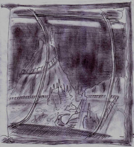

Ef correva in testa a tutti affiancata da Corolla, pronta a colpire nonostante la ferita ancora in via di guarigione.

Theo aiutava Kriss a trascinare lo scienziato lungo i corridoi metallici della base sottomarina.

“Da quella parte!” disse Ef, giunti davanti a una massiccia porta metallica, circolare. La telepate stette alcuni istanti a contemplarla, poi prese la mano del mutante e gliela fece appoggiare su una superficie piana al centro della porta. La piastra a quel contatto si illuminò leggermente, poi la porta scivolo silenziosamente aprendosi a diaframma rivelando un lungo tunnel davanti a loro.

“Impronte digitali?” disse Kriss, alludendo al meccanismo di apertura. Ma non poterono soffermarsi ad esaminare quel tipo di tecnologia, perché già altre voci giungevano poco distante, alle loro spalle.

Imboccarono di corsa il tunnel, ed Ef richiuse la grande porta dietro di loro.

“Può aprirsi solo con l’impronta delle persone più ‘autorevoli’” disse Ef in un secondo, nelle loro menti. Kriss non capì effettivamente cosa significasse, ma decise di fidarsi, che d’altro canto c’era poco da scegliere.

All’improvviso la loro attenzione si rivolse alle pareti del tunnel: erano divenute trasparenti. Correvano in un lungo tubo di vetro che doveva collegare due strutture simili. Il fondale, diversi metri più in basso, era illuminato a giorno tutt’intorno per l’area di una piccola città. Sulla sinistra si scorgevano mutanti al lavoro, uscire dai minisub senza alcuna protezione, perfettamente a loro agio in quell’ambiente. Sembrava stessero scavando, o preparando una nuova costruzione.

“Attività minerarie” chiarì Ef.

Sulla destra, poterono assistere a uno spettacolo sorprendente: una vera e propria città sottomarina, con tanto di strade e giardini di alghe e coralli. A giudicare dall’illuminazione doveva essere giorno. In strada si scorgeva una specie di mercato attorno al quale si affollava un grande numero di mutanti. La cosa che li colpì di più fu vedere uscire, da un edificio, un folto gruppo di piccoli mutanti.

“Bambini che escono da scuola…” disse Ef, non senza una certa esitazione.

Non poterono proseguire: dovettero fermarsi a osservare quella scena. Era incredibile a vedersi: pareva di assistere al sogno di un bambino al quale si racconti una favola sui popoli del mare. La città brulicava di vita e colore. Nei giardini di alghe bambini pesce giocavano nuotando liberi, le strade erano piene di gente, numerose botteghe e negozi si aprivano sulle vie principali e piccoli sommergibili luminosi facevano la spola da un posto all’altro, trasportando gli abitanti. Erano i mezzi pubblici.

Il mutante loro ostaggio ora aveva un’espressione che ricordava la fierezza, sul volto. Ma non disse una sillaba.

“Dobbiamo muoverci, stanno per entrare in questo tunnel!” esclamò Ef, strappandoli alla loro contemplazione. Ripresero a correre.

Quel tubo di vetro sembrava continuare infinito senza mai curvare, sfumando nel buio dinanzi a sé.

Dopo alcuni minuti, scorsero, contro l’effimero chiarore proveniente dalla superficie, un’altura sommersa stagliarsi di fronte a loro.

Il tunnel sembrava ora digradare lentamente, ed era rivolto verso un fianco dell’altura. Osservando bene si poteva scorgere una vaga luminosità salire da quella parte.

Si fermarono subito quando sentirono un rumore di acqua sotto i loro piedi: saliva come un velo verso di loro, lentamente ma inesorabilmente. Si guardarono allarmati, poi Kriss vide che il mutante aveva schiuso la bocca in una specie di sogghigno dai denti aguzzi.

“Vogliono affogarci…” disse Smiurl, in tono afflitto. Guardarono Ef, la quale assentì con un cenno del capo.

“Allora non c’è tempo da perdere!” esclamò Kriss, lasciando andare il mutante. Si misero a correre il più velocemente possibile.

Più andavano avanti più il livello dell’acqua saliva rapidamente. E il tunnel non accennava minimamente a risalire.

Presto si ritrovarono ad avanzare con l’acqua che arrivava loro ai fianchi. Smiurl già doveva nuotare. Dopo un po’ dovettero imitarlo tutti gli altri. Si fermarono, infine, quando fra l’acqua e il soffitto c’era solo lo spazio per le loro teste.

“Cosa facciamo?” chiese Corolla.

“Guardate: lì il tunnel torna a salire” disse Ef, indicando dinanzi a sé: il tunnel, diversi metri più avanti, curvava bruscamente verso la roccia e risaliva poco più rapidamente di quanto era disceso.

“Vorresti nuotare?” chiese Theo.

La telepate non rispose.

“Non credo abbiamo altra scelta” disse Kriss.

Si guardarono cupi. La distanza da percorrere in apnea era notevole. Poi Theo disse:

“Smiurl, tu vai per primo. Seguirà Corolla, Ef, poi Kriss e io per ultimo. Tutto chiaro?”. Assentirono tutti. Quindi Smiurl si avvicinò al limite dell’acqua, e con espressione angosciata prese tre, quattro, cinque boccate d’aria e infine si immerse. Subito Corolla lo seguì sparendo agilmente al di sotto dell’acqua.

“E voi, restate vicini” disse Theo, rivolto ai due che ancora erano con lui.

Kriss si immerse subito dopo Ef. Fortunatamente l’illuminazione del tunnel consentiva loro di vedere dove andavano.

Non pensava a nulla. Ogni fibra del suo corpo era impegnata a spingersi verso l’aria, trattenendo il fiato più a lungo possibile.

Ormai erano diversi secondi che nuotava, e cominciava ad avvertire un’insostenibile pressione nei polmoni. Cercava di non pensarci e di concentrarsi a nuotare, ma ogni istante si faceva sempre più insopportabile. Diede un’ultima bracciata, ormai non doveva mancare molto, ma lasciò sfuggire l’aria dai polmoni e ingerì quell’acqua salata. Sentiva che non c’era più nulla da fare, doveva essere finita lì, in fondo a quell’oceano sconosciuto su quell’assurdo pianeta. Dopo tutte le peripezie, i pericoli e le cose viste quello doveva essere l’epilogo. In fondo laggiù sulla Terra dovevano già crederlo morto, sin dal primo giorno in cui era scomparso.

Si sentì trascinare verso l’oblio, verso l’oscurità. D’un tratto avvertì una strana pesantezza nelle membra: con l’ultimo barlume di coscienza pensò che fosse il suo ultimo momento.

Poi avvertì una forte pressione sul torace. Una volta, due volte, tre.

Aprì gli occhi di scatto mentre sputava tossendo l’acqua dai polmoni. Theo lo stava spremendo come un limone con le sue possenti mani.

Dopo che ebbe sputato l’ultima goccia, si trascinò a sedere. Vide lo sguardo spaventato di tutti, vide Ef che aveva ancora il fiato corto. Tese una mano a Theo, dicendo:

“Se sono vivo è grazie a te. Mi hai salvato”. Lui gli strinse la mano concedendosi un sorriso e lo aiutò ad alzarsi.

“Purtroppo…” disse Ef, mentre riprendeva fiato “…non possiamo fermarci neanche ora… per loro l’acqua non è un problema…”

Si avviarono su per il tunnel verso la porta che vedevano poco distante.

Stavolta il massiccio portale non presentava protezioni di sorta. Si aprì docilmente con un sibilo non appena premettero il pulsante. Entrarono in un vasto ambiente in buona parte scavato nella roccia. Moltissime apparecchiature popolavano quell’antro, tutte molto attive, a giudicare dall’aspetto e dal rumore intenso.

Delle lampade pendevano dall’alto soffitto, fino al quale schermi e macchinari erano stipati senza soluzione di continuità. Alcune passerelle permettevano di raggiungerle quasi tutte. Due scalinate di metallo salivano, una a destra e una a sinistra, immettendo in corridoi scavati nella roccia.

“Credo sia meglio dividerci.” Disse Theo “Tu, Smiurl, vieni con me” aggiunse mentre saliva la scalinata di destra. “Voi altri, andate a sinistra. Dobbiamo trovare un modo per andarcene, e le nostre armi”

“Io sarò il nostro mezzo di comunicazione” disse Ef assentendo. Poi si slanciò nel corridoio di sinistra insieme a Corolla e Kriss. Procedettero per un minuto o due senza incontrare nulla. La monotonia di quella roccia rossiccia era interrotta solo dal cavo elettrico che collegava le lampadine poste a intervalli regolari.

All’improvviso, però, il tunnel terminò, dando su una specie di pianerottolo di metallico.

Quello che videro li lasciò senza fiato.

Davanti a loro, in un’enorme grotta scavata nella roccia era deposta, al centro, la nave sulla quale erano fuggiti fin lì e che li aveva trascinati con sé sul fondo del mare. Apparecchiature sibilavano, e sferragliavano tutt’intorno allo scafo, agli alberi e alle vele, smantellando lentamente ogni singolo pezzo. Già la metà di prua, infatti, giaceva in pezzi davanti alla metà posteriore ancora intatta.

Dopo alcuni istanti si riscossero e scesero in esplorazione.

Non potevano avvicinarsi più di tanto allo scafo, perché era circondato da braccia meccaniche che li avrebbero travolti senza colpo ferire. Si girarono di scatto quando videro un mutante che li fissava da una cabina di controllo, posta in alto su una parete. Dopo alcuni istanti sembrò riaversi dalla sorpresa, e prese una specie di telefono.

“Sta chiamando rinforzi” disse Corolla.

“Come se non avessimo già abbastanza problemi…” disse Kriss.

Improvvisamente un sibilo li sfiorò e sentirono l’impatto di un corpo metallico poco alle loro spalle. Alzarono di nuovo gli occhi e videro che quello che doveva essere un tecnico sapeva anche sparargli con una specie di fiocina.

Presero un corridoio di lato, curvandosi istintivamente per evitare i dardi.

Procedettero finché non incontrarono una delle porte, ai lati del corridoio metallico, aperta.

Nel locale c’era un molo con alcuni minisub.

“Questi sono il nostro biglietto verso la superficie” disse Kriss, con un certo sollievo.

Avendo avvertito il rumore, un paio di mutanti uscirono da dietro una serie di armadietti.

Non fecero in tempo a sfoderare i loro pungoli che già Corolla era su di loro, mettendoli fuori causa. Raccolse anche le loro armi: sembrava in grado di padroneggiare l’uso di quattro di quegli affari contemporaneamente.

“Torniamo verso Theo e Smiurl” disse.

Tornarono presso il relitto. Si sporsero di soppiatto per non essere infilzati dal tecnico, ma poi videro che era sparito.

“Stanno arrivando!” esclamò Ef.

Subito una massa di mutanti si riversò nel locale dalla stessa strada che avevano fatto loro.

“Alla cabina!” urlò Corolla indicandogli la postazione del tecnico. “Rifugiatevi lì mentre io li distraggo!” disse poi andandosi ad appostare dietro un pezzo della murata della nave che giaceva insieme agli altri segmenti dello scafo.

“Andiamo” disse Ef vedendo che Kriss esitava.

“Non se ne parla proprio!” disse lui andando a rifugiarsi anche lui dietro un riparo improvvisato.

Ef sospirò e iniziò a cercare di guadagnare la cabina. Disse nelle loro menti:

“Cercherò di confondere le loro menti. Resistete più che potete, Theo e Smiurl dovrebbero arrivare da un momento all’altro.”

I primi attaccanti fecero una brutta fine, raggiungendo subito Kriss e Corolla dietro i loro rifugi.

L’unico loro vantaggio era avere il relitto e le macchine smantellatrici fra loro e gli assalitori.

Subito gli altri si divisero per cercare di circondarli. Non fecero caso ad alcuni di loro che andavano incomprensibilmente a sbattere l’uno contro l’altro, o a gettarsi direttamente sotto le macchine in movimento. Un buon numero guadagnò però la parte opposta. Tre raggiunsero Corolla, che subito cominciò a dar prova del suo valore, e altri due accorsero presso Kriss. Cercò di respingerli, ma erano ossi duri: schivavano i suoi colpi, peraltro poco pericolosi, non avendo con sé la sua spada.

Rotolò a terra, mise un cavo di acciaio fra i piedi di uno e mentre si rialzava conficcò il pungolo nel fianco dell’altro. Poi si girò e liberò la scossa su quello che ancora stava rialzandosi. Si girò di scatto quando sentì un impatto poco dietro le sue orecchie, giusto in tempo per evitare il corpo di un terzo mutante che cadeva dall’alto di una cassa sulla quale era salito per sorprenderlo alle spalle, ma prontamente infilzato da uno dei formidabili lanci di Corolla. La cercò con lo sguardo: era circondata da cinque nemici: non poteva reggere a lungo. Raccolse l’altro pungolo elettrico e, incurante del pericolo, si slanciò fra pezzi metallici e cavi brandendo minaccioso le due armi e urlando per richiamare l’attenzione dei mutanti. Quando questi si girarono per fronteggiarlo era ormai troppo tardi. Tre caddero ai suoi piedi, e gli altri due presi da Corolla alle spalle.

Ma ne stavano già arrivando altri. Troppi.

“Questa storia inizia a stancarmi!” tuonò in quel momento Theo dall’alto della piattaforma metallica. Si slanciò insieme a Smiurl giù per le scale per impegnare parte degli assalitori.

Poco dopo le armi di Kriss e Corolla volavano nelle loro mani. Liberata così una mano dal peso, Theo poté afferrare anche l’altro maglio. Il risultato fu devastante.

Kriss sfoderò la lama e osservò i suoi riflessi rassicuranti fra le sue mani, poi si slanciò all’assalto.

Pochi minuti dopo era tutto finito. Furono raggiunti da Ef.

“Dovremmo andarcene prima che ne arrivino ancora degli altri.”

Pochi istanti dopo si stavano calando in uno dei minisub.

“Chi è che sa pilotare questi affari?” chiese Corolla indicando i comandi.

Ef scosse la testa. “Io non ho mai visto niente del genere… E non ho neanche un pilota a cui ‘chiederlo’…” intanto Smiurl aveva chiuso il boccaporto.

Kriss osservò il quadro dei comandi: era pieno di luci intermittenti, ma quello che spiccava era una specie di joypad che gli ricordava quello del suo computer e una cloche simile a quella degli aerei. Ogni indicazione riguardo al loro funzionamento era scritta in una lingua dai caratteri incomprensibili, quindi inutile.

Si sedette al posto del pilota. Provo a scostare lievemente la cloche verso l’alto: una leggera vibrazione pervase l’ambiente.

“Non deve essere così complicato…” disse quasi fra sé, più per rassicurare sé stesso che gli altri.

Osservò il joypad: aveva una leva che poteva scorrere verticalmente nel centro e due joystick, uno a destra e uno a sinistra.

Abbassò la levetta centrale di qualche millimetro e non poté trattenere un moto di euforica soddisfazione quando vide che la sua intuizione era esatta, e che il minisub andava lentamente immergendosi.

“Uao, ma come fai?” esclamò Smiurl.

“Oh, è semplice…” rispose Kriss “Vedi questa? Comanda i giri dei motori. Questa levetta qui invece serve per immergersi ed emergere…”

“Davvero? Incredibile…” fece il nano pieno di ammirazione “E queste?” aggiunse poi, indicando i due piccoli joystick.

“Ehm… devo ancora provarci…”

“Scommetto che servono per la direzione!”

“Smiurl deve avere ragione: il minisub ha due motori a elica rotanti, dovrebbero avere una escursione di circa 90 gradi…” disse Theo.

Kriss controllò se le loro supposizioni fossero esatte. Il minisub sbandò un po’ prima a destra, poi a sinistra.

“Visto?! Che ti dicevo?” strillò Smiurl tutto eccitato.

Nel frattempo avevano quasi raggiunto il fondo. Delle guide luminose portavano verso uno spazio oscuro: l’uscita.

“Beh, allora posso ritenermi promosso! Solo una cosa non sappiamo…” disse mentre mandava i motori avanti tutta “… ed è come quest’affare freni!”

Sbucarono dalla grotta sul fianco dell’altura sommersa a tutta velocità. Il minisub esitò per un po’, poi sembrò acquisire una direzione precisa, quindi prese a salire alacremente verso la superficie.

Solo quando sbucarono dall’acqua Kriss si preoccupò riguardo al rischio di embolia, ma stavano tutti bene. Poi pensò che il minisub doveva essere pressurizzato e che il problema si sarebbe posto all’apertura del boccaporto.

Trasalì violentemente, quindi, quando Smiurl aprì il boccaporto per prendere una boccata d’aria pura. Attese spasmodicamente per alcuni istanti, chiedendosi avrebbe avuto crampi improvvisi, se sarebbe morto. Ma nessun sintomo si manifestava. Pensò che non avesse mai capito bene l’argomento e la sua mente chiuse automaticamente tutti i dubbi in fondo a un cassetto, per non pregiudicare il proprio corretto funzionamento…

Si concessero alcuni istanti di euforia generale per festeggiare la loro riuscita fuga. L’unico problema era che a bordo non sembrava esserci nulla da mangiare o bere. L’acqua loro rimasta era assai scarsa. Ben presto Smiurl chiese:

“E ora dove andiamo?”

“Stavo osservando la bussola: i punti cardinali non sono riconoscibili…” disse Corolla.

“Tu sai dove ci troviamo?” chiese Theo rivolto a Ef.

“Purtroppo non ne ho idea…”

“Dobbiamo andare a sud…”disse Kriss.

“E come facciamo a sapere dov’è?” chiese Corolla.

Kriss avrebbe voluto conoscere il cielo di Noi-Hert, per aspettare la notte e orientarsi con le stelle.

“Perché non aspettiamo fino al calar del sole? Voi conoscete le costellazioni: riconoscerete senz’altro il sud…” propose agli altri.

A quelle parole Smiurl si illuminò. Sparì fuori del boccaporto e tornò dopo un istante.

“Il sud è lì” disse, indicando poco alla loro destra.

“E come faresti a saperlo?” chiese Corolla, incredula.

“Semplice. Il sole è abbastanza basso sull’orizzonte. Se la città in fondo al mare segue l’ora solare, quello è l’ovest!”

Rimasero tutti a bocca aperta a guardarlo. Non se lo aspettavano, da lui.

“Beh…” fece Kriss.

E si diresse verso il sud di Smiurl.

Che risultò essere quello esatto quando il sole morì e il cielo si vestì di diamanti.

La notte era trascorsa mentre dormivano alternandosi alla guida. I motori sembravano serbare ancora la loro energia iniziale.

“C’è qualcosa che vorrei dirvi…” disse Ef quando furono tutti svegli.

“Sarebbe?” fece Kriss.

“La tempesta… Quella che ci ha affondato. Non era un fenomeno naturale.”

Attese alcuni istanti lasciando che l’informazione raggiungesse tutti.

“E chi…” iniziò a chiedere Smiurl.

“I mutanti. Il complesso di macchine che abbiamo visto all’interno della struttura dove abbiamo trovato la nostra nave, non erano che una parte di una macchina colossale in grado di controllare il tempo. L’ho letto nelle loro menti.”

“Non è possibile…” fece Corolla.

“Ci hanno affondato di proposito, dopo averci individuati a distanza, in qualche modo…” continuò Ef “Per loro venire in possesso di quella nave, ma specialmente catturare degli esemplari di esseri umani vivi era un’occasione unica: avrebbero fatto ogni sorta di esperimenti sulle nostre menti e sui nostri corpi.”

Kriss rabbrividì al pensiero di quello che ciò poteva significare… Gli faceva senso anche solo sezionare una rana.

“Tutta quell’acqua di mare deve esser loro andata al cervello!” esclamò Smiurl, giustamente indignato.

Scoppiarono a ridere, un po’ per la battuta, un po’ per il sollievo di essere sfuggiti a quei potenziali carcerieri e torturatori.

E mentre pensava a questo Kriss rivedeva la città sommersa, piena di vita e colore, di movimento. Rivide i bambini uscire da scuola. E rivide quello scienziato guardarli con ribrezzo. E loro guardare con ribrezzo lui.

“Quei mutanti… non sono meno umani di noi…” disse infine cupo. Nessuno ebbe il coraggio di aggiungere altro.
