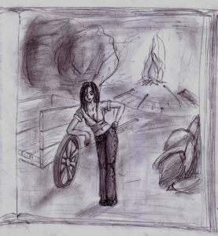

“Sei vivo…”

Di chi era quella voce? La sua?

L’aveva veramente sentita?

Aprì gli occhi lentamente, mentre i pensieri ricominciavano a scorrere nella sua mente, tentando di ristabilire il contatto con la realtà. Impiegò qualche secondo per mettere a fuoco la vista.

Si sentiva piuttosto male. Faticava anche solo a respirare a fondo. Si mise faticosamente e dolorosamente a sedere, e non riconobbe quello che vide. Si sforzò di ricordare, e gli tornò alla mente quello che era successo.

In teoria doveva essere stato colpito dal fulmine, ma non capiva come potesse essere ancora vivo. Era, comunque, completamente fradicio.

“Forse sono morto…” disse ad alta voce, guardando la piccola valle rossastra sotto di sé, dalla quale ascendevano fili di fumo da incendi non ben identificati, riconsiderando la plausibilità di quell’ipotesi. Che fosse morto.

“Pensavo peggio…” disse alzandosi cautamente in piedi. Per qualche istante ebbe le vertigini, poi il suo senso dell’equilibrio si stabilizzò.

Guardò il cielo, striato da una lunga nuvola che sembrava la scia di un aereo. Aveva un colore strano, alieno. Il sole stava tramontando, e illuminava di strani bagliori la volta celeste che stava già accogliendo il lieve scintillio di alcune stelle.

Scosse la testa, si stropicciò gli occhi, e cercò un modo di scendere verso la valle, per orientarsi e capire dove diavolo fosse finito. Di certo non c’erano valli di quel tipo e colore, vicino casa sua.

Incespicando più volte e cadendo anche, in un paio di altri casi, arrivò alla spianata, priva di alberi. C’era una strada che conduceva verso quello che sembrava il luogo dell’incendio. Ormai era notte, e il fuoco illuminava di maligni bagliori rossastri la scena.

Proseguendo Chris vide che si trattava di un villaggio, anzi, di quello che ne rimaneva. Praticamente tutto era stato dato alle fiamme. Non c’era traccia di anima viva. Non c’erano mezzi di trasporto. Non poteva far altro che continuare a camminare.

Dopo pochi metri vide il primo. Un uomo, giaceva disteso supino, con una freccia che spuntava dal torace. Chiaramente morto.

Chris guardò i suoi spenti occhi sbarrati e fu colto da un conato di vomito. Alcune mosche già gli ronzavano intorno.

Quando si fu ripreso, ebbe abbastanza presenza di spirito da mormorare:

“Dove diavolo sono finito?”

Continuò a camminare e vide che la strada era piena di cadaveri. C’era stata una specie di battaglia.

Camminava allucinato, la mente che rifiutava la realtà e che comunque aveva seri problemi a trovare una spiegazione a quello che stava vivendo.

Perse la cognizione del tempo. D’un tratto si ritrovò seduto appoggiato allo stipite dell’ingresso di una casa risparmiata dalle fiamme. La porta era stata divelta. Si riscosse, rabbrividendo. Doveva trovare un riparo, asciugarsi…

Ispezionò la casa. Era deserta, e tutto giaceva nel caos più assoluto. Entrò in quella che doveva essere la camera da letto, a giudicare dai bassi giacigli. C’era un armadio, lo aprì. Alcuni vestiti al suo interno, roba strana. Prese una specie di camicia e dei pantaloni che potevano essere più o meno della sua misura, poi si spogliò degli abiti ormai infangati e laceri (e anche un po’ bruciacchiati, ora che ci faceva caso) e li gettò in un angolo.

Si buttò sul giaciglio, coprendosi con la coperta provvidenzialmente tirata da una parte e si addormentò di colpo.

“Svegliati…”

“Chi ha chiamato?...” biascicò Chris alzandosi a sedere sul letto, mentre lottava per riprendere conoscenza. Aprì gli occhi, e la consapevolezza di quella realtà ripiombò a macigno su di lui.

Gemette, cercando di schiarirsi la vista. Non sapeva per quanto avesse dormito, ma uscendo vide che il sole era già alto.

Aveva fame. Pensò come avesse potuto non accorgersene prima. Tornò in casa e cercò qualcosa da mangiare. Divorò tutto quello che all’olfatto e ad una prudente assaggiata risultava commestibile, poi si incamminò, confortato da uno stomaco ormai ben pieno.

Gli incendi si erano quasi spenti. Il vento spargeva il fumo per tutta la valle, portando purtroppo con sé anche l’odore di morte… Chris fu nuovamente assalito dalla nausea, ma non era disposto a rinunciare tanto facilmente a quanto aveva appena mangiato, così si dominò. Si avviò nella stessa direzione della notte precedente. Dopo qualche minuto di cammino il villaggio terminò. In un tratto di terra erano state scavate e ricoperte una decina di tombe. Non c’era nessuna sorta di lapide, solo la terra smossa a coprire dei cadaveri ormai senza più nome.

Si guardò intorno, ragionando sul fatto che qualcuno aveva dovuto seppellire quei poveracci, i quali certo non avevano potuto fare a turni... E poi l’ultimo, come faceva a seppellirsi? Chris rise di quel pensiero, ma poi un brivido gli corse lungo la schiena, pensando che in effetti poteva essere vero, e che non tutti i morti potessero stare sottoterra. Scacciò quelle nefaste e ridicole sensazioni e studiò il terreno.

La terra tutt’intorno sembrava calpestata e smossa, come se un gran numero di persone fosse passato di lì. C’erano anche delle tracce di ruote. Sembravano essere state lasciate da un carro. Chris alzò lo sguardo e vide che la pista proseguiva dinanzi a sé, nel paesaggio semidesertico.

Fortunatamente anche un bambino avrebbe potuto seguirla, pensava Chris mentre camminava alla ricerca di forme di vita intelligenti… L’unica cosa cui potesse aggrapparsi.

Camminò tutto il giorno, e stava per disperare quando scorse in lontananza un vago chiarore e un filo di fumo ascendere verso il cielo.

“Fa che non sia un altro villaggio morto…” disse fra sé mentre si incamminava in quella direzione con rinnovata energia.

Ormai era notte fatta quando arrivò ai margini dell’accampamento. Osservava, sdraiato, nascosto fra la bassa vegetazione. Non era un villaggio. Li aveva raggiunti. C’erano un notevole numero di tende intorno a un grosso falò centrale, presso il quale stavano arrostendo degli enormi pezzi di carne. L’odore giungeva fino a lui, e quasi lo fece svenire. Intorno al grande barbecue numerosi uomini danzavano sul ritmo di rozze canzoni dalle parole oscure e tracannavano enormi boccali di qualcosa che doveva essere birra mentre attendevano di saziarsi della carne. Chris si guardò intorno. Non c’era movimento ai margini dell’accampamento. Fu allora che li scorse.

Schiavi. Erano ammassati in alcune gabbie grosse come autocarri, con ruote che dovevano aver lasciato le tracce che lui aveva seguito, e che dovevano essere state attaccate a quella specie di trattori che vedeva in un angolo.

Gli balenò un’ipotesi nella mente, e si rammaricò della sua sfortuna. Quella gente doveva aver attaccato il villaggio, erano gli assassini, e lui era andato a cercarli… E quelli laggiù dovevano essere i superstiti, presi come spoglie…

Era disgustoso. L’indignazione e la rabbia lo pervasero.

Fu così che gli balenò l’idea. Pochi secondi dopo strisciava già verso le gabbie, senza pensare alle immediate conseguenze di ciò che si apprestava a compiere. Al riparo dietro un carro vuoto le studiò meglio, e vide che al loro interno c’erano donne e bambini. Niente uomini, né vecchi. Pensò ai cadaveri sparsi per il villaggio distrutto, e poi subito scacciò la visione.

Riprese a strisciare verso la porta di una di quelle celle mobili. Qualcuno lo scorse, e subito si levarono mormorii e qualche lamento e un grido. Chris trasalì, si guardò intorno, portando il dito alla bocca per reclamare il silenzio, sperando di non essere già stato scoperto. Quindi prese ad esaminare il lucchetto che chiudeva la porta sotto gli sguardi disperati e vagamente speranzosi di quei disperati.

“Beh, io non lo farei…” disse una voce femminile alle sue spalle.

Chris si senti raggelare. Rimase qualche istante pietrificato, poi si voltò lentamente, cercando di apparire non troppo terrorizzato. A parlare era stata una ragazza, che ora lo studiava con il capo inclinato, appoggiata al carro che prima aveva offerto riparo a Chris.

Era decisamente attraente. Aveva lunghi capelli castani, scuri nella notte, dai riflessi rossi alle luci delle fiaccole. Indossava una larga camicia aperta sul seno; per il resto era strizzata in dei pantaloni di pelle neri. Lui stava studiando la curva del fianco sinistro che sporgeva, essendo lei appoggiata sul gomito destro alla ruota del carro. Postura interessante, sicura di sé; aveva la vita deliziosamente sottile…

“Sai, il capo potrebbe prendersela a male… e Dio solo sa cosa ti farebbe… per non parlare poi di Jeorghe…” interruppe lei il suo esame, sorridendo maliziosa.

Chris arrancò alla ricerca di qualcosa da dire.

“Fe… ferma, aspetta un attimo… Chi è Jeorghe? E il capo, non glielo dirai, vero? Io, cioè, io… ehm!”

La ragazza fece per rispondergli quando intervenne una terza foce, aspra e rozza:

“Cosa diavolo succede qui?!”

“Jeorghe, come sei caro…” rispose lei sarcastica incrociando le braccia e squadrandolo con malcelato disprezzo.

“Tu, brutta tr…”

“Ha! Attento a come parli!” fulminea aveva estratto un coltello dalla cinta e lo aveva puntato verso l’inguine di quell’energumeno alto due metri e qualcosa.

Jeorghe ringhiò, lasciando intendere che se avesse potuto avrebbe senz’altro cercato di ammazzarla, poi girò lo sguardo e squadrò Chris.

“E questo sacco di letame chi cavolo sarebbe? Uno schiavo?! No… Non c’erano uomini fra loro… Un intruso! Una spia!” prese a ridere selvaggiamente, con suono simile a un fuoribordo che non vuole partire, mentre afferrava un pezzo di legno grosso quasi quanto la gamba di Chris per rompergli la testa.

Infatti si avventò su di lui. Chris si buttò sotto il carro degli schiavi, con l’adrenalina che improvvisamente gli si riversava nel sangue a fiotti. Uscì dall’altra parte ma presto Jeorghe lo raggiunse. Rideva. Stava giocando con lui. Chris si guardò intorno: non aveva vie di fuga, in quella specie di deserto. Colto dal panico prese a schizzare da un riparo all’altro, mentre il suo avversario faceva volare in pezzi tutto ciò che la sua arma incontrava sul suo cammino.

D’un tratto si trovò in un vicolo cieco. Non aveva scampo. Jeorghe incombeva su di lui. Sogghignava godendo del terrore della vittima, mentre si avvicinava lentamente, sbattendo leggermente la sua mazza improvvisata sulla mano libera.

Gli si parò davanti in tutta la sua stazza e Chris potè avvertirne il fetore, e contare ogni singolo capillare dei suoi occhi malvagi mentre quello levava la mazza sopra di sé per finirlo.

In quell’istante si udì un sibilo ferire l’aria. Dal buio improvvisamente apparve una corda, che si avvolse strettamente intorno al torace di Jeorghe, percuotendolo infine con delle pesanti protuberanze di pietra. L’uomo si lasciò sfuggire l’arma. Udirono un urlo, e qualcosa di indistinto colpì l’uomo ormai impotente il quale cadde sotto l’urto, grugnendo di nuova rabbia.

Nel frattempo si era radunata un po’ di gente, attirata dal frastuono, tutti uomini rudi, tutti massicci e minacciosi, con le loro armi e il loro cipiglio che insieme avrebbero intimorito chiunque.

“Fate largo, idioti…” si sentì dire dalla ragazza di prima, che sbucò improvvisamente dal nulla. Poi tutti si fecero da parte, al suono di qualcuno che si avvicinava. Era un suono tintinnante, e presto Chris vide chi era a produrlo. Lo riconobbe immediatamente quale capo di quell’orda di bruti: portamento fiero, capigliatura e barba curate, espressione intelligente, sprezzante, a tratti maligna, a tratti ironica. Era alto, più slanciato di tutti gli altri. Aveva al collo svariati gioielli e appesi al fianco una grossa spada nel fodero e una catena che tintinnava a ogni passo. Si fermò a pochi metri da loro, con le mani sui fianchi, osservandoli curiosamente.

“Guarda guarda cos’hanno combinato al povero Jeorghe!” disse in tono canzonatorio, affibbiandogli poi un calcio nel sedere “Dovrò scegliermi delle guardie migliori!…” Jeorghe grugnì con rabbia indicibile.

“Liberatemi!” urlò sguaiato. Il capo fece un cenno, e l’uomo fu slegato e accompagnato, con qualche difficoltà, altrove.

“Chi sei?” chiese d’un tratto, volgendosi bruscamente verso Chris con rinnovato interesse.

“Il mio nome è Chris” fece lui dopo solo un istante di esitazione.

“Come ti trovi qui?”

Chris si trovò impreparato. Non aveva avuto né il tempo né l’idea di prepararsi una storia per una simile eventualità.

“A dire la verità… stavo tornando a casa, quando.. beh, sì, quando un fulmine mi ha colpito. E poi mi sono svegliato vicino a quel villaggio…” indicò alle sue spalle “…e non sapendo dove andare ho seguito le vostre tracce…” già dalla seconda frase qualcuno aveva cominciato a sghignazzare, ma ora erano esplosi, e Chris si era fermato, non sapendo che aspettarsi. Solo la ragazza non rideva, e continuava a osservarlo coi pugni sui fianchi.

“Basta!” tuonò all’improvviso il capo. Subito calò il silenzio. “Certo non è una grande storia…” fece poi ridacchiando “Chi vuoi che possa crederci, ragazzo?...” Gli si avvicinò, esaminandolo da capo a piedi. Poi tornò a fissarlo negli occhi.

“Non sei una spia. Non saresti stato così scemo da fare tutto questo fracasso…” concluse con noncuranza. Gettò lo sguardo da una parte, pensieroso, col mento fra le dita della mano destra e la sinistra sul gomito destro.

“Uhm… però… Ascolta: oggi mi trovi di buonumore” schioccò le dita, e avvicino il suo volto a quello di Chris.

“Ti faccio una proposta: unisciti a noi”

Immediatamente si levò un coro di proteste. Tutti pensavano di poter assistere a un’esecuzione. Lei rimaneva impassibile.

Ma anche Chris d’altronde era sorpreso. Dopo un po’ disse, non avendo per altro molta scelta:

“Ci sto!”

Il capo sorrise, poi si voltò rapidamente e mentre si allontanava disse:

“Corolla, trova un buco per…” esitò un attimo, poi soggiunse: “Kriss… Due braccia rubano più di quanto mangi una bocca…” e scomparve sghignazzando.

Lei lo prese per un braccio e lo condusse via, fra gli sguardi odiosi degli astanti.
