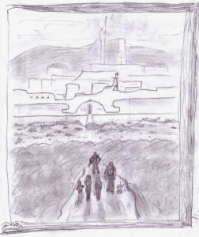

Viaggiarono verso un sud indubbiamente monotono e piatto per altri cinque giorni.

Avevano deciso di procedere pochi metri sotto la superficie in quanto in emersione i motori erano praticamente inutilizzabili. Sembravano essere stati progettati esclusivamente per uso subacqueo. E, vista la loro provenienza, doveva essere senz’altro così.

Finite le scarse provviste di cibo, il secondo giorno, iniziarono a pescare, registrando comunque scarsi successi. Si fermavano a ore stabilite del giorno e Theo si immergeva con una fiocina presa a bordo, guidato da Efeliah che aveva il compito di individuare la fauna marina. Razionarono l’acqua, ma ben presto si esaurì.

Da diverse ore ormai i motori non sembravano più carichi come alla partenza, e più passava il tempo più il minisub rallentava.

Sarebbero sopravvissuti? Sarebbe stato davvero frustrante morire di fame e di sete in mare aperto dopo essere sfuggiti a tutti quei nemici.

Magari la loro meta… di dubbia natura, per altro… era ancora migliaia di chilometri a sud di quel vasto mare.

Sentiva la gola ardergli, Kriss, mentre pensava a tutto questo. Giacevano, in silenzio, stipati in alcune brande incassate nel metallo, per risparmiare le forze, e anche perché preferivano non dire nulla.

Era il turno di Ef, ai comandi, ed era completamente assorta nel piatto e uniforme blu che aveva davanti agli occhi, aldilà della lastra di polimeri intrappolata fra braccia metalliche che formava il muso trasparente del minisub.

A volte Kriss pensava di udire delle voci, invece erano i loro stomaci che reclamavano rumorosamente per non aver ricevuto abbastanza cibo.

Passavano la giornata in quello stato catatonico, perdendo la cognizione del tempo, finché non era il loro turno di pilotare, o finché Theo non si immergeva per cercare qualcosa da mettere sotto i denti che fosse anche commestibile.

La notte non era molto diversa dal giorno. Non godevano più del ristoro del sonno, tormentato anch’esso da fame, sete, e dagli stessi incubi che li perseguitavano di giorno. L’unica cosa che dava l’impressione di non stare vagando a caso in una liquida massa oscura, sia di giorno che di notte, era la bussola, che indicava la loro direzione. Per caso il sud era indicato nella stessa direzione che stavano seguendo. L’unico compito di chi stava ai comandi era di far rimanere il minisub in linea con quell’indicatore.

Dopo il sesto giorno, fu in uno di quei momenti a metà fra l’incoscienza e la veglia che Kriss la udì di nuovo: quella voce che molte volte aveva solo pensato di aver immaginato di aver udito, ora risuonava nella sua testa molto più forte, continuando a chiamarlo con insistenza, e come se ormai dovesse mancare davvero poco. Sembrava volesse incoraggiarlo a non arrendersi. Ma vi percepiva anche una vena di timore, di apprensione. Sentì di dover continuare, di dover scoprire chi o cosa lo stesse chiamando sin da quando era giunto su quel pianeta.

Fu forse quel sentimento di determinazione a restituirgli un po’ di lucidità. Tanta quanta ne bastava per udire Smiurl che esclamava, con le sue forze residue:

“Terra!”

Dopo circa un ora il minisub si arenò sul fondo sabbioso, emergendo in buona parte dalla superficie. Si trascinarono fino sulla spiaggia, esausti. La finissima sabbia bianca accolse le loro membra mentre si accasciarono a terra. Si addormentarono, o meglio, persero i sensi, all’ombra della vegetazione, simile alle palme terrestri, che cresceva fitta al margine della spiaggia.

Dopo un tempo imprecisato Kriss si svegliò. Theo e Corolla erano in piedi proprio presso di lui.

“Abbiamo fatto provviste d’acqua” disse Theo.

“C’è un fiumiciattolo delizioso a poche centinaia di metri da qui… Mi sono potuta anche lavare” disse Corolla. “E, inoltre, abbiamo un po’ di cacciagione… Questo fucile laser non è solo

un’onorificenza…” terminò, accennando alla vistosa arma che le pendeva al fianco. Improvvisamente Kriss fu colto dal ricordo della serata di gala ad Ayonn, dove erano stati premiati, e un terribile crampo lo prese allo stomaco, accompagnato da un notevole rumore.

“Datemela anche cruda, quella carne, o morirò!” esclamò, dopo aver bevuto a lungo.

Svegliarono gli altri e bevvero di nuovo tutti quanti, poi presero ad accendere il fuoco. Corolla regolò al minimo il fucile e incendiò un tronco secco.

Dopo aver mangiato, andarono in esplorazione.

Era un posto meraviglioso: ogni scorcio ricordava a Kriss le cartoline delle spiagge tropicali della Terra…

Anche la temperatura era quella: davvero gradevole, accompagnata da una leggera brezza marina. Il mare si estendeva azzurro a perdita d’occhio, e giungeva mite a lambire la spiaggia in tutta probabilità protetta da una barriera corallina.

Alle loro spalle invece c’erano delle colline, tutte ricoperte di lussureggiante vegetazione, entro la quale risuonavano spesso versi di animali sicuramente alieni, i quali risultavano anche inquietanti.

Camminarono in una direzione e nell’altra fino a che il sole iniziò a declinare, incendiando poi il mare di mille riflessi arancioni.

Kriss si sdraiò vicino al fuoco acceso da Ef e ringraziò di essere vivo. Poi si dispose ad aspettare il ritorno di Theo, Smiurl e Corolla, con la cena.

Si era fatto buio, e avevano iniziato a far sparire la cena intorno al falò in mezzo alla spiaggia.

Kriss pensava che, finalmente, potevano rilassarsi e godersi qualche momento di tranquillità. Non avevano avuto pace per giorni, da quando erano partiti da Ayonn. Vedeva i volti di Corolla e di Ef esaltati nella loro bellezza dalla luce mutevole del fuoco e da quella del loro momento di felicità.

Piccole scintille si levavano in alto trascinate dai flussi d’aria calda, o forse dalle storie impossibili raccontate da Smiurl.

Avrebbe dato qualsiasi cosa per rimanere per sempre così, con quelle sensazioni nel cuore e quelle immagini negli occhi, ma neanche in quell’occasione gli riuscì di rilassarsi del tutto..

Continuava ad avvertire una sensazione di disagio, tutt’intorno a sé. Era come se ogni cosa che guardasse e ogni pietra che calpestasse vibrasse, percorsa da una misteriosa energia che perturbava l’animo di Kriss.

Ef notò la sua espressione.

“Qualcosa non va?” chiese nella sua mente, mentre rideva ad alcune barzellette di Smiurl.

“Non so spiegarlo… Pensi anche tu che abbia a che fare con questo misterioso richiamo?”

“Non vedo come potrebbe essere altrimenti…”

“A proposito” li interruppe Corolla.

“Eh? Che c’è?” fece Kriss, ritornando alla comunicazione verbale.

“Non credo rimarremo su questa spiaggia, vero?” chiese lei.

“In effetti, pensavo di partire domani mattina…” annunciò Kriss.

“Ancora a sud?” chiese ancora Corolla.

“Ma perché, qui non va bene?” si lamentò Smiurl.

“Sì…” continuò Kriss, ignorando il commento del nano “Ma perché lo chiedi?”

“La foresta” disse Theo.

“Theo intende dire…” spiegò Corolla “…che costeggiare la foresta verso ovest o est sarebbe un conto, ma attraversarla sarà molto, molto più impegnativo. Non sappiamo cosa vi si nasconde. Potrebbe essere molto pericoloso.”

Kriss la guardò, sentendosi anche vagamente in colpa. Disse poi:

“Dopo tutto quello che ho passato, non saranno certo un po’ di alberi, a fermarmi”

Corolla lo guardò con una strana espressione. Quasi sorridendo soddisfatta, disse:

“Era solo per sentire il tuo parere. Domani attraverseremo quel bosco!”. Quindi si alzò, e entrò nella tenda che avevano eretto, insieme alle altre, dopo averle fatte asciugare al sole.

Theo continuava a guardare imperterrito il fuoco. Smiurl aveva preso a giocherellare con dei bastoncini di legno e dei tizzoni. Kriss guardò interrogativamente Ef.

“Credo sia soddisfatta di te… Che approvi la tua linea di condotta… Almeno in parte, è sicuramente così.” disse subito lei nella sua mente.

“E’ per quanto riguarda l’altra parte?”

“Uhm… non so…” Ef si alzò, e si avviò verso la tenda che divideva con Corolla “Sai che molti dicono che il cervello delle donne sia molto più complicato di quello degli uomini?...”

Ma nel suo tono c’era una nota che Kriss non comprendeva. Sembrava stesse trattenendo una risata…

“Tu mi stai nascondendo qualcosa!” esclamò alzandosi in piedi. Smiurl lo guardò come se fosse impazzito.

“Cosa te lo fa pensare?...” Ef sparì nella tenda. Kriss dovette tenersi la curiosità. Dette un calcio a un sasso e dopo una breve passeggiata decise di andare a dormire.

Il giorno dopo smontarono il campo, all’alba, e si avviarono verso le colline a sud.

Attraversare la foresta si rivelò davvero complicato come aveva supposto Corolla. Liane, arbusti, tronchi e fogliame ostruivano completamente la visuale dopo due metri in ogni direzione. Ogni tanto Smiurl doveva arrampicarsi su un albero più alto degli altri per controllare la direzione.

Procedettero zigzagando per tutto il giorno, fermandosi stremati solo per mangiare, verso mezzogiorno, in una piccola radura.

Ripartirono dopo un’oretta, avendo ripreso un poco le forze.

A pomeriggio inoltrato giunsero sulla cima della collina. A occhio e croce sembrava si trovassero a 200 metri sul livello del mare. La cima era rocciosa, e protendeva una conformazione di roccia grigia verso l’alto. Si arrampicarono sul quel monolito per osservare il panorama dall’altro lato della collina.

Dopo una breve arrampicata arrivarono su una specie di piattaforma, abbastanza regolare e ampia per poterci stare tutti insieme senza rischiare di cadere di sotto.

Si trovavano con le spalle a sud, e ammirarono il panorama verso il mare. Videro la strada che avevano fatto. Dovettero convenire che non era stata impresa da poco percorrere quei pochi chilometri.

Si voltarono, e lo spettacolo fu sorprendente.

Dinanzi a loro si apriva una grandissima vallata, seguita poi da alte montagne. Ma sul fondo della valle giaceva una grande città. Si scorgevano i particolari degli edifici più vicini, aldilà di imponenti mura, bianche alla luce del sole.

Nel centro della città sorgeva un palazzo di molto più alto degli altri, anch’esso bianco, e avorio, probabilmente costruito in marmo, con torri, colonnati, portici e giardini tutt’intorno.

Per bellezza e leggera imponenza faceva svanire al confronto qualsiasi altra costruzione, sebbene tutta la città fosse piena di grandi edifici, tutti bellissimi.

Però c’era un particolare a deturpare tanta bellezza: la foresta a nord delle mura era stata abbattuta, e ora vi giaceva accampato un numeroso esercito. Fumo saliva da fuochi accesi qua e là. Potevano vedere l’attività che pervadeva l’accampamento. Era evidente: quella città era sotto attacco. Forse sotto assedio.

D’altronde era comprensibile, pensò Kriss, quella città era bellissima e ricchissima, e avrebbe fatto gola a chiunque. Ma non poteva accettare l’idea che venisse presa da quell’esercito di formiche nere, animali che sciamavano sotto le sue candide mura. Gli dava l’impressione che ne sarebbe stata, in un certo qual modo… profanata.

Vide con gli occhi della mente un esercito mille volte grande come l’orda in cui aveva trovato i suoi amici assaltare la città, percorrerne le vie più deliziose, trafugare statue, gioielli, uccidere senza pietà chiunque si fosse parato loro dinanzi, senza distinguere fra vecchio, giovane o donna. Vide il grande

palazzo prima svuotato, privato dei materiali pregiati e poi dato alle fiamme come la carcassa di un cadavere, e sentì che doveva assolutamente entrare in quella città.

Doveva camminare di persona nelle sue vie, voleva parlare con i suoi abitanti, e visitare il palazzo che doveva essere la reggia. Tutto, intorno a lui, sembrava spingerlo in quella direzione. Ora capiva la tensione che avvertiva tutto intorno a sé: doveva assolutamente raggiungere la città.

“Kriss vuole entrare nella città” disse Ef ad alta voce.

Theo scosse la testa.

“Non è possibile! Come pensi di passare inosservato attraverso l’accampamento? Si estende da una parte all’altra, vedi?” disse Corolla abbracciando con un gesto l’intera ampiezza della valle. “Proprio non capisco come tu possa desiderare di recarti lì dentro… Non vedo molti difensori, e non vorrei essere lì con loro quando quell’esercito entrerà nella città…”

La logica di Corolla era inoppugnabile.

“So che non sembra possibile e che tu non ne capisci il motivo, ma io so di dover entrare in quella città. Ora so che questa è la meta del nostro viaggio.”

Smiurl, che come al solito aveva assistito in silenzio alla discussione, disse:

“Va a finire che facciamo di nuovo gli eroi…” con un certo tono di apprensione repressa nella voce.

“Non c’è bisogno che veniate con me” disse Kriss, guardando fisso dinanzi a sé “Avete già rischiato abbastanza. Già così non potrò mai ricambiare il mio debito con voi…”

“Non dire idiozie” scattò Corolla, offesa “Noi verremo con te, ovunque tu decida di andare”

“Non ti lasceremo, ragazzo” concluse Theo.

Kriss guardò ancora per qualche istante la città, poi chinò il capo e disse, sottovoce:

“Grazie”
