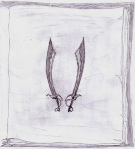

Si erano accampati presso la base del monolito di roccia.

Il sole era calato, e, salendo di nuovo sulla piattaforma, si potevano scorgere centinaia di fuochi sparsi per tutta la valle, attorno ai quali erano radunati uomini che mangiavano e bevevano, e, tendendo l’orecchio, ogni tanto, sembrava di sentire il suono di qualche tamburo e delle loro voci cantare.

Ammirando la scena, Kriss aveva rivisto in un attimo quando quella notte era arrivato su Noi-Hert ed era stato “accolto” nell’orda. Aveva pensato alla faccia di Jeorghe, e deciso che niente avrebbe potuto fargli desiderare di vederla ancora.

Ora erano radunati intorno al loro piccolo falò, che non era possibile scorgere, dalla valle, in mezzo a quel fitto fogliame.

Sedevano in silenzio, mangiando alcuni animali simili a gatti catturati prima del tramonto, con scarso appetito.

Dopo alcuni minuti che ebbero finito di mangiare, Ef prese la parola.

“Dobbiamo elaborare un piano per entrare in città”

“Dovremo agire col favore delle tenebre, poco prima che il sole sorga, per correre il minor rischio” disse Theo.

“E poi resta un altro problema. Una volta giunti alle porte della città, come faremo a lasciarci aprire? Vuoi andare a bussare dicendo: ‘amici’?” esclamò Corolla.

“A quello penseremo quando saremo lì…” disse Kriss. Corolla sospirò, tornando a guardare il fuoco.

“Come faremo ad attraversare il campo senza farci né vedere né sentire? Non è un cortile, saranno un paio di chilometri allo scoperto. Una volta usciti dalla foresta…”

“Io posso percepire la differenza fra una mente sveglia e una addormentata” disse Ef.

“Quindi potrai guidarci tu” disse Kriss.

“Sono due chilometri senza un sasso dove nascondersi” ribadì Theo.

“Già” fece Corolla “Non avremo neanche un buco dove nasconderci, e se faremo scricchiolare anche un solo rametto ci saranno addosso in centinaia in pochi secondi.”

Il silenzio scese su tutti loro. Guardavano il fuoco, unica fonte di luce e di suoni, con il suo sommesso scoppiettare.

Ad un certo punto Kriss si alzò, dirigendosi verso la tenda. Non riusciva a descrivere il suo stato d’animo. Non riusciva a concentrarsi sulla realtà, se ne sentiva dissociato. Solo la città occupava i suoi pensieri.

Prima di scomparire nella tenda, disse:

“Allora è deciso” con lo stesso tono assente che aveva avuto per tutta la serata.

Si sdraiò sul suo giaciglio, e immediatamente ogni pensiero fuggì dalla sua mente, sprofondandolo in un profondo sonno senza sogni.

Era ancora buio. L’oscurità avrebbe regnato per ancora un po’.

Si muoveva silenzioso, invisibile, fra la vegetazione fitta come mai aveva visto.

Nulla muoveva intorno a sé. Neanche gli animali notturni seppero distinguere il suo passaggio.

Osservando la città in lontananza udiva un lento, struggente suono provenire dal palazzo dove un’unica luce era ancora accesa. Sembrava un canto, un lamento, un richiamo.

Percepì le migliaia di uomini addormentati ai suoi piedi, oltre a quelli svegli che montavano la guardia.

Non poterono vederlo, né sentirlo. Scivolò nelle ombre e attraverso i loro sospiri, portando un accenno della sua presenza solo nell’oblio dei dormienti.

Veleggiava come una nave spettrale al di sopra del terreno denudato per mano di quell’esercito di bruti capaci solo di pensieri di morte, violenza e corruzione.

Senza voltarsi guardò alle sue spalle. Un lieve chiarore stava ora segnalando l’imminente arrivo dell’astro del giorno. Si mosse più veloce.

Era sotto le mura. Nel pallido chiarore indistinto foriero del giorno brillavano come pietre di luna, evanescenti ed eteree.

Possenti baluardi.

Non c’era tempo di trovare le porte. A cosa sarebbero servite? Ora la voce si faceva più forte.

Come danzando risalì lungo il muro, prigioniero unicamente di quel canto.

Passò come una nuvola sopra i bei tetti che ancora conservavano un poco di calore residuo, lasciandosi il minaccioso esercito alle spalle.

I primi raggi del sole giungevano ora rifratti, bagnando il paesaggio di luce onirica.

Ora vedeva la luce in quell’alta finestra tremolare come percependo la sua presenza, ora sempre più vicina.

Scese nei giardini del palazzo, fra incantevoli alberi ancora addormentati e fontane dal misterioso mormorio.

Giunse presso una grande scalinata bianca, marmo ammorbidito in quella luce lattiginosa.

Scorse, o credette di scorgere, una figura, in cima alla scalinata, a braccia protese, che sussurrava il suo nome.

In quell’istante il primo raggio di sole trapassò il cielo come un dardo infuocato, sciogliendosi su quegli scalini, che subito s’infiammarono a quella luce come lava fusa. La luce andava facendosi sempre più forte, finché divenne abbagliante, irresistibile. Tutto ne fu inghiottito. Ora solo calore e luce era intorno a sé.

Aprì lentamente gli occhi. La luce del giorno lo abbagliava. Si guardò intorno e subito si rese conto di non essere più nella sua tenda. Un meraviglioso giardino giaceva davanti a lui, pieno di fontane, fiori e alberi che ondeggiavano dolcemente accarezzati da una leggera brezza. Vide che a terra ancora giacevano i suoi amici, i quali si stavano svegliando, ora.

Si girò e rimase allibito: dinanzi a sé stava la scalinata che aveva visto quella notte.

Non poteva essere stato solo un sogno.

O stava forse ancora sognando?

In quello stato di dubbio semi-incosciente si avviò su per quegli scalini, avvertendo la propria ansia ed emozione crescere ad ogni passo. Non si accorgeva neanche che gli altri avevano preso a seguirlo.

Intravedeva un vasto atrio in cima a quella scala, separato dall’esterno da dei veli che scendevano dall’alto soffitto e che danzavano nell’alito che soffiava su quella terra come creature eteree.

Giunsero alla fine di quella scala e si ritrovarono in una sala bellissima.

Colonne e marmi salivano tutt’intorno alla parete ascendendo verso l’alto, lontano soffitto, a cupola. Nel suo centro c’era un’apertura la quale contribuiva insieme alle numerose e grandi finestre all’illuminazione.

Il pavimento era un marmo talmente lucido da sembrare uno specchio. Pareva di camminare sul vetro.

Ogni accesso, quattro in tutto, era velato da quegli enormi e al tempo stesso incorporei tendaggi che rivelavano ogni movimento d’aria.

Furono proprio quelli a richiamare la sua attenzione. Improvvisamente si erano fermati, come immobilizzati. Non un alito ora percorreva quell’immensa sala aperta a ogni vento. Anche i suoi amici si erano fermati, come statue.

Si voltò di scatto, avvertendo la sua presenza.

Una figura maestosa stava di fronte a lui, all’altro fuoco dell’ellisse della sala. Il suo volto, come il suo corpo, era coperto: una armatura verdastra rivestiva interamente quel misterioso guerriero. Due spade aveva nelle mani, che ora pendevano inerti ai suoi fianchi. Erano due lunge sciabole leggermente ricurve, dal manico d’oro e dalla lama vitrea, azzurrina, un ibrido fra l’acciaio più resistente e il cristallo più puro.

Kriss percepì la forza che emanava da quella figura, la forza della sua mente oltre che del suo corpo.

Una e mille voci risuonarono in quell’istante nella sua testa, e quasi gli sembrò di veder vibrare l’aria che si frapponeva fra loro, al fluire di quell’energia:

“Sono Saberinne”

Immediatamente, senza provocare alcun suono se non quello prodotto dai suoi calzari, il guerriero si slanciò contro Kriss, pronto a servirsi delle sue due armi.

Ubbidendo a un cieco istinto, senza rendersi pienamente conto delle sue azioni, Kriss sfoderò la sua spada, pronto a ricevere quel terrificante attacco.

La sua mente non fu sfiorata dalla consapevolezza di essere solo uno studente di una qualsiasi scuola della Terra il quale stava vivendo quello che molto probabilmente era un sogno che stava rivelandosi un incubo, e che non sapeva maneggiare nessun’arma, figuriamoci quella spada pazzesca che ormai si portava dietro da molto tempo.

Niente di tutto ciò, no, lui era solo consapevole dei suoi movimenti, e di quelli del suo avversario, e la spada che reggeva con entrambe le mani diveniva sempre più parte integrante del suo essere, un’estensione del suo corpo. Avvertiva ogni molecola d’aria che spostava, e, invece di cercare di fuggire, o di parare il colpo, si avventò anche lui con folle slancio contro il suo assalitore.

Senza lanciare alcun grido protese la spada nell’istante del impatto e menò un fendente che rischio quasi di sbilanciarlo, nonostante il suo stato di unione con la sua arma.

Ma il guerriero protese una delle due sciabole con velocità fulminea e parò il suo colpo, piroettando poi su sé stesso e dandogli un calcio, mandandolo a cadere più in là facendolo ruzzolare per qualche metro.

Gli cadde la spada.

Si rialzò di scatto e la riafferrò: il guerriero lo stava aspettando. Non lo avrebbe colpito mentre era a terra e disarmato.

Questa volta Kriss si mosse per primo. Corse verso quella figura che lo stava aspettando, ferma, quasi volesse schernirlo. Decise che avrebbe fatto una finta, per coglierlo di sorpresa. Caricò il colpo, ma proprio un attimo prima che si lasciasse andare in una scivolata, per sorprendere l’avversario, il guerriero balzò di lato, evitando di lasciarsi sbilanciare.

Kriss, mentre ancora scivolava, puntò la spada sul pavimento e si rialzò nonostante la punta della sua arma continuasse a slittare sollevando una scia di scintille senza lasciare alcuna traccia su quel marmo lucido.

Si scontrarono di nuovo, con rinnovato vigore. Parevano danzare velocissimi e leggeri l’uno in perfetto accordo con l’altro, invece stavano lottando sul filo della vita. La sicurezza di Kriss cominciava ora ad essere incrinata: il guerriero sembrava giungere ovunque con le sue sciabole che fendevano velocemente e silenziosamente l’aria. Preveniva come se leggesse nella sua mente tutte le iniziative di Kriss, che fra l’altro non erano neanche opera di una mano esperta. Combatteva infatti con la forza della disperazione, della determinazione a non arrendersi. La sua spada si intrecciava senza sosta a quelle dell’avversario, lanciando ad ogni tremendo impatto una cascata di scintille, ma ogni istante che passava perdeva terreno, arretrava lentamente e inesorabilmente verso la parete di fondo. Continuava a respingere gli attacchi di quel guerriero senza volto, che lo osservava dalle feritoie del suo casco. Si chiese se lo avrebbe mai visto in faccia. Si chiese quanti in effetti potevano dire di averlo fatto, ed essere ancora vivi…

Improvvisamente si trovò col muro alle spalle. Nella destra la spada, la sinistra protesa appoggiata al marmo di quella parete.

Erano pochi istanti, eppure un’eternità. Aveva combattuto come non aveva mai immaginato che alcuno potesse fare, e aveva perso. Ora il suo avversario lo fissava, e gli puntava la sciabola destra alla gola. Un gesto chiaro. Era perduto.

Ma non poteva accettarlo. Non poteva lasciare che finisse così. Pensò di nuovo a tutto quello che aveva passato, a tutto quello che aveva visto a fatto in compagnia di quegli amici che erano disposti a dare la vita l’uno per l’altro.

Non poteva finire.

Strinse il manico della spada, e come quella volta in fondo al mare, prigioniero in quella cella metallica, riversò tutta la sua rabbia ed energia mentale nella spada, in quell’unico colpo. In quell’attimo urlò, urlò come mai aveva fatto, e la spada perse il

suo peso, e sparì dal muro velocissima per ricomparire sotto l’elmo del guerriero, colpendo quella protezione con un urto tremendo, accecando per un istante gli occhi di entrambi i contendenti con il bagliore del metallo ferito, e mandando l’almo a rotolare giù per la scalinata dalla quale Kriss era salito.

Il tempo riprese allora a scorrere, senza sforzo, ma quello di Kriss si fermò.

L’armatura del guerriero prese a svanire, ritraendosi su sé stessa, svelando infine sotto di sé una superba, splendida figura.

Era una donna, meravigliosa, che lo guardava, ora, sorridendo. I suoi profondi occhi del colore del mare e degli smeraldi lo guardavano ridendo, rivelando una grande saggezza e forza, ma allo stesso tempo dolcezza. Intorno al suo viso, dai lineamenti di una dea, e lungo la schiena, scendevano tanti ricci d’oro biondo, spargendosi sulla candida veste che rivelava un corpo perfetto.

“Io sono Saberinne” disse, non senza una certa soddisfazione, sorridendo con calore e proiettando quello stesso calore direttamente nella sua mente.

Ora riconosceva quella voce.

L’aveva trovata.

Uno stato di stupore generale ora dominava le menti di Kriss e dei suoi compagni, i quali, inoltre, non si erano accorti minimamente del tremendo duello che si era svolto a due passi da loro.

Anche Efeliah non si era accorta di niente, ma fu la prima a riprendersi. Quando si rese conto del tipo di persona che aveva ora davanti si prostrò a terra rendendole omaggio come a una dea, subito imitata da Smiurl. Theo e Corolla rimasero invece a fissarla, impalati.

“Alzati” disse Saberinne “Non sono quello che tu pensi. Sono un essere umano come voi tutti”

“Ma…” esitò Ef.

“Avanti, seguitemi, accomodatevi sotto il portico” disse la loro ospite voltandosi verso l’ingresso nord “Credo di dovervi spiegare una quantità di cose…”

Procedettero in silenzio lungo un corridoio non meno meraviglioso della sala precedente. Il lontano soffitto era affrescato, e marmi e dipinti ornavano le immense pareti, intorno alle grandi, chiare, porte che si aprivano a intervalli regolari nel muro di sinistra. In quello di destra invece c’erano numerose finestre e vetrate, le quali lasciavano filtrare obliqui raggi di sole a illuminare quel passaggio di luce eterea, ora bianca, ora scomposta nelle varie tonalità dello spettro.

Si guardavano intorno a bocca aperta abbagliati da tanto splendore. Ma Kriss vi dedicava poco tempo: lui e Saberinne camminavano davanti agli altri guardandosi negli occhi, scambiandosi chissà quali pensieri, del tutto impenetrabili anche alle capacità di Ef.

Il corridoio finì, immettendo in una grande terrazza aperta sui giardini, verso i quali digradava con due larghe scalinate. Era coperta da un pergolato di varie piante rampicanti che dovevano essere curate meticolosamente, come tutto il resto. La struttura che lo sorreggeva sembrava tendere impercettibilmente allo stile liberty, secondo Kriss.

Si sedettero attorno a un tavolino già apparecchiato. Subito arrivò della servitù che portò un carrello con dei rinfreschi. Erano due bei giovani, un ragazzo e una ragazza.

“Non tollero la schiavitù nella mia città” disse Saberinne, indicando i due servitori sorridenti. “Il lavoro svolto nel palazzo è considerato un privilegio e svolto volontariamente”

I due se ne andarono, dopo essersi inchinati a Saberinne. Iniziarono a mangiare sotto lo sguardo di Saberinne che sembrava penetrare fin dentro le loro menti e anche più in profondità. Dopo qualche minuto smise di osservare i suoi ospiti e si soffermò a osservare Kriss, reclinando il capo e appoggiandolo su una mano chiusa. Sembrava lo sguardo di un’innamorata.

Kriss, inutile dirlo, era completamente stregato da quello sguardo, da quella mente, da quelle sembianze divine.

Quando tutti ebbero finito di mangiare, Saberinne iniziò a parlare.

“Kriss, io percepii la tua presenza sin dal giorno in cui giungesti su Noi-Hert, partorito dalle fibre più recondite del nostro universo. Sapevo del tuo arrivo, era profetizzato. E, anche se non lo fosse stato, tutto questo sarebbe successo ugualmente.

“Tu provieni da un universo parallelo a questo. Non hai viaggiato nel tuo spazio e nel tuo tempo. Il tuo viaggio è stato reso possibile da due fattori: in secondo luogo la scarica di energia che ti ha investito nella tua abitazione, in concomitanza con un temporale di proporzioni inusuali e che ha modificato tutta una serie di parametri energetici nella zona della tua casa e nella tua mente.

“Ma la parte più importante l’ha fatta la tua mente stessa. Come posso vedere anche ora, essa è al di fuori del comune almeno quanto lo è la mia.”

A quell’affermazione fece una pausa.

“Come Ef ha già potuto percepire, la mia mente dispone di un potenziale telepatico ed empatico enorme. Nessuno, al di fuori di me, avrebbe potuto avvertire l’arrivo di Kriss da tanta distanza. E nessuno, al di fuori di me, su questo pianeta, saprebbe

dirigere una città felice e fiorente come questa in un mondo in piena decadenza.

“Tornando a prima, nell’istante in cui la folgore ti ha sfiorato, la tua mente ha posto inconsciamente in contatto i nostri due universi. Questo perché, come già vi è stato spiegato alla Rocca del Telepate, questo universo è caratterizzato da parametri, da ‘dimensioni’, se così vogliamo definirle, aggiuntivi: permettono lo scambio di informazioni fra più menti e permettono di modificare addirittura la realtà delle normali leggi fisiche da parte di menti particolarissime, estremamente rare.

Fissò lo sguardo su Kriss.

“La tua è una di quelle”

“Ecco cosa sono le strutture di cui ti parlavo!” fece Ef nella mente di Kriss cercando di schermare la comunicazione.

“Esatto” confermò Saberinne ad alta voce “Tu, Kriss, la chiameresti, un po’ impropriamente, ‘telecinesi’. Quei circuiti celebrali non sono mai stati usati, nel corso della tua vita, poiché di fatto inutilizzabili, nel tuo universo. Quando sei arrivato su questo pianeta, però, l’energia della tua mente ha automaticamente iniziato a premere su di essi. Quella notte, quando hai salvato Smiurl dallo Sgozza-buoi, la vicinanza della mente di Efeliah ti ha trasferito una massiccia dose di emissioni emozionali, le quali hanno momentaneamente sconvolto il tuo equilibrio elettrico-mentale…”

Kriss, come tutti gli altri, non sembrava capire esattamente cosa Saberinne stesse dicendo. Lei naturalmente se ne accorse e disse:

“E’ stato come dare un’accelerazione fortissima e repentina ad un motore freddo: la tua mente si è surriscaldata rischiando anche di danneggiarsi.

“Però quell’evento fu di fondamentale importanza. Da quella sera l’accesso alle tue peculiari strutture celebrali è stato sbloccato. Ciò ti ha permesso, Kriss, fra l’altro, di entrare in contatto con me attraverso il proiettore di Ayonn. Di solito percepivi il mo richiamo soltanto quando la presa della tua coscienza si allentava o se ti trovavi in bilico fra il sonno e la veglia.

“Un’altra scarica poi l’hai data quando abbattesti quella porta, nella colonia sottomarina dei mutanti

“Da allora, ora dopo ora, giorno dopo giorno, il tuo potenziale si accresciuto moltissimo. Ed è stata questa tua capacità che vi ha reso possibile giungere qui, questa notte, anche grazie alla vicinanza delle nostre due menti, all’imminenza del nostro incontro.

“Mi crederesti se ti dicessi che ora potresti smuovere una montagna, se solo lo volessi? …No, vedo che non ci crederesti. E questo contribuisce in maniera fondamentale all’impedirti di riuscirci davvero…

“Venite, andiamo in giardino” disse Saberinne alzandosi dal tavolo. La seguirono giù per la scalinata verso i giardini del palazzo.

Dopo qualche minuto Saberinne sospirò e disse, con infinita tristezza nella voce:

“La mia millenaria città è sotto assedio. Rischia l’annientamento. Tutto quello che avete intravisto dalle colline rischia di essere eliminato per sempre.

“La città non possiede un esercito, fa parte della sua costituzione. La posizione isolata nel lontano continente meridionale e le formidabili mura sono sempre bastate a proteggerci dagli sporadici attacchi di orde che ardivano spingersi sin qui.

“Tutto ciò non è più sufficiente: decine di orde hanno stretto un’alleanza per appropriarsi della città, delle sue ricchezze, economiche e tecnologiche, le uniche rimaste intatte in tutto il pianeta da decine di secoli.

“Difendere questa città è la mia vita. Lei porta il mio stesso nome, e da quando lei vive vivo anch’io. Se dovesse essere distrutta, significherebbe distruzione anche per la mia anima.

Si fermarono a riflettere su quelle parole.

“Significherebbe che tu abbia vissuto per millenni…” disse Corolla, incredula.

Saberinne non rispose subito. Camminò ancora per qualche istante a piedi nudi sull’erba, poi si fermò e si voltò.

“Ti sembra strano che io conservi la vita e la bellezza dopo tutto questo tempo? Il corpo è solo il prodotto della mente. Una conoscenza ed un uso perfetti di questa risparmiano al corpo di portare i suoi segni di decadenza. E inoltre la mia anima trae la sua energia da tutti gli abitanti di Saberinne, e, in minima parte, anche dalle forze sepolte nel cuore del pianeta…

“E’ incredibile…” fece Ef.

“Io conobbi il Maestro” la anticipò Saberinne sui suoi stessi pensieri. “Gli trasmisi la mia conoscenza per quello che pochi anni mi permisero di fare. La vostra comunità è il prodotto di quel nostro incontro”

“Un momento, vi ricordate la leggenda?” disse Kriss.

“Quale leggenda?” chiesero gli altri.

“Quella che l’anziano Long ci raccontò, del Maestro che in sogno vide apparirgli una dea bionda che gli prediceva il nostro arrivo alla Rocca.”

“E’ buffo, io non ne sapevo niente!” disse Saberinne.

“La cosa mi sembra davvero sorprendente, date le circostanze…” disse Kriss.

Stettero alcuni istanti in silenzio, riflettendo su quelle informazioni.

Saberinne sembrò esitare, poi sospirò e disse:

“Kriss, vorrei parlarti in privato.”

Naturalmente non era possibile opporle un rifiuto. Comunque non avrebbe rifiutato per nulla al mondo…

Gli altri si allontanarono. Ef rispettosamente ritirò anche la propria presenza mentale, che fra l’altro sarebbe stata inutile.

Saberinne lo condusse attraverso ai giardini fino a un labirinto di siepi. Lo guidò all’interno, fino a giungere nel piccolo spiazzo centrale dov’era una bella fontana zampillante circondata da alcune panchine.

Si sedettero.

Kriss sentiva la mente e il cuore scoppiargli. Tanti pensieri, emozioni gli attraversavano furiosi l’animo accalcandosi nelle sue viscere e rendendogli impossibile proferire parola alcuna.

Saberinne gli portò un dito alle labbra sorridendo.

“Non dire nulla” gli sussurrò nella mente.

Se mai qualcuno avesse avuto l’opportunità di osservarli, avrebbe detto che avevano trascorso alcune ore a osservare intenti l’uno gli occhi dell’altra, ma non avrebbe potuto percepire l’intensa comunicazione mentale che si scambiavano. I loro occhi erano fissi davanti a loro, ma non vedevano i loro volti, il giardino. Erano fissi direttamente sulle rispettive anime, e i due avrebbero potuto rimanere così per l’eternità, se solo l’avessero voluto. E il desiderio era forte.

Non si scambiarono parole, né immagini. Parlavano il linguaggio delle emozioni. Ogni loro neurone vibrava in concomitanza dei pensieri dell’altro. Le loro menti così denudate si offrivano reciprocamente l’una all’altra, desiderose solo di unirsi in un abbraccio eterno.

Potevano sentire sul proprio viso i respiri e i sospiri dell’altro, contando ogni molecola d’aria in quel tempo che andava dilatandosi come melassa.

Le loro mani si cercarono, incontrandosi a metà strada.

Kriss sentiva le labbra bruciargli come se vi colasse fuoco, e in quell’incredibile comunione mentale poteva sentire che anche quelle di lei si torcevano in quell’improvviso, irrazionale spasimo del cuore.

La fontana smise di giocare con l’acqua, e una brezza improvvisa agitò i loro capelli mentre una creatura alata, sola nel cielo, cantava la loro estasi.

Tornarono dagli altri, camminando sottobraccio, a pomeriggio inoltrato.

Saberinne li condusse presso i loro regali alloggi, quindi si ritirò, esitando impercettibilmente, per gli altri, sugli occhi di Kriss, salutandolo come solo loro due potevano comprendere.

Quando Saberinne si fu allontanata, Corolla esplose, senza curarsi dell’eventualità di essere ascoltata:

“Ci vuoi dire che cosa diavolo ti ha detto per tutto questo tempo?!”

“Ci crederesti se ti dicessi che non ci siamo scambiati una

sola parola?” chiese Kriss.

“Un momento… Cosa è successo, Kriss? Percepisco un forte cambiamento in te… Quasi non ti riconosco…” disse Ef, ansiosa.

“Stai bene, Kriss?” chiese Smiurl, preoccupato dalle reazioni dei suoi amici.

“Io penso proprio di sì…” disse Theo, che guardava i giardini, dalla finestra.

Gli altri si voltarono a guardarlo, senza capire. Infine Kriss parlò.

“Conoscete il concetto di anime gemelle?” disse. Ef lo spiegò agli altri.

“Naturalmente smisi di credere a sciocchezze del genere sin da bambino… Ma i fatti ora dimostrano che mi sbagliavo.

“La mia mente e quella di Saberinne sono perfettamente complementari. Possono fondersi in un’unica entità senza problemi…”

“In effetti potrebbe essere possibile…” disse Ef.

“Nel giardino non abbiamo fatto altro che scambiarci i nostri pensieri, guardando l’uno nella mente dell’altra.”

“Ne sei sicuro?” chiese Corolla, sospettosa.

“Sì…”

“Mente” disse Ef nella mente di Corolla, schermando istintivamente la comunicazione.

“Ti ho sentito!” disse Kriss.

Ef si voltò di scatto sgranando gli occhi.

“Come è possibile?! Solo Saberinne finora è stata in grado di vedere attraverso le mie schermature!”

Kriss chinò il capo. Dopo alcuni istanti disse:

“Ormai io e lei siamo una cosa sola, due facce della stessa medaglia… La mia vita è la sua, la sua città è la mia città, e i nostri cuori, il nostro respiro, sono divenuti uno solo…”

Corolla si lasciò cadere sul letto.

“Cosa ti è successo?...” mormorò quasi fra sé fissando il vuoto.

“Non mi è successo niente di male, Corolla, te lo assicuro.” le disse poggiandole una mano sulla spalla “Voi restate i miei migliori amici, compagni per la vita… Però la mia vita d’ora in poi sarà per sempre legata a Saberinne, in ogni luogo, in ogni tempo.”

Detto questo, si ritirarono ognuno nelle proprie stanze.

Dopo un bagno ristoratore e un cambio d’abito scesero per la cena.

Saberinne li stava aspettando, nella sala dei banchetti che nulla aveva in comune con il municipio di Ayonn che pure era sembrato loro grandioso.

Il tavolo, molto piccolo rispetto all’enormità della sala, giaceva ai piedi di una larga scalinata percorsa da una guida rossa, che attraversava poi tutta la sala fino all’ingresso.

Centinaia di luci erano annidate negli anfratti di pietra delle pareti, gettando un aura di luce diffusa per tutta la sala. Dall’incredibile soffitto pendeva un enorme lampadario di gemme e d’oro, che rischiarava maggiormente il centro della sala.

Le pareti erano decorate da marmi con un effetto simile a quello nella sala ellittica, dove Kriss si era battuto contro Saberinne. Pilastri di pietra salivano dal pavimento lucido, prendendo poi forme umane, di colossi e creature a Kriss sconosciute che sembravano sorreggere con le loro teste e spalle il soffitto anch’esso riccamente decorato.

Arrivarono al tavolo ancora trasognati, per l’ennesima volta, guardandosi intorno a bocca aperta. Solo Kriss ormai era immune a quel tipo di fascino quando davanti agli occhi e alla mente gli si schiudeva quello della sua Saberinne.

Ella era ancor più splendida, se possibile. La bellezza del suo volto e la radiosità della sua espressione erano abbaglianti; il suo corpo perfetto era sapientemente velato da un abito verde con uno strascico che a Kriss sembrò quello di una sposa. Aveva indossato anche due orecchini che le donavano e una collana che scendeva verso i seni.

Pensò ancora una volta, con tutte le sue forze, che non l’avrebbe mai lasciata, proprio mentre sentiva che lei provava lo stesso sentimento per lui.

Si sedettero, e presto furono serviti.

Dopo aver consumato le portate parlando delle proprie storie e della città di Saberinne, salirono la scalinata che conduceva in un’altra terrazza, stavolta scoperta per permettere di ammirare il firmamento.

Si sistemarono su alcune sedie, alla flebile e carezzevole luce di alcune candele.

“Volevamo dirvi una cosa” disse Saberinne a un certo punto.

“Il nostro arrivo, come sappiamo, non è giunto inaspettato. C’è un motivo per cui sono apparso su questo mondo e per cui siamo giunti sani e salvi fin qui” disse Kriss.

“Come vi ho detto questa mattina, la città è sotto assedio, e non aveva speranza di sopravvivere, finché non siete arrivati voi”

“Come anch’io vi ho detto prima, le nostre menti possono fondersi perfettamente a formare un’unica entità”

“Essa conserverebbe le caratteristiche delle nostre due personalità, ma sarebbe anche qualcosa di diverso, di infinitamente superiore. Il potere delle nostre menti, già grande, si moltiplicherebbe a dismisura, permettendoci di respingere le orde a nord delle mura” concluse Saberinne.

“Domani, all’alba, entreremo nella sala ellittica, e uniremo le nostre menti.” Disse Kriss “Voi non dovrete fare altro che aspettare, e avere fiducia in noi.”

Li guardarono senza sapere cosa dire. Dopo qualche istante Corolla disse:

“Beh, mi sembra che abbiate già preso una decisione…”

“Io… Riconosco che sia giusto così. Era senz’altro questo il nostro destino” disse Ef. Capiva che fra loro due, dal momento in cui si erano incontrati, era intercorsa una comunicazione mentale, uno scambio tale che lei non poteva presumere di immaginare. Tutto ciò andava oltre le sue capacità.

“Non sarà pericoloso, vero?” chiese Smiurl, ansioso.

Kriss sorrise, e gli disse:

“Come ogni altra cosa, la faccenda presenta dei rischi… Ma non saranno questi a fermarmi, non è vero Smiurl?”

“Hai ragione” disse il nano chinando la testa.

Improvvisamente Theo si avvicinò e quasi stritolò Kriss in

un abbraccio.

“Questo è il mio addio. Ho uno strano presentimento, ragazzo… Nel caso non dovessimo rivederci.” disse poi.

“Oh” rispose Kriss quando si fu ripreso “Vi assicuro che non é necessario…”

“Non ce ne importa un bel niente!” esclamò Corollacon voce incrinata, gettandoglisi al collo.

“Non farti male, capito?” gli sussurrò all’orecchio. Poi si staccò lentamente da lui, indugiando con le mani nelle sue.

“Addio Kriss” disse Ef, con infinita malinconia negli occhi “Non so perché, ma sento che Theo ha ragione…”

Erano tutti commossi, peraltro senza capirne appieno il perché. Smiurl non seppe dire nulla, ma con un balzo si attaccò al collo di Kriss rischiando di farlo cadere, illuminandosi fiocamente di vari colori.

“Non ti dimenticheremo mai” disse quando tornò a terra.

“Neanch’io, amici.”

Si abbracciarono tutti un’ultima volta, quindi se ne andarono nelle loro stanze per passare la notte, col cuore gonfio di tristezza.

Kriss si allontanò sottobraccio a Saberinne, la quale stava placando il turbinio di emozioni che quell’addio inaspettato aveva provocato in lui.

“Pensi anche tu che non li rivedrò mai più?” chiese lui dopo un po’, usando il linguaggio verbale, quando si furono seduti su un divanetto, celato in un angolo di quel padiglione, al riparo della vista di altri che non fossero le stelle del cielo.

“E chi lo sa, Kriss?” disse lei “Certe cose davvero non possono essere previste…”

“Per la prima volta da quando ti conosco” per Kriss era ormai un eternità “Ho l’impressione che tu non mi sita dicendo tutto…”

“A chi non piace avere i suoi piccoli segreti?...” disse lei guardando il cielo. Poi aggiunse “E se si trattasse di una sorpresa?”

“Non credo riusciresti a nascondermelo a lungo…”

“Il tempo ti arrecherà risposte, Kriss caro, quando porterà con sé il domani…” gli appoggiò la testa su una spalla. “Domani abbiamo una grande missione da compiere, un appuntamento col destino. Non giova pensarci più di tanto.” Sospirò. “La notte è così breve…”

Si voltò a guardarlo negli occhi.

“E se i tuoi amici avessero ragione? E se questa fosse la nostra ultima notte?...” le sue parole si persero nei loro pensieri.

“Non possiamo più esistere separatamente, Saberinne. Nulla potrà separarmi da te, o separare te da me, neanche le nostre rispettive volontà. Lo sai molto bene”

“Certo, amore mio. Certo.”

Continuarono a guardarsi negli occhi per alcuni istanti, poi tutto intorno a loro sembrò svanire nel nulla quando lei pose fine a ogni suo dubbio e domanda chiudendogli la bocca nel suo bacio.

Le stelle impallidirono, e i primi rossastri raggi del sole li trovarono ancora stretti, addormentati, per non lasciarsi più.

Gli amici di Kriss avevano capito che Kriss e Saberinne avrebbero avuto bisogno della massima concentrazione e di stare soli, per compiere quello che avevano loro annunciato la sera precedente. La loro presenza non avrebbe dato altro risultato che turbare la serenità mentale di Kriss. Così passarono tutto il tempo riuniti in una sola stanza, interrogandosi sull’esito di quell’avventura, e se davvero non avrebbero più rivisto Kriss.

Kriss e Saberinne erano pronti. Entrarono nella sala ellittica, giungendo al centro. Si separarono, e come muovendosi allo specchio andarono a posizionarsi sui due fuochi dell’ellisse. Si inginocchiarono, le mani sulle cosce, e si guardarono negli occhi un’ultima volta.

Nello stesso istante, schiusero le loro menti l’uno all’altra, molto più di quanto non avessero fatto soltanto un giorno prima nel giardino di Saberinne.

Lo spazio e il tempo persero parte del loro significato. Percepivano, ora, i loro corpi, come se ne fossero usciti. Erano

distanti alcuni metri, ma potevano sentire l’uno il tocco dell’altra.

Abbandonarono ogni riluttanza, sciogliendo ogni tensione. Videro le rispettive menti come un grande arazzo indescrivibile di luci, suoni e pensieri. Si concentrarono ancora di più su quella percezione, dimenticando i propri corpi, la stanza ellittica, la città di Saberinne, il pianeta intero. Erano loro due, sospesi in un reticolo di energie che andava facendosi sempre più denso. Si abbandonarono in quel vortice, e i loro pensieri, i loro ricordi e sensazioni, le loro anime, si mescolarono a formare una cosa sola. Non era più Saberinne, né Kriss.

Quell’enorme potenza si sollevò verso il cielo, protendendosi in ogni direzione, cosciente di ogni casa, di ogni persona, soldato e filo d’erba, di ogni loro molecola.

Sentiva sotto di sé l’intero pianeta pulsare come un enorme cuore, trasmettendogli un’energia inimmaginabile.

Invisibile, si estese sopra tutta la città, allungandosi poi verso nord.

Tanti piccoli uomini fremevano in quello che credevano l’attacco decisivo, quello che avrebbe consegnato nelle loro mani la sorte di Saberinne. Ignoravano di essere come trasparenti sotto l’occhio di qualcosa che non sarebbero mai riusciti neanche a concepire.

Esitò solo un momento, poi, esercitando semplicemente la sua volontà, la potenza di Kriss e Saberinne agì.

Il panico più profondo e totale pervase la mente di buona parte degli assalitori. Iniziarono a fuggire da tutte le parti, sbattendo gli uni contro gli altri, calpestandosi a vicenda, ingaggiando duelli fra compagni. Altri gettarono le loro frecce ma troppo tardi si accorsero sgomenti di non aver mirato agli scarsi difensori delle mura bensì ai loro alleati, che ora reagivano attaccandoli furiosamente.

Tutte le armi da fuoco esplosero nelle loro sedi, o persero le loro cariche energetiche, risucchiate da una forza misteriosa.

L’esercito si era scompaginato, stava fuggendo, ma alcuni ancora resistevano.

Un vento impetuoso allora sorse da sud, portando con sé fitte nuvole dal malato colore rossiccio e scatenando poi selve di fulmini che annerivano in più punti il terreno, dove una volta sorgeva la foresta.

I mezzi di trasporto esplodevano, si incendiavano. I cavalli fuggivano completamente prede del terrore, quasi quanto lo erano i loro cavalieri.

La piana a nord della città era ora devastata: fuochi, cadaveri, sciami di soldati che correvano da una parte all’altra senza più comprendere nulla. Il caos regnava indiscusso.

A quella vista il suo cuore si turbò. Con un ultimo impeto, volle spazzare via d’innanzi a sé quello scempio.

Un enorme vortice nero scese dalle nuvole, facendo inchinare al suo passaggio tutta la foresta rimasta ancora intatta.

Tutto ciò che incontrò lungo il suo cammino fu trascinato in alto, nelle sue potenti spire, implacabili.

La maggior parte di quei barbari fu trascinata via, portata in alto da quel turbine come semplice sabbia.

Era uno spettacolo terrificante. Pochi furono gli abitanti di Saberinne che ebbero il coraggio di assistervi, dalle mura della città.

Il vortice si allontanò verso nord, sparendo all’orizzonte, trascinando in sé un esercito intero, portandolo, se qualcuno avesse avuto la fortuna di sopravvivere, sulla terra più lontana che sul pianeta esistesse.

Altri, i primi a fuggire attraverso la foresta, scamparono a quella fine, e, raggiunte precipitosamente le loro navi, si diedero alla fuga, spingendo al massimo la loro andatura per giorni e giorni, disperdendosi nell’oceano per approdare poi al continente settentrionale. Costoro avrebbero portato in tutto il mondo il ricordo del terrore di Saberinne, e presto una leggenda sarebbe nata, un mito avrebbe preso vita da quei tremendi avvenimenti di cui quei soldati erano stati testimoni oculari.

L’enorme pulsazione energetica dell’unica mente di Kriss e Saberinne fu percepita dall’anziano Long, dall’alto della sua rocca in mezzo al deserto, e un fremito di timore lo pervase, anche da quella distanza.

Ecco, era compiuto. La fusione era riuscita, la città era salva. Si ritirò su sé stesso, abbandonando gradualmente le tremende energie che lo avevano sostenuto. Rimpiccioliva, svaniva, ritirandosi fremente nella sala, dove i suoi corpi lo stavano aspettando.

Lentamente, con un immenso dolore che li attraversò fino alla più piccola fibra del loro essere, iniziarono a separarsi. I loro pensieri si divisero, la loro percezione tornò a diversificarsi, e iniziarono a ricadere ognuno verso il rispettivo corpo, che respirava tranquillo in attesa del loro ritorno.

Kriss sentiva che stava per tornare in sé, sul punto di riaprire gli occhi, quando un nuovo flusso di energia lo investì.

“Cosa sta succedendo?!” esclamò senza emettere alcun suono.

“Kriss, caro, tu non appartieni a questo mondo. Questo non è il tuo universo” rispose dentro di sé l’amata voce di Saberinne.

“Non capisco”

“Il processo è ora irreversibile. Non avremmo avuto un secondo tentativo a disposizione”

“Di cosa stai parlando?”

“I nostri sforzi congiunti possono riportarti nel tuo universo d’origine. Abbiamo attinto a energie tremende, e ora possono darti la spinta necessaria”

“Ma io non voglio tornare.” Grande dolore era in quella frase.

“Kriss, tu devi tornare. E’ al tuo mondo che appartieni… Oh, non pensare che sia facile per me. Sai benissimo come mi sento” la sua mente era aperta a lui, e poté scorgervi lo stesso dolore.

Pensò ai suoi amici, e li vide, tutti in quella stanza, preoccupati della sua sorte.

Avevano avuto ragione. Sicuramente non li avrebbe più visti.

Vide nelle loro menti, grazie all’aiuto di Saberinne.

Lo consideravano come un fratello. Capì le emozioni contrastanti che avevano attraversato l’animo di Corolla in quegli ultimi giorni, come approvasse la sua direttiva ma come al tempo stesso sentisse il bisogno di proteggerlo.

Vide Theo, leale e inamovibile come una roccia. Nel suo grande cuore era impressa per sempre la sua immagine, come in quello piccolino di Smiurl.

Ef, cara amica, lo stava salutando anche ora, e lui rispose al contatto nella mente di lei, che subito si accese violentemente, come una nova.

Saberinne instillò in quella mente un’indicazione, un progetto. Kriss vide Ef proiettata nel futuro, alla guida della città, costruire un proiettore superiore anche a quello di Ayonn, in collaborazione con Max.

“Perché?” si chiese. Saberinne non rispose, ma percepì lo stesso la verità nella mente di lei. Poi lei disse:

“Gli stessi rischi che corri tu, li corro io. Passando da un universo all’altro c’è una possibilità che entrambi o uno di noi finisca disperso nel continuum, in un altro universo parallelo, o nel limbo fra due dimensioni diverse…”

Non potevano perdersi.

“Non ti sopravvivrò” disse lui, con voce tremante.

“Neanch’io…” rispose lei con lo stesso tono “Ma questo sacrificio è necessario. Ricordi, stanotte, cosa mi hai detto? Nulla potrà separarci. Tieni sempre questo con te: saremo sempre uniti, in qualunque remoto angolo dello spazio tempo ci verremo a trovare, anche a millenni e universi di distanza.

“Ora, con questa consapevolezza nel cuore, possiamo lanciarci verso questo ignoto, e sperare che tutto vada bene” dissero entrambi, non senza timore.

“Non ti dimenticherò, non ti lascerò. Mai.” dissero in una sola voce, commossi fino in fondo all’anima.

Piangendo senza versare lacrime dai loro occhi, sparirono in un accecante lampo di luce.

Le cortine trasparenti della sala si polverizzarono, e un forte vento corse sulla città di Saberinne. L’eco di quello scoppio di dolore fece più volte il giro del pianeta, e oscurò, per intensità e passione, qualsiasi altra emozione in tutto il sistema solare di Noi-Hert.

La testa gli scoppiava.

Centinaia di luci gli danzavano negli occhi e un forte formicolio lo pervadeva.

Tremava, nell’oscurità. Nonostante questo, il suo primo pensiero, ancora prima di riprendere del tutto conoscenza, andò a Saberinne.

Si sentiva mutilato. La mente era tornata a chiudersi su sé stessa, sola, senza l’appoggio confortante ed esaltante di quella di lei, senza altra consapevolezza che quella del proprio corpo. Era peggiore che essere divenuti improvvisamente ciechi e sordi.

Gemette dal dolore mentale che ancora sovrastava quello fisico. Stette alcuni minuti a contorcersi a terra, perdendo conoscenza a più riprese.

Infine, si riscosse, quando le sue narici furono punte dall’odore del fumo. Rotolò su sé stesso e vide che un albero a pochi metri da lui era in fiamme. C’era un incendio.

Si trascinò via tossendo. Strisciava penosamente nel fango, sotto la pioggia incessante, lottando per respirare, finché l’oscurità lo sovrastò ancora, un’altra volta.

“Oh, mio dio, Chris, come stai?!” la madre lo guardava preoccupata. Si trovava in un letto d’ospedale. Dovevano averlo portato al pronto soccorso.

Avrebbe voluto dire che stava malissimo, molto peggio di quanto sembrasse, che avrebbe preferito morire, ma non voleva farla preoccupare oltre misura.

“Bene… almeno credo…” rispose.

Lei gli si gettò al collo, piangendo per lo spavento.

“Avanti mamma, è passato, ora sto bene…”

Quando lei si fu ripresa disse:

“Sei stato colpito dal fulmine! Ti rendi conto?”

Kriss la guardò inespressivo. Dopo quello che aveva passato non gli sembrava un evento poi così improbabile.

“Il temporale…” iniziò a dire, ma la madre lo interruppe.

“Sssst. Silenzio. Riposati ora.”

Cercò di sorridere. La madre sorrise soddisfatta. Se già gli tornava il senso dell’umorismo, era un buon segno.

In realtà lui aveva voglia di piangere.

Il giorno dopo lo dimisero. Tornando a casa non disse una parola. Osservava il suo mondo scorrere intorno a sé, vedeva il traffico della città sotto la pioggia, e pensò a Noi-Hert. Non poteva credere che si fosse trattato della sua immaginazione, lui era stato veramente lì, aveva camminato su quella terra, respirato quell’aria, aveva mangiato il cibo locale che gli aveva dato le forze, aveva parlato davvero con i suoi amici, e Saberinne…

Un nodo alla gola gli bloccò ogni altra considerazione. Si voltò verso il finestrino per nascondere gli occhi lucidi.

Il giorno successivo era domenica: non sarebbe andato comunque, a lezione. Per tutto il giorno fu circondato dalle attenzioni dei suoi cari, e per un po’ riuscì a non pensare ai suoi amici persi per sempre in quel remoto futuro di una Terra gemella.

“Sei sicuro di voler tornare a scuola?” gli chiese la madre, mentre cenavano.

“Sì. Non resisterei tutto un altro giorno dentro casa…” rispose.

“Ma devi ancora riprenderti del tutto: hai subito un forte shock, dovresti riposarti, stare a letto.” Disse il padre. Non sapeva quanto fossero vere quelle parole.

“No papà, ho deciso. Devo riprendere la mia vita normale…”

I genitori lo guardarono senza capire. Kriss vide le loro espressioni perplesse e preoccupate, quindi si alzò e disse:

“Credetemi, è meglio così” e si avviò verso la sua camera.

Doveva rituffarsi anche mentalmente nel suo mondo, nella sua vita. Non poteva continuare a vivere a Saberinne con la mente… Non sarebbe sopravvissuto. Sarebbe impazzito.

Dopo più di un’ora riuscì ad addormentarsi. E la sognò.

Bellissima, era ancora vicina a lui, e gli parlava, poteva udire di nuovo quella voce meravigliosa che smuoveva ogni atomo del suo corpo, poteva vedere il suo sorriso e respirare il suo profumo.

Si svegliò con le lacrime agli occhi. Guardò la sveglia: era notte fonda. Si affacciò alla finestra, coprendosi con una coperta, e vide la città addormentata. Osservò il cielo: non c’era più traccia di nubi, e nonostante l’illuminazione artificiale si potevano scorgere numerose stelle e qualche costellazione.

Lanciò il suo pensiero, come poteva fare solo su Noi-Hert, con immensa malinconia verso quelle profondità, consapevole che di fronte a sé, da qualche parte, c’era quello stesso pianeta, che girava solitario intorno alla sua stella, senza traccia di vita intelligente.

Niente rispose a quel richiamo. La sua mente era tornata muta. Di nuovo frustrato e con la tristezza che gli schiacciava il cuore, tornò a dormire.

La sveglia suonò molto prima di quanto avesse desiderato. Doveva alzarsi, o avrebbe fatto tardi. Con uno sforzo di volontà si impose di andare in bagno, lavarsi, poi fare colazione e uscire.

L’aria mattutina in un certo qual modo lo risvegliò, acuendo i suoi sensi. Si strinse nel giubbotto e si convinse che prima o poi avrebbe dimenticato, indipendentemente da quello che poteva pensare e provare in quel momento.

Passò accanto all’albero dove tutto era iniziato, e dove tutto era finito. La pioggia aveva spento le fiamme. Molte foglie erano state carbonizzate, e alcuni rami erano spogli e anneriti. Anche quell’albero avrebbe portato la cicatrice di quell’avventura.

Arrivò puntuale, anzi, in anticipo, tanto che entrò prima di tutti i suoi compagni, e si sedette al suo solito posto. Ad uno ad uno lo salutarono con calore, man mano che entravano, sincerandosi della sua salute e facendosi raccontare i particolari dell’incidente.

Alla fine il professore entrò in classe. Tutti si sedettero.

“Oh, Chris!” gli sussurrò uno dalla fila dietro la sua “Oggi c’è una nuova!” e indicò la porta. Kriss fissava il quaderno degli appunti.

Nel frattempo era entrata una ragazza, e si era presentata al professore.

“Prego Sabrina, accomodati. Datele il benvenuto, ragazzi!” la introdusse il professore.

Kriss alzò lo sguardo, e il suo tempo si fermò, come quella volta, nella sala ellittica. Non poteva crederci: era lei, già riconosceva quello sguardo e la piega del suo sorriso, e quasi credeva di poter avvertire di nuovo il suo tocco mentale. Dopo un istante lungo un milione di anni, esclamò:

“*Saberinne*!”

Lei lo guardò sorpresa: Kriss era sconvolto e la guardava appoggiato al banco respirando affannosamente. Non si aspettava un’accoglienza così particolare.

“Devi aver frainteso…” lo corresse sorridendo “…mi chiamo Sabrina…”

Continuava a fissarla, e lei sosteneva lo sguardo.

“Beh, Sabrina, accomodati” la incitò il professore, non dando molto peso a quegli sciocchi giochi di parole.

Lei si avviò fra i banchi, osservando i pochi posti liberi. Giunse presso Kriss, e chiese, indicando il posto che da molto tempo ormai rimaneva libero accanto a lui:

“Disturbo se mi metto qui?”

Kriss la guardava a bocca aperta, incapace di proferire sillaba, impossibilitato a capacitarsi di come potesse davvero trovarsela di fronte. Pensò di stare ancora sognando. Alla fine riuscì a balbettare un no, fra le invidiose risate schernitrici dei suoi compagni.

Lei si sedette, e sistemò le sue cose. Ad un certo punto si girò, mentre lui la fissava ancora. Guardandolo in quel modo che gli faceva scoppiare il cuore, disse:

“Sai, *Kriss*… Ho come l’impressione di averti già visto, da qualche parte…”

FINE
