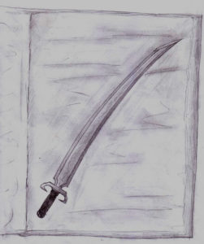

L’orda procedeva spedita sull’altopiano, in testa la jeep con il capo. I cavalli caricati di armi e uomini sollevavano nuvole di polvere, correndo sotto gli sproni dei cavalieri.

Kriss si trovava alla retroguardia, in sella all’enorme cavallo era di Theo, insieme a Smiurl. Gli altri due erano poco più avanti.

In quel momento Kriss stava pensando che mai aveva creduto che andare a cavallo potesse essere così frustrante. In effetti temeva che quando, e soprattutto *se* fosse sceso, qualcuno molto misericordioso avrebbe dovuto rimontarlo pezzo per pezzo. Nelle ossa aveva ogni scossone, e nelle orecchie le urla di quella massa di… (non sapeva neanche chi fossero), nonché quelle stridule di Smiurl, le quali stentava ad interpretare…

Dopo quella che sembrò essere un’eternità, il frastuono iniziò a scemare, i cavalli rallentarono e infine si fermarono sparpagliandosi lungo l’orlo di un canyon, che piuttosto improvvisamente tagliava loro la strada, una lunga ferita che tagliava quella vasta pianura rocciosa semidesertica.

Dalla sua posizione arretrata Kriss vide il capo saltare agilmente sul cofano della sua jeep. Un modello davvero raro, pensò Kriss, non riconoscendola in nessuna delle vetture da lui conosciute. Il capo attaccò a parlare.

“La *preda* giungerà qui al tramonto. Attaccheremo fulmineamente e li sconfiggeremo ancora prima che abbiano il tempo di allungare la mano a prendere una lancia!”

Un urlo si levò dalla marmaglia.

Cosa diavolo ci faccio in mezzo a questa gente? Si chiese Kriss. Un altro massacro stava forse per compiersi davanti ai suoi occhi? Strinse gli occhi come a negare la realtà che lo circondava, e dovette stringere forte anche la sua cavalcatura, perché l’animale iniziò a sbuffare e a scuotere il collo.

“Lascia andare Betty!” esclamò Smiurl da dietro le sue spalle, cercando di tirarlo verso di sé.

“Io e l’avanguardia” stava continuando il capo “ci apposteremo dietro quell’ansa; il resto di voi rimarrà in agguato qui e dall’altra parte, laggiù…” indicò alle sue spalle “Quando vedrete noi attaccare frontalmente, voi scenderete a rotta di collo a tagliare loro ogni via di fuga, possibilmente facendo un gran bel baccano del diavolo…” terminò con una risata.

“A presto!” salutò facendo un cenno con la mano come se stessero tutti andando a fare una gita al lago, mentre si avviava giù per la scoscesa parete del canyon rombando e sollevando un gran polverone, subito seguito da buona parte degli uomini a cavallo.

Kriss era ancora un po’ frastornato quando Corolla e Theo li raggiunsero.

“Piaciuto lo spettacolo?” esclamò Corolla sarcastica.

“Dobbiamo trovare un riparo” disse Theo.

Kriss non comprendeva.

“Che sta succedendo?” chiese.

“Succede che ci sarà una gran bella battaglia, come direbbe il capo” disse Corolla “ma non del genere che lui si aspetta. Troppo a lungo ha nutrito serpi di fra il suo seguito! Ora solo il tradimento otterrà in cambio…”

Kriss non capiva, di nuovo. Doveva essere evidente dalla sua espressione, poiché Corolla riprese a dire, con tono più mite:

“Ci sono molti nell’orda che si sono stancati della guida del capo. Pensa a Jeorghe: sono molti i tipi come lui, qua in mezzo…”

“Tutti tipi che ci ammazzerebbero volentieri!” esclamò Smiurl che fino ad allora era rimasto in silenzio.

“Ora…” riprese lei “…noi ci siamo accorti di ciò che sta accadendo, ma non ci è stato possibile avvertire il capo… Jeorghe e i suoi ci hanno impedito di avvicinarci… poi sei arrivato tu… insomma: ora non ci resta che nasconderci e sperare che non si diano troppa pena a cercarci”

Kriss annuì con la testa, fronteggiando l’impresa di assimilare ulteriori nodi indigesti di quella realtà assurda, senza capo né coda. Non riusciva neanche a chiedersi dove accidenti fosse finito, che posto fossequello, che razza di farabutti fossero quegli assassini e cosa stesse succedendo. Non riconosceva praticamente più nulla, si sentiva come se fosse diventato pazzo. Gli era difficile persino capire quello che gli dicevano, la lingua era distorta e certo dalle sue parti non parlavano così.

“Forse sto sognando” disse d’un tratto all’orecchio di Betty. Lei non rispose.

Si erano nascosti dentro una grotta naturale in una parete del canyon, in un punto dove non era possibile scorgerli dal basso dov’erano il capo con i suoi, ne dall’alto dov’erano gli altri.

Si prepararono ad attendere.

Il sole sprofondava lentamente e inesorabile, ansioso e tremulo, pronto ad essere inghiottito dalla profonda gola della notte, per cedere il passo alle sue miriadi di piccole emissarie. Bagliori alieni danzavano sull’orizzonte e i raggi più forti correvano l’ultima corsa scurendosi sempre più e trasformando la rossiccia pianura desolata in un enorme arazzo, e i soldati in sagome forse sognate.

Nemmeno il minimo rumore turbava la calma e il silenzio assoluti che ora regnavano; Kriss riusciva a sentire soltanto il battito del suo cuore e il flusso del sangue nelle orecchie. Per quello che ne sapeva, Theo, Corolla e Smiurl potevano anche aver smesso di respirare.

Scomparve ogni pallore crepuscolare, e le tenebre si fecero più fitte. Ad un tratto, ascoltando con la massima attenzione, Kriss avvertì un vago rumore. Sembrava proprio la carovana che stavano aspettando.

Il tempo sembrò rallentare ancora di più il suo cammino. Kriss poteva sentire i secondi scorrergli fra le dita come mercurio, liquido, passandovi faticosamente attraverso per poi cadere con insopportabile lentezza, quasi esitando, e spegnendosi poi a terra con un tonfo.

Ormai il convoglio stava passando proprio sotto di loro. Tenui e fugaci bagliori illuminavano le pareti del canyon. Kriss si sporse, insieme agli altri, per osservare. C’erano una decina di grossi trasporti, e molti cavalli montati dalla scorta. Delle luci erano appese sui carri merci, qualcuno trainato da cavalli e qualcuno a motore.

Ora l’attacco era imminente. E infatti non si fece attendere troppo. Improvvisamente si levarono delle urla dalla gola, che echeggiarono infinite volte sulle pareti rocciose confondendo l’orecchio. Si udì quindi il rumore acuto della jeep del capo, che subito divenne anche visibile, sbucando dal suo nascondiglio, seguita dall’avanguardia. La carovana si fermò bruscamente, e tutta la scorta si dispose intorno ai primi carri merci.

Appena l’orda iniziò a scontrarsi con la scorta dei mercanti un altro clamore ancora più alto iniziò a farsi sentire al di sopra di tutto il baccano, che permeava la gola come l’acqua in una bottiglia. Tutta la parte restante dell’orda piombò alle spalle del convoglio, chiudendo in una morsa mortale le forze nemiche.

Dopo pochi minuti passati come ore non rimaneva quasi più traccia dei difensori dei convogli.

Corolla ruppe il silenzio:

“Ascoltate, cos’è questo…”

Una cupa vibrazione andava crescendo molto rapidamente e rimbombava attraverso le rocce. All’improvviso si udì un acuta nota squillare per tutta la gola, e tutti i combattenti si fermarono, sorpresi. Iniziarono a guardarsi intorno.

Repentinamente lo squillo di quel misterioso strumento cessò, lasciando di nuovo la scena al silenzio. E silenziosamente i margini del canyon si riempirono di luci. Alcune piccole, altre più grandi, di tutti i colori. Sembravano fuochi fatui, tremolanti, che danzavano lentamente avanti e indietro. Kriss rabbrividì.

Poi, improvvisamente, l’oscurità della gola fu squarciata da un fascio luminoso, da riflessi di ogni colore dello spettro che accecò tutti, compresi Kriss e gli altri al riparo nella grotta. E a nulla serviva chiudere gli occhi; la luce sembrava arrivare direttamente nella mente.

Seguì un gran frastuono, cupo. Quando gli occhi di Kriss ripresero a funzionare, vide che quelle luci assalivano e massacravano l’orda ormai confusa, impotente.

Tutto avvenne molto rapidamente. Dopo pochi minuti già si stavano allontanando lasciando dietro di sé soltanto un silenzio di morte.

“Cosa diavolo?...” fece Corolla, esprimendo lo stato d’animo generale.

“Aspettiamo” disse Theo.

Rimasero nascosti ancora per qualche minuto, finché furono sicuri di non udire più alcun rumore, dopodichè uscirono allo scoperto. I carri merci giacevano ormai abbandonati, e le loro fiaccole ancora illuminavano la zona.

Discesero verso la zona della battaglia, incontrando sempre più frequentemente i corpi dei caduti.

Videro del fumo alzarsi da dietro un masso, e corsero lì. Dietro c’era la jeep, la cui tappezzeria alimentava il fuoco.

“Il capo!” esclamò Smiurl.

In effetti, era il capo, appoggiato al parafango posteriore. Doveva essere in fin di vita, poiché stava perdendo molto sangue da una vistosa ferita al petto. Corolla, Theo e Smiurl rimasero impalati dinanzi a quella scena, non sapendo bene come comportarsi. Kriss invece si avvicinò. Il capo alzò gli occhi e vedendolo riuscì nonostante tutto a sogghignare.

“Forse eri veramente una spia…” tossì, sangue alla bocca. Poi vide gli altri tre e comprese “Dovevo aspettarmelo…”. Sospirò rauco, e con un ultimo sforzo alzò gli occhi verso Kriss e iniziò a dire:

“Almeno potreste vendicar…” ma le parole gli morirono sulle labbra, insieme al suo ultimo respiro.

Rimasero un po’ a contemplarlo. Kriss non riusciva a reagire di fronte a quella morte. Poi, dopo alcuni istanti, senza neanche rendersene conto, si ritrovò ad avanzare verso di lui. Si sentiva come se fosse proiettato fuori dal suo corpo e qualcun altro stesse in effetti muovendo i suoi muscoli. Si abbassò sul morto, e vide distrattamente che le proprie mani slacciavano la sua cintura. Un istante dopo si ritrovava con la sua spada fra le mani, rivolta al cielo, fissando la lama che mandava sinistri bagliori.

Smiurl nel frattempo si era tutto ritirato su se stesso, acquistando una tinta brunastra. Theo invece era tornato impassibile come sempre. Corolla sembrò approvare il gesto di Kriss. Si avvicinò anche lei e prese la catena del capo, che giaceva ora a terra.

Improvvisamente Kriss tornò in sé, avvertendo di nuovo la terra sotto i suoi piedi, l’aria che gli soffiava contro, gli sguardi dei compagni, e il possente peso della spada, troppo lunga e pesante per essere brandita con una mano sola. Subito la poggiò a terra, appoggiandovi poi il proprio peso.

“Qualcosa non va?” fece Corolla, poggiandogli una mano sulla spalla.

“Eh?... Credo… Credo di no…” rispose Kriss.

Ma in verità non capiva ancora cosa fosse successo.

“Ci accampiamo qui, fino al mattino” sentenziò Theo.
