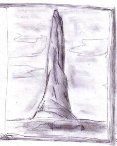

“Scusa, Kriss, ma… come facevi a sapere che… proprio questa era la direzione da prendere?...” stava dicendo Smiurl mentre litigava con le cinghie del suo zaino, grande il doppio di lui.

“Uh?” era soprappensiero “Non so… istinto” disse sorridendo al nano con un’alzata di spalle.

Corolla intanto lo osservava di sottecchi. Theo la vide e gli disse:

“Certo hai del fegato…”

“E perché? Cosa mai ci sarà di così *terribile*? E’ solo una città, e noi andiamo in pace! Quindi non vedo proprio…” si interruppe vedendo che Theo aveva distolto lo sguardo e sospirato, fissando in silenzio il terreno ai suo i piedi.

Il passaggio scorreva lentamente intorno a loro, piatto e rossastro, senza alcun segno di vita a parte alcune lucertole che al loro arrivo guizzavano fra le rocce per andarsi a nascondersi. Il sole era alto e picchiava sulle loro teste, e non prometteva nulla di buono: secondo Smiurl Ayonn distava circa dieci giorni di cammino. Kriss non credeva di poter camminare per dieci giorni in quel deserto senza trovare almeno una sorgente d’acqua potabile.

Senza parlare del fatto che avevano provviste per tre, massimo quattro giorni. Alla sua domanda su come avrebbero fatto, Theo rispose semplicemente:

“Vedremo… Forse cacceremo un po’”

Kriss guardò sconsolato una di quelle lucertole scomparire all’ombra delle pietre. Come se ci fossero prede appetibili… Scosse il capo, tergendosi poi il sudore dalla fronte. Il peso del suo zaino cominciava a farsi insistentemente sentire, ora che portava anche quella grossa spada – aveva insistito per portarla lui. Se ne stava quasi pentendo, ma qualcosa lo spingeva a non separarsene. La sentiva come la *sua* spada, l’aveva presa al capo, e non significava niente per lui che fino al giorno prima non gli apparteneva e che anzi non ne aveva mai neanche vista una da vicino.

Con questi pensieri in mente, quando si fermarono a riposare Kriss estrasse la spada dal fodero, per esaminarla da vicino.

Era molto lunga, e veramente pesante. Ma era perfettamente bilanciata. Il lungo manico sembrava fatto di qualche metallo scuritosi col passare del tempo, ma al tatto dava una sensazione completamente diversa. Era come se si adattasse perfettamente alle sue mani, come se fosse vivo: non era né freddo né rigido. Eppure era assolutamente duro e impossibile da scalfire. Kriss scrollò le spalle sconfitto e prese ad esaminare la lama.

Era a doppio taglio e si allargava dalla traversa raggiungendo quattro dita circa di larghezza e più o meno tre centimetri di spessore alla base. Si assottigliava sempre più verso la punta, che era stranamente asimmetrica, come se il fabbro avesse voluto riprodurre l’effetto di una lama spezzata, scheggiata e quindi riaffilata come un rasoio. Kriss non aveva mai visto una lama così. Inoltre era leggermente ricurva, dalla base alla punta, di qualche centimetro. Sembrava impossibile usare un’arma di quel tipo. Non riusciva a concepirne l’utilità in battaglia. Eppure, impugnandola, avvertiva la sensazione che il suo braccio divenisse un tutt’uno con la spada, e che questa non era affatto goffa o sbilanciata nei movimenti.

Anche il metallo della lama era strano, agli occhi. Riluceva in maniera irregolare, come se la sua struttura molecolare subisse continue variazioni. Ora Kriss ci si poteva specchiare, ora i riflessi sembravano nuotare o evaporare in direzioni diverse, come soggetti ad un’improvvisa e impossibile turbolenza. Fissandola a lungo la lama sembrava muoversi impercettibilmente avanti e indietro, come fosse viva, eppure al tatto il metallo era freddo e compatto. Inoltre sembrava di intravedervi su incisa una specie di iscrizione, per tutta la sua lunghezza, ma non si poteva esserne sicuri.

Infine rinunciò a cercare di capire come funzionasse, sospirò e alzò lo sguardo. I suoi compagni lo fissavano. Non si era accorto che avevano smesso di parlare, mentre lui era rapito dal suo esame.

“Che succede?”

“Sei stato un sacco di tempo in contemplazione…” iniziò a dire Corolla.

“Sembravi in trance” la interruppe Smiurl.

“…sembravi stare da un’altra parte, completamente estraniato… sicuro di sentirti bene?” terminò lei.

“Certo! Mai stato meglio…” non era sicuro che fosse vero, ma non sentiva di avere niente fuori posto.

“Meglio così” sospirò lei. Poi raccolse le sue cose e disse:

“Sarà meglio rimetterci in cammino. La strada è lunga.”

Fu nel primo pomeriggio che il panorama presentò la prima significativa novità. Davanti a loro, un po’ spostato verso sud, si ergeva una specie di pinnacolo di roccia. A giudicare dalla distanza sembrava essere molto alto e imponente.

“Quello cos’è?” chiese Kriss.

“Un pezzo di roccia come un altro” Smiurl alzò le spalle a quella domanda così ingenua. “Siamo nel deserto, non c’è niente a parte il sole e le rocce…”

Kriss tornò a scrutare il profilo lontano. Non riusciva a smettere di fissarlo. Percepiva qualcosa di strano, che non riusciva a spiegarsi. Camminava e continuava a tenere gli occhi fissi alla cima. Era una sensazione molto vaga, e si domandò se in effetti non fosse uno scherzo della vista: la roccia sembrava come muoversi, o emanare un debole chiarore, (forse il sole aveva sovra-stimolato la sua retina) o addirittura dei rumori appena percettibili.

“Ehi!” esclamò Smiurl all’improvviso, facendo svanire l’incanto.

“Eh?...” fece Kriss riscuotendosi.

“Ti eri fissato… Saranno stati dieci minuti buoni che continuavi a camminare come un fantasma, fissando il vuoto…”

“Dieci minuti?...” gli erano sembrati pochi secondi.

“Qualcosa non va?” chiese Corolla.

“Ehm… no… Cioè sì. Non so spiegare… Non so neanche se me lo sono immaginato…”

Rimasero un po’ in silenzio, guardandosi l’un l’altro, a turno.

“Forse sei ancora scosso…” iniziò a dire lei, ma lui la interruppe bruscamente.

“Voglio vederci chiaro. Andiamo al picco” disse risoluto.

Corolla interrogò Theo con lo sguardo. Lui disse:

“Ne sei sicuro? Abbiamo scarso cibo, e una lunga deviazione potrebbe esserci fatale. E’ proprio necessario?”

Kriss lo fissò in quagli imperturbabili occhi color del cielo.

“Credo di sì”

“Allora è deciso” concluse semplicemente il gigante.

Al tramonto erano giunti in prossimità della parete rocciosa. Il picco si era rivelato molto più ampio – una vera e propria montagna – e altrettanto più alto di quanto sembrava. Una specie di torre naturale nel centro del deserto.

“Non credi che dovremmo accamparci qui?” fu la proposta di Corolla quando vide Kriss scrutare bramoso la parete quasi verticale.

“Io sono stanco…” si lamentò Smiurl “E’ tutto il giorno che camminiamo…”

Kriss continuava a guardare il picco. Infine disse:

“Io non posso aspettare una notte qui sotto, non dormirei. La mia… “sensazione” ora è così forte che non mi farebbe dormire. Devo salire ora. Se volete, potete aspettarmi qui…” senza nemmeno voltarsi si avviò verso le rocce.

Non riusciva nemmeno lui a capire cosa lo spingesse tanto ad arrampicarsi su quell’enorme sasso aguzzo, ma ciò non toglieva che ormai non poteva più farne a meno.

Cominciò ad avere il fiato corto: la rupe era ancor più grande di quanto sembrava dal basso. Ma non pensò neanche per un attimo di lasciare la pesante spada. Si voltò a guardare la strada fatta – troppo poca – e poté cedere che gli altri lo stavano seguendo, pochi metri più in basso. Ciò lo rassicurò, e tornò ad arrampicarsi.

Continuarono così a lungo, in silenzio.

La luce diminuiva sempre più, e vagamente Kriss si chiese come avrebbero fatto a proseguire al buio o a fermarsi a riposare senza precipitare.

D’istinto si voltarono, restando appesi alla roccia: il sole era già sceso parzialmente sotto l’orizzonte. L’atmosfera era pervasa da quella strana luce arancione che Kriss aveva già notato la sera prima – era passato solo un giorno! Dalla parte opposta il cielo diveniva bruscamente nero, cominciando a mostrare alcune costellazioni.

Il sole continuava a gemere e tremare mentre scendeva sempre più velocemente verso la notte. Da quella posizione l’orizzonte mostrava segni di cambiamento: c’erano dei rilievi, e Kriss era sicuro che non potevano essere desertici come la piatta distesa che finora avevano attraversato.

Si riscosse, vedendo che gli altri avevano ricominciato la salita. Dovevano affrettarsi per sfruttare gli ultimi minuti di luce crepuscolare.

La parete rocciosa sembrava non finire mai e farsi sempre più liscia, difficile da scalare. Nessuno parlava, tentando di risparmiare anche le più piccole energie. Kriss alzava meccanicamente le mani e le gambe guadagnando ogni volta preziosi centimetri. Quasi non si accorse che ormai erano immersi nella tenebra, anche perché cominciava a vedere tanti puntini luminosi accumularsi ai bordi del suo campo visivo, a causa dello sforzo prolungato. Ora doveva affidarsi interamente al tatto per cercare l’appiglio successivo. Ogni movimento era un incubo di tenebra con la promessa di una lunga e mortale caduta. La paura lo attanagliava, e il tempo sembrò dilatarsi facendogli pensare che non ce l’avrebbero mai fatta, che sarebbero morti senz’altro e che era solo colpa sua. La frustrazione gli diede la forza di procedere ancora, e ancora, finché la parete non terminò bruscamente. La sua mano annaspò in cerca di un appiglio, poi Kriss capì che poteva salire su quella sporgenza con tutto il corpo, proprio mentre rischiava di perder e l’equilibrio.

Riuscì a tirarsi su, e si sdraiò con la faccia a terra. Dopo aver ripreso fiato iniziò a ridere. Dapprima piano, quasi sogghignando, poi sempre più forte, in un crescendo che lo fece piegare in due con le lacrime agli occhi, e quando tacque una stranissima eco gli rifece il verso per mezzo minuto. Nel frattempo gli altri tre lo avevano raggiunto. Nell’udire quei suoni provenire dalle rocce, Smiurl iniziò a lamentarsi e a emettere gridolini spaventati.

“Questo posto è infestato dagli spiriti!... Poveri noi! Moriremo di certo!”

Si trovavano su una specie di terrazza naturale, alla luce delle stelle ne erano appena visibili i confini.

“Piantala, Smiurl!” sbottò Corolla. Ma Smiurl non le diede ascolto. Dopo qualche secondo, mentre il nano ancora gemeva, dei bagliori iniziarono a danzare intorno a loro, vestendo le pareti rocciose di quell’anfratto di orribili maschere e grottesche figure.

“Cos’è questo rumore?” chiese Kriss udendo un rumore secco e ripetitivo.

“Sono i denti di Smiurl…” rispose Corolla in tono di disapprovazione.

“Smiurl, mi meraviglio di te!” esclamò Kriss, un po’ per non farsi contagiare dal terrore “Pensavo fossi un valoroso! Sei capace di affrontare bestie come quel Jeorghe, e poi tremi davanti a…” e indicò tutt’intorno a loro.

Smiurl rispose, cercando di non mordersi la lingua:

“Un conto è combattere con uomini o animali, un altro è affrontare uno spettro! E qui sembra che ce ne siano a legioni!!” terminò strillando con terrore e indicando le luci intorno a loro che mano a mano andavano crescendo di intensità.

Kriss rimase un po’ a guardarsi intorno con apprensione. Ad un certo punto si accorse di Theo: rimaneva impassibile come sempre, come fosse placidamente seduto nella sua tenda.

“Cosa facciamo?” gli chiese, nervoso.

Theo indicò dinanzi a loro, sulla sinistra, e disse:

“Pazienza. Se non sbaglio, fra poco dovremmo incontrare lo spettro di Smiurl…”

Kriss si voltò per cercare di discernere qualcosa in quella danza di luci e d’ombre che non dava tregua all’occhio.

La luce continuò a salire d’intensità: ormai si potevano vedere bene il ripiano roccioso su cui si erano fermati, confinante col vuoto del precipizio per una sottile linea. Si vedeva chiaramente che proveniva proprio dalla direzione indicata da Theo.

All’improvviso, da dietro una roccia spuntò un uomo, con una torcia in mano, facendo trasalire tutti, tranne Theo.

Indossava una lunga tunica bianca, e aveva dei corti capelli, ricci, neri.

L’uomo parlò, e disse:

“Salve Smiurl, Kriss, Theo e Corolla, e benvenuti. Eravate attesi alla Rocca del Telepate. Se volete seguirmi nel passaggio… Io sono Math” disse facendo un mezzo inchino.

Gli altri quattro rimasero di sasso. Dopo una ventina di secondi che Math attendeva sorridente, solo Kriss disse una parola:

“Ciao…”
