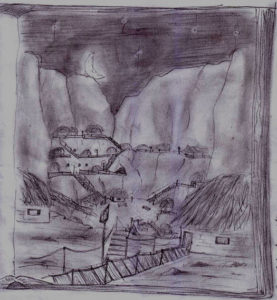

Camminavano in fila indiana dietro quel Math che li stava conducendo chissà dove attraverso un contorto e angusto sentiero scavato nella roccia, che spesso diveniva un tunnel. Era un percorso piuttosto in salita, e dopo una mezz’ora cominciarono ad avere il fiato grosso.

“Rocca del Telepate…” mormorava pensierosa fra sé Corolla “Ne sai qualcosa?” Theo scosse la testa.

“Perché non lo chiediamo a lui?...” propose Kriss.

“Non mi fido! Questo posto è maledetto! Non ne usciremo vivi!...” Smiurl ricominciò a lagnarsi.

Apparentemente sordo ai loro discorsi, la voce di Math continuava a guidarli poco più avanti – “Prego, da questa parte” – ad ogni biforcazione. Dopo un’ora circa di arrampicata il sentiero terminò brusco dopo una curva e uno spettacolo sorprendente si presentò ai loro occhi.

Erano in un incavo della rupe, sicuramente sulla cima, quasi come il cratere di un vulcano. Era un vasto spazio riempito di case e strade, sentieri e camminamenti sospesi. Centinaia di fori costellavano le pareti rocciose, portando chissà dove. Gentili luci illuminavano le strade più importanti, e altre luci filtravano dalle finestre delle abitazioni dalla curiosa forma sferica, fatte di mattoni di argilla e paglia, probabilmente. Si sentivano curiosamente osservati.

Si riscuoterono quando Math riprese a camminare. Lo seguivano in silenzio, e i loro passi risuonavano sulla pietra. Tutto taceva, ma l’atmosfera sembrava permeata, al limite dell’udibilità, di un sottile canto, un sussurro melodico di tante e nessuna voci che sembrava andare e venire come trasportato dal vento. Però l’aria era calmissima.

Le luci lungo la via principale erano enormi fiaccole che emanavano anche un discreto calore. Scintille si levavano verso l’alto, trasportate dall’aria calda, danzando intorno per poi spegnersi nel buio. Anche qualche abitante cominciava a farsi vivo, qualcuno lungo la strada, altri affacciati alle finestre, li guardavano tutti all’incirca con lo stesso moderato interesse.

Si ritrovarono fermi ai piedi di una collinetta

“Questa è la casa dell’anziano, saggio Long. Vi sta aspettando”

Lo guardarono tutti, a più riprese, non realizzando che in effetti li stava invitando a entrare.

Dopo un po’ l’idea filtrò nelle loro coscienze, e senza aggiungere altro decisero di avviarsi in fila indiana verso la porta di questo anziano dal nome familiare. Sicuramente doveva essere il capo di quel villaggio…

“Chiunque sia questo ‘anziano’, almeno saprà dirci come scendere da quassù…” disse Kriss conciliante forse più a sé stesso che agli altri che erano troppo occupati a guardarsi intorno per preoccuparsi di simili sciocchezze. Poi aggiunse, a mezza voce “…forse saprà dirci anche perché, ci siamo venuti, quassù…”

“Certo non è granché…” esclamò Corolla, arrivati dinanzi all’uscio dell’abitazione. Forse si aspettava qualcosa di più, in riferimento alla posizione sociale dell’occupante. Ma la casa era semplicemente un po’ più alta di quelle ad essa più vicine… Più lontano ce n’erano altre ben più grandi e in posizioni più prominenti.

Dall’interno filtrava una flebile luce tremula, sicuramente proveniente da qualche candela. Improvvisamente, tutti e quattro udirono una voce calda e ferma invitarli:

“Entrate, prego”

La voce sembrava provenire proprio da mezzo a loro, al massimo a un metro di distanza. Si scambiarono alcune occhiate perplesse. Smiurl si era rannicchiato a terra e dava le spalle alla porta. Infine Theo decise per tutti ed entrò deciso, scostando la leggera porta di legno sui cardini scricchiolanti.

Si trovavano in una specie di corridoio angusto, dalle pareti in qualcosa che ricordava vagamente il bambù, con vari disegni appesi. Ai lati si intravedevano, fra le ombre, dei piccoli e bassi mobili, con parecchi oggettini sopra. La luce sembrava provenire da un’estremità del corridoio. Ora non sembrava più una candela. Pareva ora azzurrina, ora verdastra… Si diressero, diretti da Theo, da quella parte. A Kriss pareva di riuscire a sentire il tremore emesso da Smiurl. Provava una strana sensazione di irrealtà. Si sorprese, dopo un secondo, a stringere convulsamente l’elsa della spada. Era una reazione istintiva, pensò. Non so neanche come usarla, pensò.

All’improvviso il corridoio finì, e repentinamente la luce si abbassò, lasciando il posto al chiarore più naturale di alcune candele. C’era un vecchio seduto in poltrona, che dava loro le spalle. Si capiva che era vecchio dalla massa di capelli argentei che gli scendevano lungo le spalle. Lentamente si girò, e con la stessa voce che avevano udito all’esterno disse:

“Sedetevi, prego. Ho appena finito di preparare il tè.”

Kriss ubbidì per primo. Sentiva di potersi fidare di quel vecchio. Leggendo i suoi pensieri, il vecchio lo guardò e disse:

“Attento, ragazzo. Non fidarti mai del tutto… Non è detto che tu non abbia niente da temere da un povero vecchio…” ma non aveva mosso la bocca. Lo aveva semplicemente fissato. Le parole gli erano sgorgate direttamente nella mente. Ora iniziava a capire il significato del titolo ‘telepate anziano’… Ma non riusciva comunque ancora a crederci. Così rimase seduto sulla poltroncina di vimini a guardare quel vecchio a bocca semiaperta, alla cui vista anche Smiurl sembrò riscuotersi.

“Lo sta ipnotizzando! Aiuto!” strillò, e fece per fuggire, ma, a uno sguardo del vecchio, Theo allungò un braccio e lo acchiappò per il collo, sollevandolo poi da terra, senza mai staccare gli occhi da quello sguardo. Poi il vecchio passò a guardare Smiurl e sorridendo affabile disse:

“Tranquillo piccolo Smiurl. Non vi accadrà niente di male.”

Misteriosamente, Smiurl sembrò accettare quella spiegazione. Neanche pensò al fatto che lo aveva chiamato per nome senza che prima lui si fosse presentato. Ormai era troppo sotto shock.

Corolla si sedette vicino a Kriss, trascinando seco Smiurl, mentre Theo rimase in piedi presso di loro. Poi lei disse:

“Caro vecchio telepate anziano, dove siamo?”

Lui osservò con espressione divertita il suo sguardo acceso. Poi, sempre ridacchiando, si riaccomodò nella sua poltrona, girandola verso gli ospiti.

“Detto fatto: benvenuti alla Rocca del Telepate.”

Theo sospirò. Poi disse:

“Ce lo ha già detto… Math” con un cenno del capo verso l’esterno dell’abitazione.

“Ma, in effetti, non c’è altro da aggiungere” disse il vecchio, a bocca chiusa. Ormai Kriss si era già abituato. Rispose, ad alta voce:

“In che senso?”

“Oh, scusate!” esclamò il vecchio “penso sempre ad alta voce! Forse è il caso che vi racconti la storia di questo posto, vedo che non la conoscete…” e continuò a parlare.

La Rocca del Telepate doveva il suo nome al suo fondatore chiamato “Il Maestro”, ultimo maestro psichico dell’università di Noi-Hert. Dopo qualche decina di anni la fuga dei terrestri, fuggì dalla sua città ormai in crisi, dilaniata da lotte interne. Si rifugiò su questo angusto ma superbo moncone di roccia, che si ergeva solitario allora come oggi al centro del Grande deserto.

Al sicuro dalle orde, creò una comunità che continuò ad insegnare le arti psichiche a tutti i suoi componenti. Vivevano di poco: allevavano animali dalla pelle coriacea che passavano periodicamente ai piedi della Rocca, e di un’erba dalla quale era possibile ricavare una strana e fine farina, che cresceva ovunque trovasse un grammo di terra. L’acqua era assicurata da un pozzo profondo chilometri (così disse il vecchio) che scendeva attraverso tutta la Rocca fino al sottosuolo.

Il più anziano e esperto telepate della comunità veniva automaticamente nominato “telepate anziano”, titolo che identificava l’autorità nel villaggio, alla morte del suo predecessore, avvenimento comunque sporadico, visto che avevano una vita media di duecento anni (così disse il vecchio).

Il vecchio fece una lunga pausa sorseggiando il suo tè prima di riprendere a parlare. Poi, ripreso fiato, disse:

“Vi ho fatti subito portare qui perché, dovete sapere, vi stavamo aspettando.”

“Riuscite a vedere da qui chi attraversa il deserto?” fece incredulo Kriss.

“Certo!…” e guardò un attimo davanti a sé sorridendo. Poi cambiò bruscamente espressione “Ma no, no! Sciocco, vi stavamo aspettando da secoli. Cioè:…” e si accomodò meglio sulla poltrona. “…qualche anno fa, poco dopo che ero stato nominato ‘telepate anziano’, mi trovavo nella biblioteca sotterranea, accessibile solo agli anziani, dal momento della loro nomina fino alla loro morte.” Sorrise. “Stavo esaminando niente meno che le memorie del Maestro quando mi imbattei in un racconto di uno strano sogno. Raccontava di una splendida ragazza dai capelli d’oro che gli appariva e lo avvertiva che nel futuro la sua comunità avrebbe dovuto accogliere un gruppo di visitatori, un ragazzo, un nano, un uomo e una donna, menzionando ora e luogo di apparizione. A dir la verità mi ricorda una vecchia leggenda terrestre…” la sua voce si spense e prese a guardare il vuoto. Poi si riprese e disse:

“Ecco, ora vi è chiaro che parlava di voi. Nel diario del Maestro ci è comandato di darvi ospitalità e assistenza, e potete contare che assolveremo al nostro dovere.”

Nessuno fece in tempo a pronunciare domanda alcuna che il vecchio si alzò e disse:

“Probabilmente sarete stanchi. Math, accompagnali ai loro alloggi.”

Math comparve dal nulla, dal corridoio, e li scortò fino a una casa lasciata libera da una certa Efeliah, disse, e, sdraiatisi su quei letti, quasi fossero i più comodi che avessero mai provato, si addormentarono di sasso e dormirono dodici ore.

Furono svegliati dal movimento del villaggio.

“Che ora è?” chiese Kriss con voce impastata dal sonno. Smiurl era già in piedi, e sedeva sul letto. Gli rispose:

“Il sole è alto, ormai. Sarà mezzogiorno…” e alzò le spalle. Poi indicò, pensando che Kriss ne avesse bisogno, il bagno e soggiunse “Theo è in bagno.”

Un mucchio di coperte si mosse sul letto di Corolla e ne emerse una voce, attutita:

“Ci sono prima io!” poi dopo un po’: “…che fame!…”

Ricordandosi del suo stomaco, Kriss ebbe la spiacevole sensazione di averci un buco dentro. Sensazione poi accentuata dal delizioso odore di carne arrosto che si propagava nell’aria.

Theo uscì dal bagno e disse:

“Il pranzo è quasi pronto.”

Nella piazza principale del villaggio c’era una sorta di grande braciere centrale, su cui era collocata un’immensa graticola, che a Kriss ricordò con un brivido quelle usate per uccidere i martiri… Pensiero subito scacciato alla vista di ciò che vi era posto a cuocere. Una dozzina di masse sgocciolanti di grasso erano infilzate e girate lentamente, costantemente, dai cuochi. Kriss pensò di morire.

Istintivamente accelerarono il passo. Furono subito recuperati da Math e una giovane donna.

“Buongiorno. Spero abbiate riposato a sufficienza”

Corolla sorrise e rispose, con un leggero inchino:

“Certo. La vostra ospitalità è deliziosa.”

“Vorrei presentarvi Efeliah. Si è offerta di fornirvi l’alloggio.”

La giovane donna che era con Math fece un passo avanti. Era leggermente più alta di Corolla (Kriss notò che in quel villaggio erano tutti molto alti). Aveva capelli biondi che scendevano mossi fino alle scapole, e occhi di un verde stupendo. Come Math, indossava una semplice tunica, chiara.

“E’ un piacere per me accogliervi a nome di tutto il villaggio.” Disse dopo essersi inchinata al gruppo.

“Ma ora vogliate seguirmi, il banchetto è quasi pronto, e suppongo siate affamati...” fece una pausa scrutandoli con gli occhi leggermente socchiusi “… e vedo che non mangiate da ieri mattina... Prego.” Concluse facendo cenno di seguirla e dirigendosi insieme a Math verso un lungo tavolo apparecchiato, al centro dell’unica modesta piazza del villaggio.

Li seguirono.

Arrivati al tavolo, furono invitati a sedersi intorno al telepate anziano, che già si era posto a capotavola. Anche Math ed Efeliah si disposero vicino a loro.

Appena furono comodi, arrivò un cameriere con la prima portata.

“Questo è per il signor Smiurl” disse. Depositò il vassoio d’argento davanti al nano e lo scoperchiò. Dopo una frazione di secondo di incredulità Smiurl diede in un vero e proprio lampo di felicità, esclamando:

“Frutti di sabbia all’‘Occhio di Croegg’!” impaziente, infilò un dito nella salsa rossastra e assaggiò “…uhmmmm…. Squisita! Questa è vera salsa Ghermina!”

Kriss lo stava fissando, stupito. Mentre il nano mangiava, continuava a illuminarsi come una lucciola passando dal giallo al blu, con intermittenza. Fu riscosso dallo stesso inserviente che stava mettendo dinanzi a lui un altro vassoio. Istintivamente chinò leggermente il capo, come per sbirciare nella fessura fra il vassoio e il coperchio. Poi il coperchio fu bruscamente tolto, mentre il cameriere annunciava:

“Per il signor Kriss, ‘braciole alla terrestre’!” dal tono, si capiva che tutti i cuochi erano orgogliosi della realizzazione di quel piatto.

In effetti, a Kriss non sembrava molto diverso dalla carne che cocevano sul barbecue in giardino o dallo spezzatino con salsa al pomodoro che la madre preparava ogni tanto, con le patate. Al ricordo improvviso di quei momenti, Kriss fu assalito da un’ondata di tristezza e malinconia. Fino a quel momento non aveva avuto un secondo libero per ricordare la sua casa, che pure aveva lasciato da soli tre giorni, circa.

Math notò, più che la sua espressione, i suoi pensieri, e disse, per riportarlo al presente:

“Cosa c’è? Il piatto non è di tuo gusto?” a quelle parole subito il cameriere si rabbuiò preoccupato.

Kriss si riscosse, alzò lo sguardo a incontrare quello di Math e disse:

“No, no, tranquilli. Sono sicuro che sia ottimo…” disse afferrando un arnese alla sua sinistra che con ogni probabilità era una posata, affondandolo poi nella portata, infilzando un grosso e succulento pezzo di carne. Se lo cacciò in bocca, masticandolo vigorosamente. Dopo qualche secondo tornò a guardare Math e il cameriere, emulando un sorriso per quello che la bocca piena gli permetteva e disse:

“*Infati*…” cercando di non farsi cadere niente addosso. Si misero tutti a ridere, incluso Theo. Quando poté permetterselo senza rischiare di strangolarsi, anche Kriss si unì a loro.

Finito il luculliano pranzo, a pomeriggio inoltrato, si ritirarono tutti nelle proprie stanze. Per quel giorno le normali attività lavorative erano state sospese.

“Se volete ora potete andare a risposare” disse Efeliah che li stava riaccompagnando al loro alloggio.

“Grazie, credo proprio di averne bisogno” fece Kriss. Efeliah rise. Poi aggiunse:

“Bene, allora! Ci rivedremo stasera, il…” cambiò tono ed espressione “…‘vecchio’ ha qualcos’altro da dirvi…” e se ne andò con un sorrisetto che non riuscirono a interpretare.

La sera venne in fretta. Kriss e gli altri stavano riposando, e non poterono vedere la notte che trafugava ancora una volta il sole.

Apparve la luna. Quando Kriss la guardò si rese conto che era la prima volta che la vedeva. Era una falce sottile nel cielo, e aveva una sfumatura leggermente diversa da quella terrestre. Inoltre sembrava anche un po’ più grande.

Tornando a rivolgere l’attenzione al villaggio vide che c’era un certo movimento. Le fiaccole erano state riaccese, ed altre erano state radunate presso la piazza.

Uscirono per andare a curiosare. Dopo l’impeccabile ospitalità ricevuta, Smiurl si era decisamente calmato e rabbonito, comunque non era molto loquace. Mentre camminavano per la strada non c’era anche solo una persona che non si voltasse a salutarli sorridendo con un leggero inchino. Stavano per iniziare anche a sentirsi vagamente a disagio, quando giunsero alla piazza.

L’area era illuminata chiaramente dalle grandi fiaccole lì radunate. Erano stati allestiti delle specie di buffet. Dopo il banchetto nessuno osava pensare a qualcosa che fosse cibo, ma certo dei rinfreschi e drinks sarebbero stati graditi a tutti.

Si avvicinarono a uno dei banchi, e subito l’addetto li riconobbe, sorridendo loro.

“Desiderano?” chiese.

“Non so” prese Corolla la parola “tu cosa ci consigli?”

“Oh, vi assicuro che qualunque cosa vedete è squisita… Comunque io prediligo i cocktail a base di Martee’nee al Pinzerro”

“Cosa hai detto?! *Martini*?” esclamò Kriss.

“Sì. E’ una ricetta molto antica, ma…”

“Incredibile…” fece Kriss guardando nel vuoto (pensando poi, ai margini della coscienza, “ma come lo ottengono?”).

“Oh, eccovi.” Era Efeliah che sopraggiungeva dalla strada che avevano percorso poco prima.

“Volete seguirmi? Per bere avremo tempo dopo” disse gentilmente, prendendo Kriss sottobraccio.

Si avvicinarono a una specie di palco, eretto su un lato della piazza.

“Stasera il ‘vecchio’…” disse Efeliah di nuovo con quel tono ironico “…parlerà”.

Arrivò anche Math.

“Salve” disse “Il rinfresco è di vostro gradimento?”

“A dir la verità siamo appena arrivati, ed Efeliah ci ha subito rapiti…” rispose Corolla, sorridendo.

“Ha detto che il vec… ehm…” Kriss riuscì a correggersi in tempo “…l’anziano telepate farà un discorso, stasera. Di cosa parlerà?” chiese.

Math distolse lo sguardo e prese a farlo vagare con una strana espressione… A Corolla sembrò che si stesse sforzando di non mettersi a ridere. Poi Math rispose, e disse:

“Credo voglia farvi una sorpresa…” ma mentre pronunciava quelle parole con la voce, Kriss udì distintamente la stessa voce dire, o meglio, pensare:

“…Di noi/voi…”

Istintivamente si voltò verso gli altri. Non sembravano essersene accorti. Corolla vide la sua espressione e gli chiese:

“Tutto a posto?”

“Ehm… Sì… Credo, sì.” Rispose Kriss, poi sorrise vagamente imbarazzato e per dissimulare si voltò a guardare la piazza. Alzò lo sguardo, e vide la casa del telepate anziano. Alla finestra era affacciato il “vecchio”. Kriss ebbe l’impressione che stesse guardando proprio lui.

“Infatti…” rispose il vecchio, con la solita “voce”. Kriss non poté fare a meno di sorprendersi ancora una volta. Cominciò a dubitare di potervisi mai abituare.

“Ma qual è il problema” pensò poi “Tanto prima o poi ripartiremo, e non incontrerò più questi tipi… non che mi dispiacciano… però…”

“Io non ne sarei così sicuro” rispose il vecchio Long, che nel frattempo aveva iniziato a scendere verso la piazza.

Kriss si voltò di scatto verso Long, guardandolo con aperta espressione di risentimento. Non era entusiasta del fatto che qualcuno controllasse i suoi pensieri.

Per pensare ad altro tornò a rivolgere l’attenzione al suo gruppo. Notò sorpreso che Smiurl stava parlando con Math.

“Come fate a far parlare i pensieri? Quali sono i vostri incantesimi?” stava chiedendogli.

Math rise. Disse:

“Non sono magie. Come disse il Maestro…” e assunse una posa leggermente più solenne “la telepatia è una facoltà implicita, e latente alla nascita, della mente umana. Naturalmente, come ogni capacità deve essere esercitata, anche questa necessita di studi e sforzi.” Smiurl aveva un’espressione decisamente incredula. Math continuò:

“Vedi, quando pensi a qualcosa, quando parli, qualsiasi cosa tu faccia, nel tuo cervello hanno luogo con una serie di reazioni chimiche… Queste emettono una certa quantità di energia. Una mente addestrata riesce a discernere il senso di queste emissioni, ecco tutto…” Math aveva la classica espressione del maestro che spiega all’iniziato un concetto in parole così povere da essere quasi comiche ai suoi occhi di esperto.

A beneficio degli altri, aggiunse:

“Questi impulsi viaggiano, oltre che in quelle standard, anche in una dimensione particolare dell’universo, che non è raggiunta dalle altre onde ed energie. Gli impulsi mentali sono molto deboli in confronto alle radiazioni naturali, e ne sarebbero soffocati”

Kriss era affascinato. Sembrava proprio la spiegazione di uno dei personaggi di quei libri di fantascienza che aveva letto, quando era ancora sulla Terra.

A quel forte pensiero di nuovo doloroso, Math ed Efeliah si voltarono verso di lui proprio come se avessero udito un forte rumore. Kriss sorrise. Forse poteva abituarsi, pensò.

“Buonasera, abitanti tutti e anche voi ospiti” aveva attaccato brusco Long dal palco quando nella piazza era sceso un po’ di silenzio. Parlava a voce bassa, e allo stesso tempo irradiava i suoi pensieri. C’era gente infatti che seguiva il discorso affacciati alle finestre delle case nei paraggi.

Raccontò con molti più particolari la storia che aveva già narrato a Kriss e gli altri a proposito dell’incarico finora segreto lasciato loro dal “Maestro”. Avendo già udito quelle parole, Kriss si distrasse un momento. Quando tornò a rivolgere la sua attenzione al discorso, fu con sbigottimento che udì il vecchio dire:

“… e per meglio adempiere a tale incarico due nostri amici si sono offerti di accompagnare questi graditi ospiti” con un breve cenno della mano verso il gruppo “…incontro al loro fato”.

Fece una pausa. Kriss guardò Math ed Efeliah. Sorridevano. Theo emise un breve grugnito, a metà fra l’approvazione e il dubbio. Smiurl si accese, forse di eccitazione, forse di paura.

“Quindi incarico ufficialmente i cittadini Math Fraimann e Efeliah Amas di scortare Kriss, Corolla, Theo e Smiurl ovunque vogliano, ovunque sia necessario.” Long si inchinò, segnalando che il discorso era finito.

Subito si alzò un brusio di voci e pensieri. Math ed Efeliah si voltarono e si inchinarono sorridendo. Corolla sorrise e disse:

“Siamo davvero onorati. Prima l’ospitalità, poi questo…” lasciò cadere la frase “… siete sicuri di volerci accompagnare?” dai suoi pensieri filtrò “io ci penserei più di due volte, prima…”

Math ed Efeliah risposero:

“Non ti preoccupare, cara Corolla, ci abbiamo pensato davvero bene.”

A quella risposta, Corolla assunse un’espressione più seria, e inchinandosi come erano soliti fare i loro ospiti disse:

“Allora vi accogliamo con piacere”
