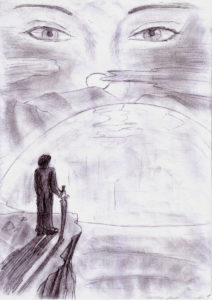

“Però, non male questo sentiero nascosto…” stava dicendo Kriss, cercando di non sbadigliare. Erano le prime luci dell’alba. Theo grugnì come per dirsi d’accordo.

“Sapendolo prima, non ci saremmo quasi uccisi per scalare quella parete.” Continuò.

Stavano scendendo dalla rupe lungo un sentiero che procedeva nascosto, quasi completamente coperto dalle rocce, tanto che sembrava una galleria.

“Già” disse Math “Avete dimostrato di avere fegato. Io non mi arrischierei mai in un’impresa del genere”

“In effetti non lo avremmo fatto neanche noi…” rispose Corolla “Se non fosse stato per lui…” indicò Kriss.

“Ehi!” fece Kriss alzando le spalle.

“E’ stato lui a voler salire a tutti i costi. Però… Non potevamo certo lasciarlo solo, no?” Continuò Corolla.

“A tutti i costi?...” fece Efeliah.

“Sì… Beh… Non so spiegare esattamente cosa mi ha preso, ma più mi avvicinavo alla Rocca, più sentivo il bisogno di scoprire cosa… cosa nascondeva.” Rispose Kriss.

“Adempiendo così la profezia.” Disse Math, congiungendo le mani dinanzi a sé come se stesse pregando.

Erano giunti alla fine del sentiero. Emersero da una specie di buca nascosta fra le rocce, e si ritrovarono di nuovo nel deserto, ai piedi della rupe. Theo indicò un punto verso occidente.

“Ayonn è da quella parte” annunciò, e senza aspettare si voltò e iniziò a camminare. Portava un grosso zaino che nessuno di loro sarebbe stato in grado di sollevare, ma non sembrava farci caso.

Gli altri si misero subito in marcia per stargli dietro.

“Ayonn… La città leggendaria… Sai spiegare, questa volta, perché ti senti spinto ad andarci?” disse Math.

“La mitica città di luce! Anche voi ne avete sentito parlare, eh?” interruppe eccitato Smiurl. “E’ un posto temibile! E’ abitato non da uomini, ma da spiriti!”

“Non credo che gli ‘spiriti’ saranno poi così terribili…” disse Efeliah rassicurando il nano.

“Stavolta ho un motivo più razionale” riprese Kriss, ignorandoli. “Finora, escluso il vostro villaggio, non ho visto ombra di civiltà, e praticamente nessuna traccia di tecnologie moderne… Se Ayonn è anche lontanamente quel che si dice, beh… Sicuramente saprà rispondere a molte mie domande.”

Math ed Efeliah lo guardarono con un’espressione indecifrabile. Kriss disse, alzando le braccia:

“Beh? Che c’è?”

Math scosse la testa.

“Non è lì che troverai la civiltà… Quanto alle risposte, solo il tempo deciderà se dartele.”

“Nella città di luce c’è solo terrore! E spiriti!” ripeté in tono di protesta Smiurl.

“Oh, Smiurl, falla finita…” disse Corolla.

“Già, non credo che avrete molto da temere da questi ‘spiriti’… Almeno finché ci siamo noi con voi…” disse Efeliah.

“…ma ci sono altri pericoli ben più tangibili da cui dovremo difenderci” concluse Math.

“Esatto. Avete armi con voi?” intervenne Theo.

“No, Theo. Noi telepati seguiamo l’insegnamento del Maestro del non usare mai armi…” iniziò Math.

“… e comunque non fare mai un atto di violenza a qualcuno, per nessun motivo.” Concluse Efeliah. Poi cambiò tono, evidentemente per fare un citazione “‘Si deve sempre fare tutto per evitare il conflitto; allorché ciò non basti ci si prodighi per limitarne gli effetti negativi’”

“Così recita il principio numero 372 delle ‘Memorie del Maestro’.” Affermò Math.

Per tutta risposta, Theo grugnì senza neanche girarsi. Sospirò, poi disse:

“Desumo quindi che la difesa delle vostre persone sia affidata a noi…”

“Forse” dissero Math ed Efeliah.

“Sarebbe a dire?” rispose Theo.

“Il tempo risponderà anche te, Theo…” aggiunse Efeliah.

“Sarà…” rispose, poi soggiunse, fra sé:

“Se io fossi un predone me ne fregherei altamente delle loro regole…”

“Sei troppo intelligente per recitare la parte del predone” disse Math, sorridendo. Theo alzò gli occhi al cielo esasperato.

“E’ meglio che tu cominci ad abituarti, come sto facendo io, Theo.” Gli disse Kriss avvicinandoglisi all’orecchio, con una gomitata complice nelle costole. “Bada a come ‘pensi’!” Poi si scostò e levando un braccio in alto disse:

“Tutti ad Ayonn!”

Stavano camminando ormai da quasi tutto il giorno, tanto che il sole iniziava a calare, e in lontananza si potevano ormai scorgere i primi rilievi, desertici e rocciosi. Il gruppo aveva accolto con giubilo la notizia, da parte dei due telepati, che Ayonn era molto meno distante di quanto non pensassero.

Theo disse:

“Quelli sono i Labirinti Rocciosi”

A Kriss la parola labirinto non risvegliò ricordi molto piacevoli. Pensò al labirinto di Cnosso. E sperò che al loro interno non vi fosse celato un “Minotauro” pronto a mangiarseli tutti. Dopo qualche istante, rise di quell’immagine. “Certo, dovrà avere uno stomaco di ferro per mandare giù Theo!...” pensò.

“Pensi che dovremmo parlargliene?...” era la voce di Efeliah, poco più che un sussurro. In quel momento lei e Math camminavano davanti a lui, e non poterono vedere il suo sguardo incuriosito.

“Non so… E poi non ne siamo certi…” rispose Math, sullo stesso tono.

Smiurl, immediatamente davanti a loro due, non sembrava accorgersi dello scambio di battute.

“Pensaci, e se fosse vero?”

“E se non lo fosse? Come reagirebbe? Non lo conosciamo abbastanza…”

“Dovresti analizzarlo più in profondità. Magari chiedendogli il permesso… E se non vuoi lo farò io. Credo sia importante stabilirlo.”

Non potevano aver parlato ad alta voce. Smiurl avrebbe sentito per forza qualcosa. Ma in quel caso lui non avrebbe dovuto sentirli… Decise di controllare. Accelerò il passo e si affiancò ai due. Dovevano aver smesso immediatamente perché Kriss non udiva più nulla.

“Sì?” fece Math.

“Facciamo un gioco!” disse Kriss. Fu la prima cosa che gli venne in mente. Forse fu per quello non destò sospetti.

Theo grugnì, con una nota di viva esasperazione. Corolla rallentò e si affiancò a loro.

“Che tipo di gioco?” chiese Efeliah.

Kriss ci pensò un attimo e disse:

“Fateci vedere se siete davvero bravi. Voglio che indoviniate quello che sto pensando.”

“Una sedia.” Disse senza esitazione Efeliah.

“Certo, giusto. Ma questa era facile” rispose Kriss sorridendo. “Provate ora…”

“Uhm… Non ho mai visto niente del genere…” disse Math.

“Si direbbe qualcosa da mangiare… non è vapore quello?” aggiunse Efeliah.

“Temo proprio di non saper rispondere…” disse infine Math, cedendo.

“Aspetta…. Piz-za… Sì, pizza! Ho indovinato?” esclamò trionfante Efeliah.

“Sì… Ma come hai fatto?...” rispose Kriss sconfitto.

“Sei stato sbadato. Hai curato troppo i dettagli. Oltre alla… pizza… hai pensato pure alla scatola in cui di solito sta… e hai visualizzato anche la scritta che vi è sopra: ‘pizza express’!”

“Ehi, è vero!” esclamò Kriss, totalmente in contropiede. “Accidenti, sei proprio brava! Riuscite a ‘ricevere’ anche le immagini oltre che i pensieri in sé per sé!”

“Già” ammisero Efeliah e Math.

“Incredibile…” disse Corolla, meravigliata.

Il sole stava ormai quasi per tramontare. Theo disse:

“Dobbiamo accamparci qui, prima che faccia notte”

“Perché?” disse Kriss.

“Vuoi camminare al buio?” chiese Corolla stupita da una simile domanda.

Math intervenne e disse, col suo solito calmo tono di voce:

“Non vuol dire che intorno a te non esistano pericoli, solo per il semplice fatto che tu non li veda…”

“Il signor Math ha ragione!” disse Smiurl. “Ho sentito dire che questa zona di deserto sia infestata da branchi di Sgozza-buoi…”

“Sgozza-che?” disse Kriss, impallidendo leggermente.

“Sono fiere del deserto…” disse Efeliah “Per farti capire… Fammi vedere… Sono come un incrocio fra quelli che tu chiami lupi… e le tigri”

“Accidenti!” esclamò sorpreso Kriss.

“Già. E di solito sono anche molto grandi.” Continuò Efeliah.

“Ci puoi scommettere il tuo orecchio sinistro!” disse Smiurl. “Mio nonno mi raccontava sempre di quella volta che la nostra famiglia ne catturò uno grande come un…”

“Smiurl! Piantala di dire sciocchezze e renditi utile!” gli urlò Corolla che aveva già iniziato a montare le tende con Theo.

“Corolla, a volte diventi proprio insopportabile!” rispose Smiurl contrariato, trascinandosi verso di lei per dare una mano.

In pochi minuti il “campo”, definizione un po’ forzata, visto che consisteva solo di tre tende, era pronto. Math ed Efeliah avevano impiegato meno tempo di tutti a montare la loro tenda. Appena finirono si sedettero a guardare Kriss che lottava con corde e pioli… finché non arrivò un quanto mai misericordioso Smiurl ad aiutarlo.

Nel frattempo il sole era tramontato, e avevano dovuto accendere un fuoco. Tutto era oscurità, aldilà del ristretto cerchio di calore creato dal fuoco. Le ombre, quasi approfittando di quella notte tranquilla, danzavano allegre tutt’intorno a loro. Kriss prese un pezzo di carne che avevano portato con loro dal villaggio dei telepati e che Theo stava cocendo sul falò. Si appartò dietro una tenda, sdraiandosi a terra.

Ebbe modo di osservare con attenzione, per la prima volta, il cielo di Noi-Hert: quella sera non c’era neanche una nuvola. La luna non era ancora sorta, e una tenue luce era irradiata dal coro delle stelle. Non c’era neanche una costellazione familiare… E la disposizione delle stelle non era regolare come nel cielo della Terra… Abbastanza alto, sull’orizzonte, alla sua destra, Kriss poté notare un ammasso di stelle, luminoso e concentrato, che spiccava rispetto al resto del firmamento per la sua lucentezza. Scendeva sempre più verso la sua destra fino a sbiadire sempre più man mano che si avvicinava all’orizzonte. Sembrava un enorme gioiello. Un diadema celeste.

“La Via Lattea” sussurrò una voce dentro di lui. “Quella voce da dove veniva?” il pensiero attraversò Kriss come l’ombra di una nuvoletta di fumo, e rapidamente svanì. In effetti, doveva essere proprio un braccio della spirale…

Braccio che la sua generazione ormai non poteva più vedere dalla Terra, soffocata com’era da miliardi di luci artificiali.

Ecco cosa lo aveva colpito: la nitidezza di quel panorama. Da casa non aveva mai potuto vedere niente di simile. Il cielo, per i terrestri, era decaduto semplicemente a essere “tetto delle città”… Insomma, qualcosa da avere sulla testa per non finire nello spazio. E tanti saluti al panorama celeste.

Ma un’altra cosa stupefacente era il silenzio. L’orecchio “civilizzato” di Kriss stentava ad abituarsi all’assenza di rumori. Niente macchine. Niente tubature dell’acqua che fischiano di notte. Niente televisori. Solo il rumore del fuoco scoppiettante e lo sfrigolio del grasso che cadeva sulle braci, e le voci di Corolla, Smiurl, e gli altri.

Improvvisamente sentì di amare quel posto, nonostante la sua desolazione, e quelle persone. Immaginò di poter tornare in quell’istante nella sua casa, nella sua camera… Ma tutto quello che avrebbe potuto fare sarebbe stato fissare la luce dei lampioni che disegnava linee sul soffitto attraverso le persiane, ripensando

a Noi-Hert, a tutto quello che significava, ai suoi nuovi amici, al cielo stellato……

Una testa sbucò di fianco alla tenda. Era Corolla.

“Ah. Eccoti.” Disse “D’un tratto ci siamo accorti che erano passati diversi minuti da che eri scomparso…” lo guardò. Lui aveva fatto un cenno di assenso, e aveva sciolto le mani da dietro la nuca, ma non si era voltato verso di lei.

“Beh… Allora… Torno…” disse lei, indicando gli altri, esitando a tornare da loro.

“No, stai, se vuoi…” disse Kriss con voce che era quasi un sussurro, con tono assente. Corolla stette qualche istante ferma a guardarlo. Poi si mosse, lentamente, silenziosamente, e si sedette accanto a lui.

Kriss continuava a fissare le stelle. Si riflettevano una per una nei suoi occhi. Corolla lo osservò per un po’, poi disse:

“Non lo hai mai visto…?”

Kriss diede in un lungo sospiro. Poi disse:

“Non ho mai visto niente di simile. E’ stupendo.”

“Già. Noi ci siamo abituati” disse lei, abbracciandosi le ginocchia, dondolandosi leggermente.

Stettero in silenzio per qualche istante. Poi Kriss disse, con una nota d’amarezza:

“Noi ci siamo abituati a non averlo, invece…”

“Che strano!” disse lei, sdraiandosi all’improvviso, con le braccia sopra la testa e le gambe completamente stese.

“Che cosa” fece lui un po’ sorpreso, voltando leggermente il collo verso di lei.

“Un giorno, stanchi delle vostre ‘città senza cielo’, costruirete immensi vascelli e verrete qui a iniziare una nuova storia…” Corolla sospirò. Poi riprese:

“E’ strano, dicevo. Potresti essere un mio antenato… Ti immagini?: Sto parlando con il mio bis-bis-bisnonno! Ah ah ah!”

La sua risata si spense dolcemente.

Improvvisamente Kriss se la ritrovò che gli stava puntando il dito sul naso, inginocchiata su di lui. Diceva, scherzosamente perentoria:

“Nonnino, ora tu mi prometti che tratterai sempre bene i tuoi cari figli, e che insegnerai loro a essere bravi ragazzi e a fare altrettanto con i loro figli… E via dicendo, finché loro non lo faranno con me, capito? Avanti: dì ‘lo giuro’.”

Corolla tratteneva a stento le risate. La luce delle stelle si rifletteva nei suoi occhi, e i suoi capelli scendevano intorno al viso di Kriss. Kriss aspirò il suo profumo in effetti familiare (era solo suggestione?) e mentre pensava a che cosa avessero pensato gli altri se li avessero visti così, disse, solennemente:

“Lo giuro, figliola”

Immediatamente scoppiarono tutti e due a ridere. Lei si ributtò a terra al suo fianco, e lui si piegò in due in preda a euforia incontrollata, solo in parte frutto della tensione accumulata durante il viaggio.

Da dietro la tenda sbucò la testa di Theo, col suo solito cipiglio. Vedendolo Kriss e Corolla si zittirono un attimo, ma il suo sguardo li fece ricadere di nuovo nell’euforia. Ormai avevano entrambi le lacrime agli occhi.

Udirono, vagamente, la voce di Smiurl che diceva:

“Ma che li ha morsi la tarantola del deserto?”

Continuarono a ridere per un bel pezzo, finché non crollarono, esausti. Scivolando nel sonno, Kriss pensò:

“E questa Corolla sarebbe quella che mi ha salvato da quel Jeorghe?!…”

Fu svegliato dalla voce di Math che diceva:

“Presto, svegliamoli!”

Si alzò in piedi, svegliando anche Corolla, che non aveva sentito nulla. Erano così stanchi che si erano addormentati lì, dietro alla tenda.

Trovarono Math ed Efeliah vicino al fuoco ormai ridotto a pochi tizzoni. Contemporaneamente Theo uscì dalla tenda, seguito da Smiurl. Efeliah disse:

“Abbiamo avvertito la presenza di due Sgozza-buoi. Stanno per attaccarci, da quella parte, e da questa” indicò con le braccia due direzioni opposte. Theo annuì.

“Me ne sono accorto. Il loro odore.” Disse indicando l’aria intorno a sé.

Kriss annusò a più riprese l’aria. Non c’era nessun odore particolare. Intorno a lui percepiva solamente la tensione.

Theo prese il suo enorme maglio che portava sempre con sé, al cui confronto quello che aveva prestato a Kriss sembrava un giocattolo.

“Saprò accoglierli come si deve” dichiarò.

Corolla emerse nel frattempo dalla sua tenda. Aveva preso le sue bolas e una daga. Smiurl aveva il suo coltellaccio.

“Kriss: tu, Math ed Efeliah, riparatevi in una delle tende.” disse Corolla, in tono perentorio.

“Ma…” fece per dire Kriss.

“Niente ma!” Lo zittì categoricamente lei “E’ troppo pericoloso!”

“Non voglio restare lì dentro, mentre voi…”

“Avanti, Kriss” lo interruppe Efeliah “Cosa potremmo fare noi? Saremmo solo di impiccio. Su, vieni.” Lo prese per mano e lo condusse con sé e Math.

Una volta al riparo della tenda, si sedettero a terra. Kriss vi restò solo due secondi. Si alzò di scatto e prese a passeggiare furiosamente su e giù per quello che l’angusto spazio gli permetteva.

Osservò i due telepati, che sedevano in perfetta tranquillità, a gambe incrociate, uno dinanzi all’altra. Sembravano guardare nel vuoto. Questo in qualche modo lo fece infuriare ancora di più. Prese fiato per urlare qualcosa, ma Math lo prevenne.

“Perché non provi a sederti e rilassarti?” gli chiese con voce innaturalmente calma, senza mai perdere quell’espressione persa nel vuoto.

“Rilassarmi?!” esclamò Kriss esterrefatto. “Tu mi dici di rilassarmi? Io… io…” non riusciva a trovare le parole “Ah! Accidenti!” esclamò con un gesto di stizza, e riprese a dimenarsi inquieto su e giù.

Improvvisamente udirono un urlo lacerare il silenzio della notte. Sembrava un ringhio profondo, furibondo e assassino, e fu seguito da un intenso tramestio di tonfi e ringhi; Kriss non poté più tenersi e aprì i lembi della tenda.

Vide Theo pochi metri più in là, appoggiato al suo maglio posato a terra, dinanzi a quello che doveva essere stato il corpo di una di quelle bestie… Il quale era ridotto piuttosto male. Theo ansimava un po’, ma stava benissimo, a parte qualche graffio. Kriss uscì dalla tenda, seguito da Math ed Efeliah.

Subito sopraggiunse anche Corolla. Vide Theo e sorrise con approvazione. Poi cambiò bruscamente espressione, udendo un altro urlo squarciare le tenebre.

“Smiurl!” urlarono lei e Kriss, all’unisono.

A Kriss il tempo parve fermarsi. Vide Theo che si metteva a correre come al rallentatore verso la direzione che aveva preso il nano poco prima, Corolla seguirlo subito dopo, e soprattutto senti Efeliah trasalire accanto a sé, e in un lampo una terrificante immagine gli pervase la mente. Nell’oscurità della notte un orribile ghigno era sospeso sopra di lui. In una frazione di secondo percepì tutti i particolari: sentì l’alito nauseabondo dello Sgozza-buoi, che sapeva di decomposizione, scendergli sul volto; vide i suoi denti acuminati e sporchi che sembravano schiudersi in una perversa risata malvagia, i lunghi baffi tremuli che aveva ai lati del muso, il naso canino umido che fiutava impaziente l’odore del terrore della preda, i suoi occhi assetati di sangue, gialli, nei quali si rispecchiava l’immagine di uno Smiurl terrorizzato.

Gli sembrò di non essere più reale, come quando si era trovato di fronte al capo, in quel canyon, e vide le sue gambe iniziare a muoversi. In un attimo era entrato nella tenda, mentre con un angolo della coscienza aveva notato che Efeliah era svenuta, prontamente sorretta da Math. Come un lampo si era chinato a raccogliere la spada del capo – la sua spada – e in un secondo era fuori. Corse come una furia, pallida ombra senza reale consistenza sotto quell’effimero chiaro di luna aliena che tingeva di onirico il paesaggio.

Vide, ancora come se stesse sognando, Corolla rimanergli improvvisamente indietro. L’aveva sorpassata e non se ne era quasi accorto.

Nel buio riusciva a schivare qualsiasi ostacolo, non c’era sasso che trovasse il modo di farlo inciampare, o buca nella quale cadere in fallo. Improvvisamente si trovò sull’orlo di una piccola depressione. Mentre stava ancora correndo vide l’orrida bestia che teneva i suoi artigli sul povero Smiurl. Riusciva a udire i suoi gemiti. Il suo terrore.

Si ritrovò ad urlare. Afferrò quasi inconsciamente la spada, ancora nel fodero, dalla parte della punta. La bestia, udendo quel suono e vedendolo correre giù a quella velocità alzò il suo perfido sguardo, e in una frazione infinitesimale di tempo Kriss pensò di leggere sul suo brutto muso un espressione di timore, e si concesse un sorriso compiaciuto, che nessuno avrebbe comunque mai potuto notare.

Un attimo dopo, urlando, con tutta la sua rabbia riversata nei muscoli e con il suo slancio, slanciava la spada dal basso verso l’alto, sul cranio dell’animale, che emise un tonfo orrendo. Il corpo cadde riverso senza emettere alcun suono, a parte quello prodotto dal sangue che cadeva a terra spruzzando qualche metro più in là.

Il tempo riprese a scorrere normalmente. Kriss sentì le forze venirgli meno. Cadde in ginocchio, sempre con la spada stretta fra le mani, accanto a Smiurl, che lo guardava spaventato rantolando, perdendo sangue da ferite che non gli riuscì di individuare.

Crollò su un fianco, fra Smiurl e l’animale. Udì il passo pesante di Theo venire di corsa verso di loro, seguito da Corolla che urlava i loro nomi.

Poi tutto fu oscurità. Tutto fu oblio.

“Come sta Smiurl?” era la voce di Corolla.

“Meglio ora. Ef dice che domani starà in piedi” questo era Math.

“Oh, quasi mi dimenticavo di lei. Si è ripresa?” chiese lei con rimorso nella voce.

“Certo. Ha solo avuto un sovraccarico empatico… Una forte emozione, volevo dire.” Disse lui “E lui, invece? Come sta?”

“Ora respira normalmente. Per un paio di ore credo abbia avuto la febbre. Delirava. Chissà cosa gli è preso.” Udì la mano di lei carezzargli la fronte.

“Non ho mai visto niente di simile” disse Math.

“Neanch’io. Hai sentito come urlava? Ha ridotto in poltiglia con un solo colpo la testa di quella bestia… Era enorme. Non so come abbia fatto”

“Anche noi abbiamo percepito qualcosa di strano nella sua mente.”

“L’importante e che siamo tutti sani e salvi” Su quelle parole, Kriss scivolò di nuovo nel sonno.

“Sveglia!”

Troppe voci, aveva udito quella notte, per preoccuparsi anche di questa.

Attese che la vista gli si mettesse a fuoco. Si trovava nella tenda di Theo. Era giorno, e doveva esserlo da un pezzo. Cercò di alzarsi di scatto, ma la testa prese a pulsargli come un martello pneumatico, e la tenda sembrò iniziare a vorticare intorno a lui.

Ricadde pesantemente sul suo giaciglio. Attese che le vertigini passassero, poi scese con cautela, lentamente. Si rizzò a sedere, e infine si alzò. Non stava poi malissimo.

Vide, sulla sua destra, Corolla, che stava dormendo sdraiata per terra, appoggiata con la testa su un braccio. Gli fece tenerezza. Si era presa cura di lui per tutta la notte. Doveva essere esausta.

Non poteva sperare di sollevarla, conciato com’era, così si limitò a metterle sotto la testa gli stracci che avevano fatto da cuscino a lui, togliendole l’arto intorpidito da quella posizione. Lei sospirò e si rilassò visibilmente.

Uscì dalla tenda nella luce del giorno, che gli abbagliò gli occhi. Si portò una mano al viso per ripararsi dai raggi del sole.

Guardò attraverso le dita e vide Theo che stava lavorando, chinato a terra. Avanzò verso di lui e disse:

“Buongiorno!”

Theo alzò gli occhi sorpreso. Quindi rispose:

“Buongiorno a te”

Kriss si avvicinò del tutto. Ora i suoi occhi si erano abituati. Guardò l’oggetto delle attenzioni di Theo, e vide che aveva appena finito di scuoiare uno Sgozza-buoi. Rabbrividì al ricordo della notte precedente.

“Cosa stai facendo?” chiese un po’ sbigottito.

“Fra poco vedrai.”

“Oh, vedo che ti sei rimesso!” esclamò Math sorridendo sbucando da qualche parte, con una specie di tegame in mano e qualcos’altro nell’altra, mentre Theo si allontanava.

“Ciao Math” rispose Kriss. “Che abbiamo per colazione?” chiese poi accennando col capo all’involto che Math stava portando verso il focolare ancora dormiente.

“La Colazione del Colono” annunciò con orgoglio, poggiando gli oggetti a terra e accingendosi ad accendere un fuoco. “E’ una ricetta che risale all’antichità, quando i terrestri vivevano ancora prosperi su Noi-Hert.”

“Come il Martini?” chiese Kriss sorridendo.

“Già” rispose il telepate. Poi cambiò di colpo espressione, drizzando la testa come se avesse udito un suono inaspettato. Si drizzò in piedi e si avviò di buon passo verso la sua tenda. Non fece in tempo ad entrarvi, che ne uscì Efeliah, la quale sorrise subito a Math, includendo per un attimo anche Kriss. Tornò a guardare Math. Questi si rilassò e sorrise, poi si girò e con un cenno del capo disse:

“La colazione è quasi pronta…”

Lei lo seguì fino al focolare, dove Kriss era rimasto a guardarli perplesso e incuriosito. Le disse:

“Ciao Ef!”

“Oh! Come fai a sapere…” disse lei sorpresa “… ah… capisco…” disse poi cambiando tono e guardandolo con un sorriso che non riusciva ad interpretare. Lui ebbe l’impressione di essersi lasciato sfuggire qualcosa.

“Mi avrà letto nella mente?...” si chiese mettendosi a sedere. Lei lo guardò e lui sentì la sua voce dirgli:

“Non ne ho potuto fare a meno!...” Efeliah sorrideva. Gli aveva parlato nella mente, come sussurrando. Math non sembrava essersene accorto.

“Attento a come pensi!” lo ammonì lei, visto che Kriss stava guardando Math come aspettando che anche lui si unisse alla “conversazione”.

“Sto schermando i nostri pensieri! Ma potrebbe comunque accorgersi…”

Kriss fece un’espressione così sbigottita che Efeliah per poco non scoppiò a ridere.

Math riuscì ad accendere il fuoco, e tirò fuori dall’involto un uovo. Perlomeno era quello che sembrava essere, con ogni

probabilità. Non ha una forma così comune, un uovo, da poter essere confuso con qualcos’altro. Solo che quello era nerastro, puntinato di verde. Poi prese anche dei pezzi di carne. Mise l’uovo, dopo averne rotto il guscio, nella padella, da una parte, e la carne dall’altra, e iniziò a cuocerli.

“Eggs and bacon…” disse Kriss.

“Chi ha parlato di Egzen’bèikohn?” disse una vocetta allegra dietro a loro.

“Oh! Ciao Smiurl!” dissero tutti, felici di vederlo di nuovo sano e salvo e di buon umore.

Il nano si avviò verso di loro. Sorrideva, camminando in modo che tutti potessero vedere i solchi sulla sua guancia lasciati dagli artigli dello Sgozza-buoi che per poco non lo aveva ucciso. Non avevano un gran bell’aspetto, ma andavano guarendo molto in fretta.

“Non ho mai avuto tanta fame in vita mia! E questo delizioso odorino!” esclamò sedendosi di fianco a Kriss.

“Mi hai salvato la vita” disse improvvisamente serio.

“Oh! Non potrei mai permettermi di perderti…” esclamò Kriss sorridendo “…e poi ero in debito con te, no?”

A quello parole il nano si illuminò tutto.

“Abbiamo visite” disse Ef a Kriss, indicando la tenda di Theo.

Kriss fece in tempo a voltarsi per vedere Corolla emergerne. Li guardò strizzando gli occhi e poi stropicciandoseli.

“Fate un baccano tremendo! E’ impossibile riposare in santa pace con voi nei dintorni!” disse scherzando. Si avvicinò subito a Kriss e Smiurl, sedendosi di fronte a loro.

“Come state?” chiese.

“Ci vuole altro per abbattere il fiero Smiurl” disse il nano gonfiando il petto probabilmente ancora dolorante.

“Bene, ora” rispose anche Kriss. Poi aggiunse “…grazie a te.” Corolla sorrise. Distolse lo sguardo. Scorse Theo e disse:

“Theo! Cos’hai lì?”

“Il premio dei valorosi” rispose lui. Si avvicinò a Kriss e Smiurl. Srotolò la pelle che portava con sé. La stese davanti a Smiurl.

“La pelle della bestia per il coraggio di colui che le resiste” disse solennemente. Alla luce del giorno quel manto era davvero bello. Somigliava a quello di una tigre.

Smiurl era molto impressionato. Ringraziò con un inchino, accendendosi. Poi Theo si rivolse a Kriss, che rimase così sorpreso.

“Le zanne della bestia per il valore di colui che la uccide” disse, e porse una specie di collana a Kriss. Era fatta con i denti dello Sgozza-buoi, lucidati e disposti simmetricamente, con quello più grande al centro.

“Ti ringrazio, Theo.” Disse Kriss. Theo mantenne la sua solita espressione e si sedette con loro.

Kriss rimase molto colpito da quel gesto. Anche in seguito continuò a chiedersi da dove venisse un uomo così, quale fosse la sua storia.

Non fu il solo: tutti erano rimasti in silenzio a fissare Theo. Dopo una decina di secondi, questi esclamò:

“Allora, questa colazione?!”

Kriss non riuscì a trattenersi e scoppiò a ridere, piegato in due.

“Qui iniziano i Labirinti Rocciosi” annunciò Theo. Era pomeriggio inoltrato, e si erano fermati sull’orlo di una specie di stretto e indeciso canyon che zigzagava in varie direzioni.

Kriss non stava ascoltando. Percepiva nell’aria una strana tensione. Aveva l’impressione che dovesse succedere qualcosa di brutto. Guardò giù nel canyon pieno di ombre e rabbrividì. L’ultima cosa che voleva era scendere lì sotto. Sentì una mano sulla spalla e si voltò. Era Math.

“Lo senti anche tu?” chiese Ef.

“Sì. Sta per succedere qualcosa…?” disse Kriss.

“Non lo sappiamo…” disse Math chinando il capo.

Lo scambio di pensieri era durato un paio di secondi.

“Le fenditure sono numerosissime, dovremo fare attenzione a non perderci. Smiurl, conto sul tuo senso dell’orientamento”

disse Corolla.

Smiurl si illuminò vagamente, ma era anche lui incomprensibilmente ansioso, preoccupato, come il resto del gruppo.

“Scendiamo” disse Theo.

“Non c’è altro modo?…” disse Kriss restio a calarsi in quella gola minacciosa.

“No”

Kriss sospirò e si accinse a scendere.

La gola era molto profonda, e la penombra regnava, insieme al silenzio. Gli unici rumori che si sentivano erano i loro passi e quello prodotto dalle minuscole frane che di quando in quando si staccavano dalle pareti rocciose e strisciavano fino a terra sbriciolandosi sui massi più grandi.

“Questo posto non mi piace per niente” disse ad un tratto Corolla. La sua voce riecheggiò rimbalzando sulle rocce, facendo calare di nuovo un intimorito silenzio. Mentre camminavano, tutti, eccetto Theo, si guardavano nervosamente intorno e alle spalle.

Smiurl gemette. Erano arrivati di fronte a un bivio. I due rami serpeggiavano sempre indistinguibili e contorti. Dopo poche decine di metri le anse e le svolte delle gole occultavano il resto del percorso alla vista.

Esitò, guardandosi intorno. Dopo qualche secondo disse, non senza una forte nota di dubbio nella voce:

“A destra.”

Si diressero quindi da quella parte. I massi che sporgevano dalle pareti formavano uno strano disegno, e quella luce, che ormai andava decrescendo, che riusciva a raggiungere il fondo era fiaccata dagli innumerevoli rimbalzi che doveva compiere. Gli stessi rimbalzi che davano luogo a quell’inquietante eco.

Stavolta la gola sembrava interminabile.

“Ma almeno siamo nella direzione giusta?” chiese Corolla.

“Credo… Spero di sì…” rispose Smiurl.

Continuarono a camminare per un po’. La luce continuava a scemare.

“Fermi!” esclamò Efeliah d’un tratto.

“Cosa succede?” chiesero gli altri. Efeliah non rispose subito. Teneva gli occhi chiusi e le mani sollevate dinanzi a sé, così tutti attesero in silenzio impazienti.

Riaprì gli occhi.

“Qualcuno ci segue.” disse, atterrita.

“Quanti sono?” chiese Math.

“Tanti… E malvagi…”

La paura si accentuò in tutti loro.

“Sono dietro di noi?” chiese Corolla.

“Sì” rispose la telepate.

“Presto, allora, cerchiamo di seminarli!” e si mise a correre seguendo l’esempio di Theo.

Corsero tutti più forte che poterono, sentendo il panico carezzargli con gelide dita la schiena. Kriss sentiva rizzarsi i capelli sulla nuca. Correvano più veloci del vento, senza preoccuparsi di respirare e saltando un sasso dopo l’altro, rischiando più volte di cadere. Smiurl faceva incredibili balzi da un masso all’altro. Un momento era sulla loro destra, un attimo dopo era sulla sinistra, e a volte lo sentivano emettere gridolini spaventati mentre passava sopra le loro teste. Kriss notò con un angolo della mente quanto fossero sproporzionati quei salti rispetto alla sua grandezza. Sembrava che Smiurl volasse. Lui non sarebbe riuscito a saltare neanche la metà così lontano.

Improvvisamente si ritrovarono in uno spazio più ampio. Davanti a loro si apriva una specie di piazza. A Kriss sembrò creata da una mano gigantesca, come se un enorme titano avesse in quel punto colpito la terra con un pugno.

“Oh no! E adesso?” esclamò Corolla. Davanti a loro si aprivano numerose gole minori, quattro in tutto. Tutti guardarono Smiurl. Aveva il fiato corto e gli occhi spalancati. Fra un ansito e l’altro disse:

“Non lo so… Ci siamo… persi….”

“Ci sono sempre alle calcagna” disse Ef.

Corolla guardò Theo. Lui disse:

“Cerchiamo un riparo. Da quella parte.” Indicò la seconda gola da sinistra. Corsero da quella parte. Si inoltrarono nel canyon,

peraltro indistinguibile dagli altri.

Ormai il sole doveva essere tramontato. Kriss riconobbe, nella sottile fenditura di cielo sopra le loro teste, il colore del crepuscolo.

Il canyon si allargò un poco e poi rivelò la sua fine: una ripida parete cosparsa di macigni.

“Un vicolo cieco!” esclamò Kriss

Theo non sembrò scoraggiarsi. Disse:

“Nascondiamoci. Dietro quelle rocce” disse ai due telepati, indicando un punto difficile da individuare a metà della parete rocciosa.

“Corolla, Smiurl, voi due in quella specie di apertura. Attenti ai pipistrelli.” Continuò Theo. Poi prese Kriss per un braccio e lo condusse con sé dietro un enorme masso dal quale era possibile controllare i nascondigli degli altri e il canyon che riconduceva allo slargo da dove erano arrivati.

Il tempo prese a scorrere lentamente, mentre Kriss era divorato dalla tensione. La luce continuava inesorabilmente a calare, lasciando sempre più il posto alla notte e ai suoi fantasmi.

Si girò a guardare gli altri. Math ed Efeliah erano quasi invisibili. Si vedevano solo le loro teste.

D’un tratto sentì Efeliah esclamare nella sua mente:

“Stanno arrivando!”

Kriss vide Corolla che afferrava Smiurl e gli tappava la bocca prima che potesse mettersi a piagnucolare.

Le tenebre che stavano inghiottendo tutto vibrarono: dal canyon videro arrivare fino a loro dei riflessi colorati, mutevoli. Le pareti rocciose giocavano con essi danzando a un macabro ritmo con i pensieri terrorizzati di tutti loro.

Corolla si ritrasse scomparendo del tutto, sempre tenendo Smiurl ben stretto.

Per interminabili secondi nulla avvenne. La luce continuava a tremolare intorno a loro. Ad un tratto però, le tenebre si trassero da parte all’arrivo di due luci, una azzurrina e l’altra gialla che danzavano senza alcun senso logico apparente, sospese a un metro da terra. A Kriss ricordarono la danza delle api. Ma più le osservava, più sentiva crescere dentro di sé il terrore. Ormai era pietrificato, non riusciva più a muovere un singolo muscolo.

Le luci continuavano a danzare davanti a loro, come se fossero restie a desistere, poco convinte. Kriss riuscì a spostare lo sguardo su Efeliah. Ormai non poteva più vederla: l’oscurità era praticamente totale, e i riflessi gettati dalle due luci vorticavano troppo veloci, confusamente. Però udì la sua voce:

“Cerca di stare calmo. Io/Math stiamo cercando di schermarci” Kriss capì che si riferiva a tutti loro. Lo disse a Theo, in un tono di voce così basso che neanche lui si sentì. Theo non si mosse, ma con un brevissimo sguardo comunicò di aver capito.

Le luci erano ancora lì davanti, e se si fossero avvicinate alla parete rocciosa per esaminarla da vicino li avrebbero senz’altro scoperti. Il tempo continuava a scorrere così lentamente che Kriss pensò che avrebbe potuto impazzire, se la cosa fosse andata per le lunghe. L’adrenalina gli scorreva a fiumi nelle vene.

Piano, all’inizio impercettibilmente, poi sempre più decisamente, le luci si ritrassero. Continuavano a ballare così follemente l’una intorno a l’altra mentre retrocedevano verso lo slargo un centinaio di metri alle loro spalle.

Deboli riflessi continuavano a pervadere le rocce.

“Non vi muovete” giunse loro la voce di Efeliah e Math. Era un avvertimento inutile. Kriss sentiva che gli sarebbe occorsa qualche ora per riprendersi. Per non parlare del fatto che quella luce continuava a venire dal canyon.

Improvvisamente una luce gialla, forse la stessa di prima, spuntò da dietro le rocce davanti a loro. Kriss sentì il proprio cuore mancare un battito. Correva velocissima rasente alle pareti. Si appiattirono dietro il macigno. La luce passò proprio dinanzi a loro, e subito si allontanò. Passò vicino al riparo dei due telepati e gettò raggi di luce indagatori nella piccola grotta dov’erano Corolla e Smiurl.

Poi, repentinamente come era apparsa, scomparve di nuovo.

Dopo qualche minuto la luce proveniente dal canyon cominciò ad affievolirsi, finché non sparì del tutto, dopo altri

lunghissimi minuti.

Kriss rilassò i muscoli, stendendosi nello scomodo riparo con la schiena appoggiata al masso che li aveva nascosti.

“Possiamo uscire, ora. Se ne sono andati” sentirono Efeliah dire a voce alta dal suo nascondiglio. Scesero tutti ai piedi nella scarpata dove erano nascosti. Per ultimi arrivarono Corolla con Smiurl. Evidentemente lei doveva averci messo un po’ a convincerlo a uscire.

“Che cosa erano quelle luci?” chiese Kriss.

“Gli spiriti che proteggono la città…” disse Smiurl.

“Non erano spiriti. Al di sotto dei loro schermi mentali abbiamo percepito delle menti umane.” Disse Math.

“Cosa? Schermi mentali?” chiese Corolla.

“Sì” disse Efeliah “Sono delle barriere che impediscono ai pensieri della mente che le genera di filtrare. Anche noi ne abbiamo generato uno, per non farci individuare. Voi non ve ne siete accorti, ma abbiamo usato anche le vostre energie.”

“Però il loro schermo era completamente diverso… in termini materiali, come potrei dire… Era perfettamente ‘liscio’, simmetrico… Quasi ‘meccanico’.” Disse Math

Nessuno di loro sembrò capire la spiegazione.

“L’importante è che se ne siano andati” disse Corolla.

“Nello slargo ce n’erano circa un centinaio” disse Efeliah, indicando.

Kriss rimase sgomento, sentendo quanto vicini al pericolo fossero stati, di qualunque cosa si fosse trattata…

Guardò verso l’alto, il cielo stellato che si vedeva fra i cigli del canyon. Vide una strana luminosità provenire dalla parte opposta alla quale erano venuti.

“Guardate” disse agli altri.

“Che ce ne siano degli altri, lì?” chiese Smiurl, ancora spaventato.

“Voglio andare a vedere” disse Kriss iniziando ad arrampicarsi su per la scarpata. Theo lo guardò un attimo, poi decise di seguirlo.

In pochi minuti arrivarono in cima. Kriss si rizzò al di là dell’orlo della roccia e si sedette. Restò a bocca aperta.

Davanti a loro il terreno digradava, e al centro di quell’enorme depressione, a circa due chilometri di distanza, c’era una bolla, semisferica, di mille colori, di una luminosità incredibile.

“Ayonn!” esclamarono Smiurl e i due telepati. Poi Smiurl aggiunse, per dovizia di particolari:

“Lo scudo magico!”

Era davvero uno spettacolo assurdo, allo stesso tempo terrificante e stupendo. Decine di gole si aprivano nelle pareti rocciose tutt’intorno alle città, che emanava il giorno intorno a sé, grazie al suo mistico bagliore.

Attraverso la bolla si intravedevano profili di alti palazzi d’oro che sembravano costruiti con luce stessa.

Dopo qualche minuto di contemplazione Kriss si alzò e disse:

“Allora, cosa stiamo aspettando? Ayonn ci aspetta!” e si mise in cammino. Il suo tono di voce era risultato molto più sicuro di quanto lui stesso non lo fosse stato. Più guardava quella bolla al centro della valle, più sentiva crescere inspiegabilmente la paura dentro di sé. Non riusciva a ragionare con logica per più di pochi secondi. Non poteva analizzare cosa lo spaventava tanto.

Si voltò, e vide che gli altri lo stavano seguendo, e dalle loro espressioni capì che dovevano sentirsi più o meno come lui.

Arrivati a metà strada, la luce equivaleva a quella del giorno. Si fermarono un attimo a riposare, più che altro la mente, visto che avevano camminato in lieve discesa.

“Non credo che resisterò ancora per molto” disse Efeliah sospirando.

“E’ insopportabile! Ma cosa succede?!” chiese Corolla lamentandosi, portandosi le mani alle tempie.

“Il panico sembra scaturire direttamente dalla città…” disse Math “…Comunque, più ci concentreremo su questo, meno strada faremo”

Kriss cercò di pensare. Sentiva il panico attanagliarli il cervello e lo stomaco, e più si sforzava di pensare più gli sembrava di sentire il cervello scaldarsi e appesantirsi. Disse:

“Credo che dovremmo cercare di pensare… a qualcosa di bello, rassicurante…” quelle parole gli sembrarono così vuote, vacue.

“Hai ragione” disse Efeliah, raddrizzandosi. “Fate così. Sforzatevi più che potete.”

Smiurl era tutto rannicchiato su sé stesso, e annuì pateticamente alle parole della telepate. Anche lui ricominciò a camminare, sospinto da Corolla.

Le prime centinaia di metri passarono abbastanza “in fretta”. Presto però la pressione mentale iniziò a farsi sempre più forte. Cresceva esponenzialmente. Kriss, con un angolo della mente, ricordò una lezione, nella sua “vecchia” scuola, in cui si parlava del campo elettrico e di quello gravitazionale, e come la forza fosse inversamente proporzionale al quadrato della distanza. Stranamente, questo lo aiutò ad estraniarsi, a concentrarsi sul suo vecchio mondo, la Terra del ventunesimo secolo, dove tutto scorreva più o meno regolarmente, giorno dopo giorno, dove non c’erano orde di predoni, né misteriosi luci volanti, tanto meno città protette da scudi magici.

Più cercava di concentrarsi, più sentiva il cervello esplodere. Qualcosa lo circondava, e lo attaccava anche dall’interno, ed era impossibile resistere. La pressione mentale lo faceva sentire come una nocciolina sotto un rullo compressore.

Ormai mancavano poche decine di metri per raggiungere la parete del misterioso scudo magico. Kriss si voltò lentamente, i lineamenti contorti nello spasimo del conflitto mentale. Vide Smiurl diverse decine di metri più indietro saltellare come impazzito, per poi andare a scomparire dietro un basso cespuglio. Poco avanti a lui era stesa a terra Corolla. Ancora, pochi metri più avanti c’era Theo, che aveva posato il maglio a terra e vi si stava appoggiando con tutto il peso, incapace di andare avanti. Ancora lo seguivano Math ed Efeliah, che avanzavano tenendosi per mano.

Kriss fece un altro passo, sempre guardandosi alle spalle. La pressione raddoppiò, facendogli venire le lacrime agli occhi. Barcollò, e fu per miracolo che rimase in piedi.

In lui si stava spegnendo l’ultima speranza. Tutto era finito. Non era semplicemente possibile, resistere a quella forza sovrumana. Tanto valeva stendersi ed attendere che l’oblio arrecasse il suo sicuro sollievo.

Poi la vide. Efeliah improvvisamente era caduta in ginocchio, sempre tenendo la mano di Math, finché questa non le sfuggì. Si accasciò a terra rovesciando gli occhi.

Kriss la vide come al rallentatore, il bianco dei suoi occhi, la bocca semi aperta, mentre cadeva lentamente, a faccia avanti, con i capelli che la seguivano dappresso, leggeri. Vide la polvere che alzò con lo spostamento d’aria dovuto al peso del suo corpo, e improvvisamente fu cosciente di tutto quello che lo circondava.

In un attimo, il furore lo pervase. Con un angolo della coscienza percepì Math che lo fissava sbalordito, e iniziava ad arrancare velocemente verso di lui, che aveva già cominciato ad avviarsi deciso verso la parete di luce.

Non pensava più a nulla. Solo una fiamma inestinguibile nella sua mente, improvvisamente riaccesasi alla vista di Ef. Sentiva il panico urlare senza pietà contro la sua mente. Riusciva anche a sentirne l’impatto, dacché la testa stava per esplodergli.

Iniziò a digrignare i denti, e un cupo rantolio gli salì dalla gola. Protese le mani in avanti: la parete di luce era a un solo metro da lui.

Il dolore era insopportabile, ma più cresceva più questo lo rendeva furibondo. La rabbia andava ad alimentare quell’ultima fiamma che lo sosteneva. Sentì la mano di Math sulla spalla. Gli si stava appoggiando con tutto il peso.

La fece scivolare lungo il braccio, prendendolo per mano, e continuò a protendersi verso la luce. Non vedeva più nulla con gli occhi. La luce arrivava direttamente nella sua mente.

Urlò, e in un ultimo scatto d’ira oltrepassò l’ultimo metro, tirandosi dietro Math.

Per una frazione di nanosecondo la pressione nella sua testa fu insopportabile, poi improvvisamente, repentinamente, calò. Un lampo accecante e un boato assordante pervasero l’aria, e scariche di energia viaggiarono impazzite tutt’intorno a loro. La luce poi bruscamente diminuì, adeguandosi a quella naturale delle stelle. Con essa fuggì anche la sensazione di panico, ma un istante dopo Kriss sentì scivolare via anche la coscienza, e si abbandonò, cadendo accanto a Math.

All’inizio era solo un gemito. Un lamento urlato da ogni suo neurone. Con estrema lentezza, il tempo riprese a scorrere, e l’urlo della sua mente si condensò, stringendo nelle dita del dolore la sua testa, facendogli contare ogni pulsazione del sangue che scorreva in ogni singolo capillare, messi in evidenza dal dolore come tanti rivoli di fuoco.

Insieme al dolore prese consistenza anche una superficie dura a contatto col suo viso. Kriss aprì gli occhi. Non servì a molto, perché per un pezzo non poté vedere granché. Schiaritosi la vista, si rizzò a sedere, lentamente, poggiando tutto il suo peso sulle braccia puntate a terra. Si trascinò verso un muro, appoggiandovi la schiena con un sospiro.

Si guardò intorno. Accanto a lui c’era Math, che giaceva ancora privo di sensi. Si trovavano in una cella, non c’era da ingannarsi. La terza parete era infatti formata da sbarre, le quali emettevano una vaga luminescenza, mutevole. Pareva un campo di forza.

Non c’era molta luce, eccezion fatta per quella proveniente dalle lampade appese al soffitto del corridoio su cui dava la cella. Kriss si sporse e vide che sembravano proprio comunissimi tubi al neon.

Distolti gli occhi dalla luce, guardò davanti a sé, e vide che c’era un’altra cella davanti a loro. Attese che gli occhi si abituassero di nuovo alla penombra, quindi poté scorgere al suo interno Corolla e Smiurl, che sembravano tornare a dare i primi segni di vita.

Nel frattempo anche Math si era ripreso.

Improvvisamente si udì un forte rumore metallico, e poi dei passi. Non dovettero attendere per molto per sapere cosa stava per accadere. Alla sinistra di Kriss, lungo il corridoio apparve un uomo che portava tre recipienti argentei. Guardava fisso davanti a sé, con lo sguardo perso nel vuoto. Si fermò davanti alle loro celle. La luminescenza svanì dalle sbarre, che furono fatte scorrere di lato quanto bastava per far scivolare uno di quei recipienti fino a loro. Ripeté il procedimento per tutte e tre le celle (Theo ed Efeliah si trovavano nella cella successiva a quella occupata da Corolla e Smiurl). L’uomo svolse tutte quelle operazioni sempre con quello strano sguardo trasognato, e senza mai guardarli in faccia. Sembrava un robot.

“Non lo è” disse Math. “La sua mente è chiaramente umana… Ma sono ancora stordito. Avrei bisogno di ‘dargli un’altra occhiata’…”

Kriss prese il recipiente e, dopo averci armeggiato per qualche secondo, lo aprì. Non ne uscì un odore esattamente delizioso, ma, di qualunque cosa si trattasse, doveva essere sicuramente cibo.

Udirono Smiurl gemere, aprendo il suo contenitore. Kriss si sforzò di ingoiare quella poltiglia, divedendola con Math.

“Cosa diamine è successo?” chiese Kriss, a bassa voce. Ora tutti si erano più o meno ripresi, e sedevano il più possibile vicino alle sbarre, senza osare toccarle. Non avevano più neanche un’arma, con loro.

“Anche se non ero cosciente, la mia mente ha registrato una pulsione pazzesca di energia psichica.” disse Efeliah “Tu c’eri fino all’ultimo: cosa hai sentito?” chiese rivolta a Math.

“Kriss, e non riesco ancora a capire come, è riuscito a penetrare nello scudo ‘magico’, trascinandomi con sé. Poi l’accecante luminosità è scomparsa, ma siamo svenuti.”

“E qualcuno deve averci preso e portato qui” aggiunse Corolla.

“Certo. Ma perché?” chiese Math.

“Non dovevamo venire! L’avevo detto, è una città maledetta! Moriremo in queste segrete!” si lamentò Smiurl.

“Credo che la mente di Kriss abbia mandato ‘in corto’ lo scudo, facendolo collassare… Ma non credo questo sia bastato a distruggerlo…” disse Efeliah.

“Più che dello scudo io mi preoccuperei di come uscire da qui” disse Kriss.

“Come possiamo fare? Queste celle sembrano

completamente chiuse e queste sbarre devono essere indeformabili, per non parlare poi di questa luce che emanano…” disse Corolla.

“Sembra un campo elettrico…chi dovesse toccarle riceverà una bella scossa, ve l’assicuro.” disse Math.

Kriss notò che Math conosceva l’elettricità, e ricordò di non averne trovato traccia, lassù alla Rocca. La decadenza di quel pianeta cominciava a divenire evidente.

“Cosa percepite all’esterno di queste celle?” chiese Kriss.

“Un momento…” disse Math, concentrandosi. Dopo qualche secondo disse: ”Siamo sotto il livello del suolo, ma non possiamo stabilire quanto sotto, né cosa ci sia sopra di noi…”

“Al di là della porta c’è uno stanzino che conduce in un altro corridoio come questo…” aggiunse Efeliah “Un momento! Percepisco la presenza del nostro secondino… Sembra che non faccia altro che camminare per questi corridoi, per ora…”

Dopo un istante di silenzio, Theo disse:

“Potete farlo venire qua?”

Per un attimo Math ed Efeliah si guardarono, e Kriss li osservò con attenzione. Aguzzò inconsciamente l’udito per cercare di carpire le parole che quei due si stavano sicuramente scambiando. Ma non fece in tempo neanche a pensarlo che Math ritornò a parlare.

“Forse possiamo riuscirci… La sua mente è come ipnotizzata, e non è facile comunicare con lui.”

Il silenzio calò di nuovo fra di loro. Kriss iniziò a domandarsi cosa avesse intenzione di fare Theo, e interrogò con lo sguardo Corolla. Lei fece un’espressione che Kriss decodificò in:

“Non ne ho la minima idea: stiamo a vedere, lui sa quello che fa”.

“Arriva!” li avvertì Efeliah interrompendo i suoi pensieri.

Udirono di nuovo il rumore metallico della porta che veniva aperta, e poi i passi lenti e regolari della “guardia”. Oltrepassò la cella di Kriss e si fermò presso quella di Theo ed Efeliah. Fece per voltarsi verso i due occupanti, quando Theo scattò.

Protese fulmineamente la mano fra le sbarre, afferrando il carceriere per il collo. Questi boccheggio, portandosi le mani al collo, cercando inutilmente di allentare la formidabile stretta di Theo. Theo lo strattonò, tirandolo verso di sé. Lo fece urtare contro le sbarre, le quali subito si risvegliarono mandando una serie di scintille, e investendo la guardia con una forte scossa. La luce dei neon tremolò. La corrente si propagò anche nel braccio di Theo, il quale iniziò a digrignare i denti per il dolore.

Sempre tenendo la guardia attaccata alle sbarre, con la mano libera afferrò la prima sbarra tirandola con tutta la forza a sé.

Per un paio di secondi interminabili, la guardia continuò a dibattersi addosso alle sbarre, e Theo a tirare con tutte le sue forze.

Nell’aria iniziava a propagarsi un fetido odore di carne bruciata, accompagnato da un filo di fumo prodotto dai vestiti che avevano ricevuto la pioggia di scintille, quando improvvisamente la grata cedette, e scorse via. Theo mollò subito la presa, e si accasciò a terra, appoggiandosi al muro. La guardia giaceva immobile a terra.

Kriss aveva fissato sbalordito tutta la scena. Lui non avrebbe mai avuto né il coraggio né la forza di fare una cosa del genere.

Nel frattempo Efeliah balzava fuori dalla cella, scomparendo poi nello stanzino al di là della porta metallica.

Un istante dopo le altre due grate si aprirono, permettendo a tutti di uscire. Kriss si avvicinò a Theo, che ricambiò il suo sguardo. Si stava riprendendo.

“Abbiamo lenito la tua sensazione di dolore mentre la corrente ti attraversava, anche se per lo più scorreva nel corpo della guardia... Ma il tuo corpo necessita comunque di riprendersi.” Disse Math.

Kriss si voltò e si chinò a esaminare la guardia da vicino.

“Non è morto, anche se ci è mancato molto poco…” disse Efeliah, tornando dallo stanzino.

“Cos’è questo?” disse Corolla, raccogliendo un oggetto vicino alla testa della guardia. Era una specie di cerchietto di metallo.

“Deve essergli caduto mentre Theo lo friggeva…”aggiunse.

Aveva diverse spie luminose e terminava, alle estremità, con due piccole protuberanze. Probabilmente andavano inserite negli orecchi.

“Deve essere una sorta di controllo mentale… Questo almeno spiegherebbe il perché del suo comportamento da automa…” disse Efeliah.

Theo si alzò faticosamente in piedi e disse:

“Dobbiamo fuggire. Prima o poi qualcuno darà l’allarme.”

Smiurl continuava a gemere, ogni tanto.

“Ha ragione. Andiamo!” disse Corolla, conducendoli verso lo stanzino. Lì c’erano altre due porte.

“Dove?...” si chiese. Poi disse: “Math, Efeliah, guidateci voi.”

Dopo un attimo Efeliah disse:

“Quella di destra sembra andare verso l’alto.”

Si avviarono di corsa. Spalancata la porta, si trovarono davanti una serie di scalini, che salivano in senso antiorario. Salirono vorticando intorno al muro circolare centrale. Arrivati in cima, un lungo corridoio si aprì dinanzi a loro. Le pareti erano costituite interamente da grate. Sul soffitto correvano molte tubature, e una vibrazione permeava l’aria, insieme a una luce rossastra proveniente da alcune lampade poste a intervalli regolari. Da alcuni tubi gocciava dell’acqua, che scompariva fra le fessure del pavimento metallico.

Appena entrarono in quel passaggio, un coro si levò dalle celle: lì dentro erano stipati un numero inverosimilmente alto di prigionieri.

“Aiuto!””Liberateci!”

“Tirateci fuori di qui!”

In due secondi si era alzato un clamore infernale. Kriss e gli altri rimasero impalati, non sapendo cosa fare. D’un tratto Efeliah alzò un braccio e urlò, con quanto fiato aveva in corpo:

“Silenzio!”

E il silenzio scese davvero. Dopo qualche secondo:

“Signora, vi preghiamo, liberateci” disse un uomo da una cella un po’ più avanti, sulla destra. Lo raggiunsero. Era di mezz’età, e aveva un bell’aspetto.

“Perché dovremmo farlo?” chiese Efeliah, calandosi nel ruolo di comandante.

“Vi prego! Presto saranno qui!” fece in preda all’agitazione. Poi disse: “Vi aiuteremo!” Sembrava sincero. Efeliah fissò lo sguardo in lontananza, scrutando la sua mente. Poi annuì, dicendo:

“D’accordo.” E si avviò verso la fine del corridoio. Gli altri la seguirono.

“Questi uomini sono ribelli” disse Math, mentre camminavano. “Refrattari al controllo mentale, si sono opposti inutilmente a ‘Joe il tiranno’… che sarebbe l’attuale re… Ora non sappiamo i particolari, però di certo era sincero”

Lo guardarono increduli. Kriss disse:

“E con un attimo avete ‘visto’ la sua storia?”

“Già…” disse Efeliah. “Ci aiuteranno senz’altro ad uscire di qui…”

Kriss alzò le mani dinanzi a sé scrollò le spalle, guardando Corolla.

Arrivarono alla porta. Fortunatamente anche questa era aperta. La oltrepassarono e si ritrovarono in un’angusta stanza. C’era poca luce, in maggior parte proveniente da alcuni schermi che mostravano dati scritti e immagini in rapida successione; non c’era nessuno a osservarli.

Efeliah d’un tratto trovò quello che stava cercando. Premette un tasto, e il campo elettrico delle sbarre fu disattivato. Poi si aprirono uno dopo l’altro i cancelli di ogni cella. Subito una massa urlante si riversò nel corridoio. Dopo alcuni secondi ne emerse l’uomo con cui avevano parlato.

“Vi ringrazio. Ora, se volete seguirmi…”

Si mise a correre, subito seguito dagli altri e poi dalla massa di ribelli. Dopo un’interminabile corsa fra gallerie, passaggi, scalinate e stanze piene di tubature, giunsero in un ampio salone,

avvolto nella penombra.

Il soffitto era molto alto, e si perdeva nelle ombre. Lo spazio era pieno di scaffali, casse, macchinari.

“Aspettate qui” disse l’uomo, poi scomparve dietro una specie di container.

Kriss e gli altri si spostarono per osservarlo rimanendo nascosti. Lo videro strisciare verso un angolo del salone dove sedeva un’altra guardia dall’aria imbambolata, davanti ad alcuni schermi, in prossimità di una porta attraverso la quale sarebbe potuto passare un tir.

Quando fu a pochi metri di distanza l’uomo si alzò in piedi, e si slanciò verso il guardiano. Egli non ebbe il tempo di reagire, e fu messo a terra in un istante. Poi l’uomo fece loro un cenno, dicendo;

“A posto, via libera!”

Si riversarono tutti in quella specie di hangar. Erano un centinaio circa.

“Entro l’alba si accorgeranno che c’è qualcosa che non va’. Se non troviamo subito una soluzione, saremo spacciati” dichiarò l’uomo.

“Dove sono le nostre armi?” chiese Theo.

Quell’uomo si chiamava Riff. Era il capo dei ribelli. Avevano combattuto spalla a spalla contro il dispotico governo di questo “Joe il tiranno”, ma alla fine erano stati inevitabilmente sconfitti.

“Il suo asso nella manica consiste nel Proiettore, la macchina psichica che risiede nel Municipio” stava dicendo Riff, mentre quella specie di hangar brulicava di attività frenetiche “Essa genera il campo olografico che avrete sicuramente potuto ‘ammirare’ mentre giungevate qui, insieme a un campo di energia al quale ogni mente reagisce con una sensazione più o meno forte, dal vago timore al panico più incontrollato. Ma questa è solo una delle sue funzioni. La macchina è antichissima: nessuno conosce esattamente il suo funzionamento. Dai tempi dell’abbandono i maestri psichici crearono lo scudo che ci protegge dalle orde, e da allora è sempre rimasto attivo, giorno e notte.”

“Adesso è tutto molto più chiaro…” disse Efeliah “Tutte quelle leggende… abbiamo svelato il loro mistero.” Poi riprese: “L’altra funzione è il controllo mentale, vero?”

“Hai indovinato. Qualche anno fa Joe reclutò in varie città i migliori studiosi (pagandoli o costringendoli) per svelare i segreti del Proiettore. Dopo un paio di anni fu in grado di formare il suo esercito privato, gratuito e fedele… sino alla morte. Avete visto quelle guardie: persone ormai ridotte ad automi, al servizio di un folle. Grazie alle scoperte effettuate sul Proiettore, Joe è stato in grado di assicurarsi il potere a vita, condizionando tutta la popolazione di Ayonn, e non c’è stato nulla da fare affinché potessimo impedirlo.” Riff fece una pausa, e i suoi occhi vagarono, come osservando qualcosa in lontananza, qualcosa perso nel tempo, qualcosa che si aggrappava ancora alla sua memoria, per sopravvivere.

“Prima che scoprisse il controllo mentale, c’era ancora una speranza, un barlume che tutti noi potevamo intravedere attraverso le tenebre che ci circondavano, ma ora…” e lasciò cadere la frase. Trattenne un singhiozzo.

“Abbiamo perso tutto: mogli, figli, case. Non abbiamo più neanche la speranza…”

Mentre Math ed Efeliah cercavano di confortare Riff, Theo si alzò a disse:

“Preparate le armi. Fra poco si combatte.”

“Fammi capire: questo è il tuo piano?!” chiese Corolla incredula a Kriss. “Forse è meglio che tu me lo ripeta.”

“E’ di una semplicità sorprendente…” rispose Kriss, includendo anche gli altri “Tutto quello di cui abbiamo bisogno è un diversivo: se voi ribelli distoglierete l’attenzione della guardia municipale noi entreremo di soppiatto nell’edificio, troveremo la macchina, la disattiveremo, e il resto verrà da sé…”

“Già, hai detto bene: è troppo semplice…” disse Riff, per niente contagiato dall’ottimismo di Kriss.

“Devi ammettere che Riff ha ragione: non hai la minima

idea di dove sia il Municipio, né questo Proiettore, né di come fare per disattivarlo… E poi, anche se riuscissimo nell’impresa, come usciremo da lì? Voglio dire: sicuramente questo Joe avrà i suoi fedeli, anche senza bisogno del controllo mentale, no?” disse Corolla.

“Corolla è nel giusto” disse Riff.

Kriss restò un attimo in silenzio. Spostò il peso da un piede all’altro appoggiandosi alla spada, riflettendo.

“Io so che riusciremo” disse poi, con tutta la convinzione che era capace di imprimere alla sua voce. Efeliah lo guardò in modo strano, a quelle parole.

“Come sarebbe a dire?” disse Corolla.

“Andiamo: è la cosa giusta da fare! Come puoi pensare di lasciare questa città, e queste persone…” disse indicando con un gesto quel centinaio di ribelli che si preparava alla lotta “…nelle mani di questo Joe? E poi sento che non falliremo…”

“Non vorrai affidarti a una sensazione in una questione di vita o di morte, vero?” chiese Math.

“Accidenti, è più di una semplice sensazione… non so spiegarlo… è come se sentissi che questo è ciò che devo fare… Come quello che ho provato quando ho deciso che avrei viaggiato fino qui, o quando ho scalato la vostra Rocca…” rispose Kriss.

Lo osservarono tutti per un po’ in silenzio. Poi Efeliah disse:

“Ma c’è dell’altro, vero?”

Kriss la osservò, vagamente sorpreso.

“Beh… Sono mortalmente curioso di saperne di più su questa storia… Voglio vedere questo ‘Proiettore’. Magari…”

“… risponderà ad alcune tue domande.” Terminò la frase Efeliah per lui, interrompendolo.

“Già…” ammise Kriss.

“Sai, ho un vago presentimento, in proposito…” riprese lei. Poi aggiunse:

“Io ci sto! Voto per il ‘piano’ di Kriss, qualunque esso sia… Chi altri è con me?” chiese.

Per un po’ tutti tacquero. Poi Math disse senza esitazioni:

“Naturalmente, io ti accompagno.”

“Smiurl è pronto a combattere” tutti si voltarono in direzione della vocetta del nano. Era armato fino ai denti con una collezione incredibile di pugnali e stiletti, e luccicava per l’eccitazione. I suoi amici rimasero veramente di stucco, vedendolo così temerario. Theo gli si accostò e disse:

“Non temo il confronto con questi ‘automi’…”

Corolla li guardò, per metà sorpresa e per l’altra divertita, e disse, alzando le spalle:

“Beh, allora è deciso! …Sempre che…” guardò Riff. Lui restituì lo sguardo, con una strana luce negli occhi.

“In effetti, non credo abbiamo altra scelta…” disse poi con rassegnazione, sorridendo.

Il Municipio sorgeva esattamente al centro della città, e si affacciava su una vasta piazza.

Avanzavano fra i palazzi tutt’altro che gloriosi. Quelli che da lontano erano sembrati oro erano semplici mattoni. I tetti piatti non erano certo sfolgoranti: qualche filo di fumo ascendeva dai comignoli. La città era per lo più illuminata dal riflesso dell’ologramma, e poco potevano gli sporadici lampioni al neon per combattere l’oscurità.

“Il sole sorgerà fra un paio di ore.” annunciò Theo.

Kriss alzò gli occhi al cielo. Riflessi purpurei, azzurrini, verdastri, danzavano per il cielo nero. Nuotavano per un po’ come immersi in un oceano e poi cambiavano repentinamente, attorcigliandosi, sciogliendosi, dividendosi, sparpagliandosi in tutte le direzioni fino all’orizzonte. Gli sembrava un’enorme bolla di sapone.

“Dovrete entrare dall’ingresso laterale. Probabilmente incontrerete qualche guardia.” Stava dicendo Riff. Theo annuì in risposta.

Camminarono in silenzio fra quegli squallidi quartieri. Kriss sentiva una strana calma intorno a sé. Come se niente di minaccioso avrebbe mai potuto celarsi in quel posto. Per quanto squallida, la città non era inquietante nella sua desolazione.

Vicino ai marciapiedi erano ferme delle specie di autovetture, dei veicoli a tre ruote, scoperti. Vide una parte dei ribelli sparpagliarsi intorno ad un gruppo di quei buffi tricicli.

“Cosa fanno?” chiese Kriss.

“Le rubano” rispose Corolla.

“Serviranno loro per la fuga” disse Efeliah.

Arrivarono alla fine della strada, e Riff si fermò.

“E’ giunta l’ora di separarci.” Disse “Noi siamo pronti ad attuare la diversione. Dovete proseguire per quella via” indicò una strada alla loro destra “E poi girare a sinistra, e vi troverete di fianco al Municipio. Siete pronti?”

“Quando vuoi…” disse Theo.

“D’accordo. Quando udrete il nostro ‘segnale’, entrate in azione. Non potremo resistere per molto.” Fece per allontanarsi, poi si fermò, e disse:

“Buona fortuna”. Poi si voltò e scomparve fra gli altri ribelli.

“Andiamo” fece Corolla rivolta a Kriss, che era rimasto a guardare quegli uomini.

“Un momento” disse lui “Non potranno resistere per molto… Cosa significa? E queste macchine per fuggire… Di che entità è il rischio che stanno correndo?”

Corolla lo osservò per un attimo, e poi volse lo sguardo ai ribelli che iniziavano a ritirarsi pronti a entrare in azione.

“Massima.” Disse ad un tratto. “Massima, entità” ripeté.

Kriss si volse a guardarla, turbato dalla visione di tutti quegli uomini in pericolo di morte, in fondo per causa sua.

“Forse non dovevamo davvero venire” disse con tono mesto, chinando il capo.

“Non dire così” gli disse Corolla “In fondo lo hanno detto loro stessi, ricordi? ‘Non abbiamo altra scelta’. Il loro destino sarebbe comunque questo…”

“No, è colpa mia…” iniziò Kriss, ma fu interrotto da Efeliah:

“E’ per questo che dobbiamo agire in fretta! Se riusciamo a disattivare il Proiettore in tempo, le truppe inviate al loro inseguimento cadranno in confusione, e i ribelli saranno al sicuro, fra i Labirinti.”

Kriss la guardò accigliato per qualche secondo. Poi sospirò, e disse:

“Andiamo”

“Qual è, esattamente, il loro segnale?” chiese Kriss.

Theo neanche rispose.

Continuarono ad attendere per qualche minuto. Poi, improvvisamente, udirono una vibrazione permeare l’aria. Gettarono uno sguardo oltre il muro dietro il quale si nascondevano e videro i primi ribelli cominciare a uscire dalla strada che dava

nella piazza proprio di fronte al Municipio. Del movimento si iniziava a scorgere anche sulle mura del Municipio: le sentinelle avevano dato l’allarme.

I ribelli presero ad avanzare verso l’entrata principale dell’edificio. Improvvisamente si vide una saetta scaturire dalle mura e andare a colpire il terreno, esplodendo, davanti ai primi ribelli, che volarono in aria sospinti dall’onda d’urto. Immediatamente si udì la detonazione.

Poi, ebbero l’impressione che il loro campo visivo si distorcesse. Udirono uno strano rumore arrivare direttamente nelle loro menti, ronzante, e poi avvertirono quella sensazione di panico ormai familiare, che avevano già provato avvicinandosi alla città. Durò poco, ma le prime file di ribelli si erano scompaginate.

D’un tratto, si levò un urlo fra la massa degli attaccanti, e ogni uomo iniziò a sparare e urlare caricando verso l’edificio. Era quello il segnale che stavano attendendo.

“Presto! Ora!” disse Theo, e corsero tutti verso la porta indicata loro da Riff. Era piuttosto pesante, ma fortunatamente non era chiusa a chiave.

Un istante prima di entrare Kriss gettò uno sguardo nella piazza, e vide che i ribelli avevano iniziato a ritirarsi: ora vedeva le macchine che prima avevano rubato arrivare a raccogliere gli attaccanti, per poi fuggire per la direzione dalla quale erano venuti. Istintivamente Kriss si voltò, e vide che dalla direzione opposta sopraggiungeva una fila di quelle luci che aveva visto nei Labirinti Rocciosi, e nel canyon dove era morto il capo.

Entrò nella stanza e si richiuse immediatamente la porta alle spalle. Erano entrati.

Qualcuno accese la luce. Si trovavano davanti un lungo corridoio. Il pavimento in marmo verde rifletteva le loro immagini. Il soffitto era riccamente decorato, e Kriss riconobbe l’inconfondibile stile della Terra (un pensiero lo sfiorò: “Perché, ho mai visto stili alieni?”). Alla loro destra c’era un altro corridoio uguale all’altro. Molte porte si affacciavano su di essi. Le finestre erano coperte da grosse tende rosse, che oscillavano leggermente a causa di qualche corrente d’aria. Una scala, inoltre, saliva fino a scomparire nel soffitto, addossata alla parete interna del corridoio di destra.

“Dove andiamo?” chiese Corolla ai due telepati, che già si stavano concentrando. Math rispose:

“Tutte queste porte conducono in uffici o biblioteche… credo che dovremmo andare al piano di sopra.

“Sento una forte energia scorrere nel centro dell’edificio, dal basso verso l’alto” disse Efeliah. “Con ogni probabilità il Proiettore si trova in prossimità del tetto”

Si avviarono su per la scala di marmo.

Alla fine della scalinata, si ritrovarono di nuovo all’angolo di due corridoi identici, con altre scale identiche a quelle che avevano appena percorso. Decisero di salire ancora.

Alla fine della seconda scalinata, sbucarono in un corridoio molto diverso da quelli dei piani inferiori. Il pavimento era di plastica, e voleva ricordare il parquet. I muri, come il soffitto, erano spogli, e non erano più così bianchi come una volta. Percorsero quei pochi metri e aprirono una porta.

Rimasero per un attimo immobili, incerti sul da farsi. All’interno della sala in cui dava la porta c’erano sì molte scrivanie, computer e macchine varie, ma c’erano anche diversi impiegati. Questi li guardarono con quella strana aria trasognata. Anche loro erano sotto il controllo mentale. Però dopo avere studiato gli attaccanti per qualche secondo decisamente lungo, uno di loro pensò bene di dare l’allarme. Premette un pulsante, e una sirena cominciò a suonare in tutto l’edificio. Poi si voltò e continuò a guardarli con quell’aria stupida.

“Dobbiamo muoverci” disse Corolla.

“Le guardie municipali stanno accorrendo qui.” Disse Efeliah.

“Da questa parte!”

Si voltarono, era Smiurl che era sgattaiolato dentro inosservato. Aveva trovato una scala di servizio.

“Questa dovrebbe portarci proprio su!” disse entusiasta, indicando le giravolte degli scalini metallici che salivano a spirale verso l’alto, sparendo poi nella penombra.

“Avanti!” li spronò Theo, e si precipitarono verso la scala.

Era davvero angusta, quella scala a chiocciola. E la fretta la rendeva ancora più claustrofobica. La situazione poi peggiorò ulteriormente man mano che salivano, perché la luce andava affievolendosi. Continuarono ad arrancare nell’oscurità, sbattendo su scalini e corrimano, mentre continuavano a udire le sirene.

D’un tratto la scala finì. Erano ammassati su un piccolo pianerottolo che doveva stare proprio dietro una porta. Kriss notò che c’era una spia rossa alla stessa altezza dove avrebbe dovuto trovarsi anche la maniglia. Qualcuno gli si mise davanti e aprì la porta.

Uscirono in un corridoio stretto che scompariva dietro una curva sia a destra che a sinistra. Sulla sinistra stavano correndo proprio in quel momento delle guardie. Stavano per scomparire dietro l’angolo quando uno di loro li vide e richiamò gli altri.

Furono fulminei. Corolla lanciò le sue bolas atterrandone uno e slanciandosi poi all’attacco, preceduta da Smiurl che era già balzato in testa a un altro tirandogli i capelli e tempestandolo di pugni. La guardia brancolava non potendo vedere, mandando rauchi gemiti, finché Smiurl non trovò il punto giusto e colpendolo di taglio con la mano gli face perdere i sensi. Ne rimanevano due.

Theo era alla carica protendendo il suo maglio. Le due guardie non arretrarono. Protesero le loro armi simili a baionette, senza arretrare di un passo né manifestare la minima paura. Uno cadde immediatamente a terra. L’altro cercò di approfittarne per menare un fendente a Theo che ora era di spalle, ma questi si girò e parò il colpo con l’asta del maglio, e poi colpì a sua volta con l’impugnatura.

“Andiamo” disse Theo.

Kriss rimase per due secondi imbambolato dinanzi a tanta efficienza… Passò con aria ancora trasognata accanto alle guardie a terra, osservandole.

“Ci siamo quasi” disse Efeliah “E’ proprio sopra di noi. Un piano, due al massimo” Arrivarono alla fine del corridoio, e salirono una scaletta pieghevole di metallo calata dal soffitto. Non c’erano altri passaggi.

Corolla, che era in testa, si fermò e indietreggiò bruscamente, facendo perdere l’equilibrio agli altri.

“Cosa c’è?” chiese Theo.

“E’ pieno di guardie!” disse Corolla sottovoce “Saranno…”

“…26” disse Math.

Theo si oscurò.

“Temo siano troppi. Hanno armi da fuoco” disse infine.

“Forse possiamo creare un diversivo…” disse Efeliah.

“Non vogliamo che corriate rischi inutili!” disse Corolla.

“…possiamo provare a scavalcare il controllo mentale di alcuni di loro…” disse Math.

“Cioè?” fece Corolla che non capiva.

“Lasciali fare…” disse Kriss, che si sentiva sicuro delle intenzioni dei due telepati.

“Cosa?” scattò Corolla.

“Al mio via dobbiamo correre tutti verso… sinistra” disse Efeliah, ad occhi chiusi che stava già concentrandosi, insieme a Math.

Improvvisamente sentirono un grande trambusto provenire da sopra le loro teste. Spari, passi affrettati. Praticamente nello stesso momento Math disse: “Via!” esitarono solo per una frazione di secondo. Poi si slanciarono nel salone.

Kriss poté vedere, mentre correva, che le guardie erano impegnate a lottare con due di loro, che avevano inspiegabilmente preso i fucili e iniziato a sparare verso i loro stessi compagni.

“Saliamo!” era la voce di Efeliah. Si inerpicarono su una scaletta di metallo e salirono su una passerella che costeggiava tutto il salone. Kriss vide che dal soffitto pendevano moltissimi cavi, e parti di macchinari. Udì uno scoppio proprio sulla sua testa e istintivamente si abbassò. Le guardie avevano finito con quei due, e ora potevano tornare a concentrarsi su di loro. Vari raggi di energia cominciarono a piovere loro intorno. Vide un raggio sfiorare la schiena di Corolla, bruciando i vestiti e la pelle. Lei barcollò in avanti. La prese al volo mentre correva. Poi scomparirono nell’apertura nella parete in cui la passerella

terminava. Math ed Efeliah non si fermarono. Salirono subito le scale. Kriss, aiutato da Smiurl, trascinò su Corolla, che gravava inerte interamente sulle loro spalle.

Un altro corridoio si presentava dinanzi a loro. Poche porte davano su di esso, ma la più grande, che attirò subito la loro attenzione, era posta proprio alla fine. Era una porta completamente diversa dalle altre. Era di legno massiccio e metallo, aveva due battenti e sembrava resistente a qualsiasi esplosione. Su tutto il bordo c’era una iscrizione in caratteri che Kriss non aveva mai visto.

Si fermarono, come sentendo la sua aura di forza e antichità estendersi fra di loro.

Efeliah esclamò:

“Una macchina psichica!”

“Bisogna aprirla?” chiese Smiurl.

“Aldilà della porta c’è il Proiettore…” disse Kriss, guardando nel vuoto. Immediatamente Efeliah e Math si voltarono a guardarlo. Lui si rivolse loro e disse:

“E’ così, vero?”

Corolla era ancora priva di sensi.

“Facciamo in fretta!” disse Theo.

“Una porta psichica può aprirsi solo con una chiave della stessa natura…” disse Efeliah.

Guardarono la porta, ma non c’era alcuna serratura.

“No, non dovete cercare una chiave fisica…” disse Math “Dovete trovare la chiave giusta nella vostra mente…”

Math ed Efeliah tenevano gli occhi chiusi, e non sembravano parlare specificamente ai loro compagni. Rimasero a guardarli stare immobili, con ansia crescente. Dopo un minuto percepirono una specie di movimento, e i due telepati aprirono di scatto gli occhi. Si avvicinarono alla porta, e sparirono al suo interno.

Kriss e Smiurl e Theo si guardarono sbigottiti, come per sincerarsi di non esserselo immaginato. Rimasero lì alcuni secondi, poi udirono la voce di Efeliah:

“Andiamo! Entrate!”

Come per un tacito accordo, Kriss entrò per primo. Si avvicinò alla porta. Chiuse gli occhi, e avvicinò una mano verso di essa. La sentì dura e presente al tatto. Si ritrasse di scatto.

“Devi entrare, Kriss! Non temere: l’hai appena visto che la porta si schiude a chi entra…” sembrava essere la voce di Efeliah, ma quella frase gli sembrò alquanto insensata. Però ricordò chi era che gli parlava, e poi come lui fosse arrivato lì, e tutto quello che aveva visto fino ad allora.

Alzò le spalle, e disse, dirigendosi verso la porta:

“Beh, apriti sesamo!”

Era entrato. Non si era accorto di niente. Era come se la porta non fosse esistita, nell’attimo in cui l’aveva varcata. Si guardò alle spalle, e vide solo muro. Poi vide Theo comparirgli davanti con Corolla, seguito poi da Smiurl.

“Incredibile…” fece Kriss.

Quella stanza non aveva porte.

“Quello è l’unico accesso” disse Efeliah, indicando la misteriosa porta che avevano appena varcato “E abbiamo subito provveduto a richiuderlo.”

“Però io proporrei di fare in fretta…” disse Math “Non sappiamo ancora quali risorse possieda questo Joe…”

“D’accordo” fece Theo.

Kriss guardò Corolla, ricordandosi improvvisamente di lei.

“Un momento!” Si chinò su di lei. Respirava. Fece per dire qualcosa, ma Math lo bloccò.

“E’ fuori pericolo, si tratta solo di una ustione superficiale. Abbiamo già isolato il dolore. Presto si riprenderà.”

Kriss lo guardò un attimo, preoccupato. Ma Math era sincero.

“Bisogna salire lì sopra.” Disse Efeliah indicando verso l’alto.

La stanza era occupata interamente da tubi e macchinari e cavi che andavano in tutte le direzioni, e non avevano notato la scala che conduceva a una specie di piattaforma in cima a quel guazzabuglio.

Arrivati in cima, videro, nello spazio ricavato fra

quell’intrigo di cavi, vari schermi di computer, pieni di dati scritti che scorrevano incessantemente.

“Quelli sono stati aggiunti in un secondo momento” disse Math, indicandoli.

“Come fate a saperlo?” chiese Theo.

“Perché questo proiettore è opera del Maestro.” Disse Efeliah, in tono solenne.

Rimasero senza parole. La tecnologia che avevano davanti era il prodotto di quella scienza che ormai era dimenticata e che aveva lasciato come suo ricordo nel tempo solo una Rocca in mezzo al deserto, piena di telepati, come quei due.

La cosa andava ben oltre quello che Kriss aveva immaginato, ed ebbe un fremito interiore di paura e meraviglia insieme, pensando a come doveva essere quella Terra del futuro, che aveva raggiunto traguardi tecnologici come quello che ora aveva davanti. Si chiese poi se un giorno l’avrebbe mai potuta vedere, senza soffermarsi a pensare all’assurdità di un pensiero del genere. Senza poi neanche soffermarsi a pensare di nuovo all’assurdità di tutto quello che aveva vissuto da quando era giunto su Noi-Hert.

La sua attenzione fu poi reclamata da due specie di poltroncine che si trovavano più o meno al centro della struttura. Erano due. Erano anche contrassegnati da due numeri, uno e due.

“Quelli devono essere i ‘terminali’” disse Math.

“Dobbiamo subito disattivare il controllo mentale delle guardie che stanno inseguendo Riff e i ribelli!” esclamò Efeliah.

Entrambi i telepati si precipitarono sulle due sedie, come se conoscessero alla perfezione il funzionamento di quella macchina incredibile.

Si sdraiarono, poi tirarono fuori dai braccioli due oggetti metallici legati ad un filo: una sferetta e un cilindro per ogni sedile.

Presero la sferetta nella mano sinistra e il cilindro nella destra. Chiusero gli occhi. Poi un braccio meccanico si mosse sopra di loro, e una forte luce colpì le loro fronti.

Smiurl fu colto dal panico e si andò a nascondere dietro il corpo di Corolla, adagiato a terra. Kriss e Theo rimasero immobili come statue, fra lo stupore e il timore.

Dopo alcuni minuti di interminabile attesa le luci si spensero, e i due telepati riaprirono gli occhi. Si alzarono lentamente, faticando a reggersi in piedi.

“Sono salvi…” disse Efeliah, con voce così bassa da essere a stento udibile.

Kriss e Theo non riuscivano a capacitarsi di quello che fosse successo.

“Abbiamo disattivato il controllo mentale. Del tutto. Completamente. Ayonn è libera.”

“Gli inseguitori di Riff adesso stanno riportando i ribelli alla città, per accoglierli come salvatori.”

“Non è possibile…” disse Theo.

“Il nostro compito è concluso…” disse Math.

“Non credo” intervenne Efeliah. “Vero Kriss?”

Tutti gli sguardi furono su di lui.

“Beh…” iniziò a dire. Poi tacque e si avvicino al sedile numero uno. Il cuore prese a battergli più forte. Nonostante il timore, qualcosa lo spingeva a collegarsi alla macchina. Più passavano i secondi, più l’impulso diventava irrefrenabile. Gli pareva quasi di sentire qualcosa gemere, contrarsi, durante la sua esitazione. Qualcosa a lui esterno: non era il suo stomaco.

Si sedette sul sedile uno. Prese il cilindro, e la sferetta.

“In caso di difficoltà mi inserirò dal terminale secondario e ti trarrò in ‘salvo’” disse Efeliah.

Kriss non si domandò come potesse dire una cosa del genere. Strinse i due oggetti metallici, chiuse gli occhi, e attese.

Una forte luce lo investì.

Non possedeva un corpo, né organi di senso, eppure percepiva, ‘vedeva’. Tutto era lattiginoso e bianco e luminoso intorno a lui.

Un unico pensiero lo attraversò:

“Dove sono?”

Nello stesso istante in cui se lo chiedeva un varco si aprì

dinanzi a lui, nel bianco. Alla velocità della luce vide allontanarsi il Municipio sotto di sé, seguito poi dall’intera Ayonn. Vide poi il deserto con la Rocca alla sua destra, e il mare alla sua sinistra. Poi, sempre come il lampo si ritrovò a guardare l’intero pianeta di Noi-Hert, da un polo all’altro. La sua sicurezza vacillò, ma non poté rinunciare quando la visuale si ampliò a velocità impossibile mostrandogli il braccio della Via Lattea, visto dall’alto. Era consapevole della posizione di Noi-Hert, e ora divenne consapevole anche della posizione della Terra. Provò il desiderio di osservarla, ma non accadde nulla. Fissò le stelle affascinato per qualche ‘minuto’, poi decise di ridiscendere su Noi-Hert. ‘Planò’ su Ayonn, e fu consapevole di tutte le macchine psichiche che erano presenti, fra quelle ancora attive e quelle disattivate da Math ed Efeliah. Individuò le luci danzanti che tanto lo avevano terrorizzato nei Labirinti Rocciosi, ora ridotte a semplici sfere di metallo adagiate a terra.

Cominciava a prendere familiarità con il proiettore.

Tornò nello spazio bianco e luminoso. Ora iniziò ad avvertire una strana sensazione. Sentiva una specie di ‘pressione’ nella sua testa, unita a un senso come di urgenza, e di aspettativa. Si guardò intorno, in attesa. Non sapeva cosa fare. Tutto era bianco, e vuoto ma pieno allo stesso tempo. Smise di cercare e si limito ad ascoltare, dentro di sé, quella sensazione che non riusciva a comprendere. Era come se non fosse una sensazione realmente sua. Tese ‘l’orecchio’: qualcosa mormorava nel silenzio. L’accenno di un suono, il ricordo di una parola, Kriss non afferrava il senso. Decise di attendere ancora. Attendere, con pazienza. Nel frattempo, avrebbe ascoltato.

Smise di pensare a qualsiasi altra cosa, e si concentrò esclusivamente sell’’ascolto’. Era debole e fioco come il fumo di una candela, indistinto ed irregolare come la risacca del mare. Sembrava concitato, ansioso, eppure era lentissimo, come l’erosione di una scogliera. Trasmetteva una sensazione calda, rosea, come quando Kriss vedeva la luce del sole attraverso le palpebre chiuse quando si stendeva sulla sabbia, al mare.

A quel pensiero una immagine prese forma dinanzi a lui. Un litorale. Vedeva le spiagge, la vegetazione divenire più fitta salendo sui monti da un lato, e il mare sconfinato dall’altra.

“Sì” pensò “Un posto del genere…”

Si rilassò al pensiero di trovarsi lì, mentre l’immagine svaniva.

Improvvisamente, repentinamente, vide un apertura farsi strada nel bianco assoluto mentre una voce familiare sussurrava e urlava nello stesso tempo: “Vieni”. Mentre ancora il ricordo dell’eco di quel richiamo gli rimbalzava nella mente l’apertura lo inghiottì. Volava, si dirigeva a sud. Vedeva scorrere sotto di sé la terra, le piante e gli animali, sporadici. Vide la costa, e anche i resti di qualche città. Non si fermò: continuò a librarsi veloce sopra la distesa dell’oceano, senza pensare. L’acqua azzurra correva sotto di lui senza riflettere la sua immagine. Avvistò la terra, in lontananza. Una striscia sottile, di foreste e bassi rilievi, che sembrava vibrare, come permeata della stessa energia che sentiva chiamarlo dentro di sé.

Avvertì come un sussulto, e tutto sparì.

Aprì gli occhi. Ora ricordava di essere seduto sul terminale del proiettore. Vide gli altri che lo guardavano preoccupati.

Scese dal sedile. Efeliah lo interrogò con lo sguardo, e chiese nella sua mente:

“Hai trovato le risposte?”

Lui disse, ad alta voce:

“Credo di sapere cosa fare”

“Era come una sorta di richiamo…” stava spiegando Kriss agli altri, descrivendo la sua esperienza col proiettore. Si trovavano nell’infermeria del Municipio, per prestare cure a Corolla.

“Osanna ai salvatori!” Riff esclamò entrando all’improvviso.

“Siete salvi!” esclamò Kriss, sollevato.

“Certo, grazie a voi! Il vostro folle piano è riuscito: stavamo fuggendo, e proprio quando pensavamo di essere ormai spacciati, le macchine sono cadute dietro di noi, spegnendosi all’improvviso. I più svegli fra i soldati alle nostre calcagna, poi, una volta resosi conto dell’accaduto, ci hanno offerto i loro cavalli per tornare in città! E’ stato grandioso!”

“Un momento…” disse Theo.

“E Joe?” terminò Kriss.

“Sta fuggendo…” disse Math.

“Abbiamo già inviato una squadra dei migliori combattenti al suo inseguimento. Presto sarà condotto qui e giustizia sarà fatta…”

Mentre pronunciava quelle ultime parole, Riff si rabbuiò. Sul suo viso emerse un’ondata di antico rancore

“Lo giustizierete?” chiese Math.

“Non credo… Sono stanco di vedere persone morire… Se dipendesse da me, finirebbe i suoi giorni i quegli alloggi ‘privilegiati’ che per anni ha riservato a noi”

“Mhn…” Corolla emise un gemito “Mi hanno colpito?… Dannazione, devo stare invecchiando…”

Una risata generale proruppe fra di loro, e Kriss e Smiurl si precipitarono ad abbracciarla, per quanto la sua ferita lo permettesse.

“Questi due valorosi ti hanno scorrazzata qua e là mentre eri priva di conoscenza!” disse Efeliah, con ironia. “E’ anche a loro che devi la vita…”

“Smiurl! Fantastico!” esclamò Corolla “Ora ho un debito con te! E pensa quanto potrai vantartene!” gli sorrise. Lui si accese di vari colori, rimanendo senza parole.

“Io invece credo ancora di avercelo, un debito con te” disse Kriss.

“Non se ne parla neanche…” replicò lei.

“Se non ero io ci sarebbe stato Theo, o gli altri…”

Lei lo zittì mettendogli una mano davanti la bocca.

“Però sei stato tu. Questo conta.” Disse Corolla, sorridendo. Kriss arrossì un poco. Distolse lo sguardo, ma naturalmente Efeliah e Math se ne accorsero.

Corolla si mise a sedere sul letto, nonostante Efeliah cercasse di impedirglielo. Poi si alzò, e le disse:

“Mica vorrete impedirmi di muovermi, vero?” poi tese la mano a Kriss:

“Amici? Per la pelle.”

Non sapendo che altro fare, Kriss le strinse la mano e ripeté la formula. Non sapeva che tipo di saluto, rito o luogo comune fosse quello. Però aveva l’aria di essere molto importante.

Ci furono alcuni istanti di silenzio, che furono poi rotti da Math.

“Vorrei fare un annuncio” disse “Io ed Efeliah sappiamo che con un buon 98% delle probabilità, Riff sarà eletto sindaco di Ayonn” Riff rimase allibito. Math fece una pausa, durante la quale Efeliah cambiò espressione come dalla notte al giorno.

“Visto il grande patrimonio scientifico e culturale che giace in questo posto, e le numerose macchine costruite dal maestro, vorrei chiedere al futuro sindaco di poter rimanere presso questa città in qualità di studioso Municipale, o qualcosa del genere, se tutti i presenti sono d’accordo, certo…”

“Era questo che mi nascondevi, allora!” disse Efeliah, a metà divertita e a metà sconvolta. Theo parlò:

“Non possiamo obbligarlo a restare” Kriss e Corolla annuirono, e Smiurl li seguì. Tutti guardarono Efeliah. Dopo qualche istante disse, con voce incerta:

“Certo. Se vuoi restare, se senti che devi farlo, allora devi restare…” scrollò le spalle rassegnata.

Poi fu il turno di Riff.

“Per me non c’è problema” disse alzando le spalle “Sempre che avrò davvero l’autorità per farlo.”

“Non temere, la tua proposta sarà accolta favorevolmente da un 79% della popolazione, consiglieri municipali inclusi.” Disse Math.

“Allora siamo d’accordo.” Disse Riff guardando prima Math, poi tutti gli altri.

“D’accordo.”

“Vorrei parlarti un momento” disse Efeliah, rivolta a Kriss.

Si erano radunati tutti nell’alloggio di Corolla, prima di scendere per la cena.

“Oh, a proposito” le disse Kriss “Stavamo organizzando la partenza… Pensiamo che l’alba di domani sia il momento migliore.”

Efeliah sospirò.

“Va bene” disse “Ma ora ascolta. Si tratta della tua mente.”

“Cosa c’è che non va?”

“Non è che ci sia qualcosa che non va… Mentre eri collegato al proiettore, io e Math non abbiamo potuto fare a meno di esaminarla, di studiarne ogni punto. Durante il collegamento alla macchina, infatti, le tue funzioni cerebrali si sono ‘espanse’, per così dire, in tutte le direzioni. Non abbiamo avuto bisogno di aggirare i blocchi che hai dalla nascita. La tua mente ci si è parata davanti, diciamo, come un quadro ad una mostra. Alcuni giorni fa, appena partiti dalla Rocca, parlai con Math di qualcosa che ci lasciava perplessi, nella tua mente, e proposi di esaminarti”

“Certo. Ricordo. Voi non ve ne siete accorti, ma ero dietro di voi e vi stavo ascoltando.”

A quelle parole Efeliah sgranò gli occhi. Dopo qualche secondo si riprese e disse:

“Ci stavi ascoltando?! Tu non ti rendi conto di casa significhi questo!” la guardarono tutti senza capire.

“E’ impazzita?” chiese Smiurl a Corolla, indicando l’espressione esaltata della telepate che aveva appena appreso che l’apparato uditivo di Kriss era normalmente funzionante. Corolla lo zittì con una gomitata.

“Non stavamo parlando!” Riprese Efeliah “Era una comunicazione telepatica!”

“Un momento” intervenne Corolla “Tutti noi abbiamo udito queste ‘comunicazioni telepatiche’ quando eravamo alla Rocca. Qual è il problema?”

“E’ che quelle erano trasmissioni ‘pubbliche’, per capirsi, è come quando si parla a un gruppo di persone. Fra me e Math era in corso una conversazione privata, cui nessuno poteva accedere se non ammesso da uno dei partecipanti.”

Tacquero un momento.

“Ha un cervello fuori del normale, non c’è altra spiegazione” sentenziò Corolla.

Kriss la guardò, poi tornò a rivolgersi ad Efeliah.

“Sì, è così” confermo Efeliah “Era proprio questo che ero venuta a dirti. Esaminando la tua mente abbiamo individuato alcune strutture, due per ogni emisfero, che non esistono nei cervelli di Noi-Hert. Sono così complesse che non siamo riusciti a capire come funzionino. Però c’è un dato significativo.”

“Sarebbe?” fece Kriss, incredulo e scioccato.

“Ricordi quella notte, quando fummo attaccati dai Sgozza-buoi?”

“Certo” disse lui.

“Ricordi quando improvvisamente sei corso a prendere la spada e poi a uccidere la bestia?”

Kriss quasi sussultò al ricordo improvviso, che era così vicino. Non ci aveva più pensato.

“Sì” disse.

“Io svenni…” riprese Efeliah “…sotto l’urto di un sovraccarico empatico. In qualche modo tu percepisti parte delle mie sensazioni. E già questo è un fatto notevole, ma il punto è che da quel momento fino a che non sei crollato al fianco di Smiurl, quelle aree di cui parlavo prima sono come impazzite. Hanno ricevuto un’energia decine, forse cento volte superiore alla norma. Poi non sappiamo cosa sia successo. Ti abbiamo ritrovato a fianco al

cranio fracassato dello Sgozza-buoi. L’attività mentale era cessata, ma quelle aree, per così dire, ‘scottavano’, per l’improvvisa scarica di energia ricevuta. Conseguentemente hai avuto la febbre e hai delirato tutta la notte, ma questo è comprensibile.”

Kriss la guardò sconvolto, allibito. Non riusciva a crederci. Ma sapeva che Efeliah stava dicendo la verità Sentì una mano sulla spalla. Era Corolla.

“Non ha riportato ‘lesioni’?...” chiese quest’ultima, preoccupata.

“No, la sua mente è forte, e ora è di nuovo in forma… Però…”

“Però cosa?” disse Kriss.

“Dopo la seduta al proiettore, ho la vaga impressione che alcune tue strutture cerebrali siano cambiate.”

“E ciò significa?” disse Corolla.

“Non lo so” rispose la telepate, crollando il capo.

Giunse l’ora della cena. Indossarono i vestiti forniti loro dalla servitù speciale loro assegnata e scesero al pianterreno, sul retro del municipio. La più vasta sala municipale era stata addobbata in tempo record per accogliere più ayonnesi possibile in quella grande e forse unica occasione, unica come quel giorno che sarebbe passato alla storia di Ayonn come “la Liberazione”.

Kriss e gli altri entrarono e si guardarono intorno meravigliati. Lunghissimi tavoli riempivano quasi l’intera area del salone, e su di essi trovavano posto centinaia di portate che numerosi chef si erano affannati a preparare per tutto il giorno.

Dall’alto pendevano enormi lampadari di cristallo che illuminavano di vari colori l’ambiente, creando curiosi giochi d’ombre fra gli anfratti un po’ più remoti delle volte dell’altissimo soffitto. Ai lati della sala c’erano due colonnati che scendevano dal soffitto, e a Kriss ricordavano molto le navate di una chiesa. Non c’era nessun altare, però. Solo una grande e stupenda fontana illuminata.

Mentre ammiravano tutto questo un gruppo di uomini in nero, i più eleganti in tutta la sala, li avvicinò.

“Non troveremo mai abbastanza parole per ringraziarvi” disse il più anziano, inchinandosi.

“I vostri nomi resteranno immortali negli annali di Ayonn. Sarete gli ‘eroi liberatori’ della città…” disse un altro

Kriss si sentiva molto a disagio dinanzi a tanti onori. Non pensava poi di aver fatto cose così grandi.

In un attimo gli giunse un pensiero di Efeliah:

“Non sottovalutare la nostra impresa. L’idea è stata tua, è grazie a te che tutta questa gente è finalmente tornata padrona di sé stessa. La libertà è una cosa molto preziosa, in fin dei conti. O non è vero?”

“Si… (esitazione) …ma chiunque altro avrebbe potuto farlo, al posto mio… Quanti ostacoli abbiamo incontrato all’interno del municipio? Siamo onesti, è stata quasi una passeggiata. A Theo non è venuto neanche il fiatone…” Kriss ribatté, senza pronunciare le parole.

“Stai tralasciando un particolare. Lo scudo emozionale generato dal proiettore è impenetrabile. Solo tu sei riuscito ad attraversarlo.”

“Sempre la mia mente particolare?”

“Credo proprio di sì.”

“Allora… era destino?”

“Una cosa del genere…”

Lo scambio di pensieri era durato solo pochi secondi, e nessuno se ne accorse.

“A nome del consiglio municipale di Ayonn vi invitiamo a sedere presso i posti d’onore a voi riservati…”

Kriss, ancora a disagio per quei modi formali, si avviò insieme agli altri, accettando l’invito con un lieve inchino, seguendo l’esempio dei due telepati. Loro sapevano sempre come comportarsi, e conoscevano tutte le usanze di qualsiasi gente dal momento in cui la incontravano.

Corolla si sedette adagio per non urtare l’ustione con la sedia. Kriss la osservò. Nonostante la fasciatura che stonava in maniera atroce col vestito da sera di seta nera, Corolla conservava intatto il suo fascino. I suoi occhi sembravano mandare fiammelle

divertite, come sempre.

Theo sedeva rigido e visibilmente a disagio senza le sue armi a portata di mano. Era stretto in un enorme completo grigio scuro.

Smiurl destava l’ilarità di molti. Della sua misura erano stati reperiti soltanto dei vestiti di bambini: una giacchetta e pantaloni grigi, un gilet rosso e camicia bianca. Naturalmente non glielo avevano detto, ma cominciava forse ad intuire la verità notando le decine di sguardi divertiti degli invitati.

Math ed Efeliah sembravano essersi trasformati. Lasciate le loro tuniche, avevano indossato lui un elegantissimo completo nero (che doveva essere l’ultimo grido in quanto a moda ayonnese) e lei un bellissimo vestito, lungo dietro e corto davanti, che finalmente rendeva giustizia alle sue forme. Era dello stesso colore degli occhi, ora messi in risalto, come anche la bocca, da un truccatore esperto.

Kriss invece indossava dei pantaloni neri e una camicia bianca, aperta sul collo. Neanche in quell’occasione aveva pensato di togliersi le zanne dello Sgozza-buoi. Non avrebbe mai fatto un torto del genere a Theo. Da qualche parte, sentiva che era giusto così.

Ben presto iniziarono le danze dei camerieri. Non c’era altro modo per descrivere la loro attività: decine di giovani uomini e donne sciamavano per la sala consegnando piatti pieni e ritirando quelli vuoti. Avevano tutti la stessa divisa, e vederli servire così spediti dava l’impressione di stare osservando una coreografia studiata.

In poche ore Kriss divenne un erudito di cucina ayonnese: decine erano le portate riservate soltanto al loro tavolo. Non aveva mai partecipato a un banchetto così ricco, neanche lontanamente paragonabile a tutti i pranzi di matrimonio che aveva visto.

Dozzine di vini accompagnavano le portate, e ben presto Smiurl assunse un espressione che la diceva lunga sul suo tasso di alcool nel sangue.

Kriss si trovò di nuovo a raccontare ai consiglieri e a Riff, che sedeva con loro, la sua storia, e di come avesse sentito l’irrefrenabile impulso di recarsi in quella città.

“…E ora partiremo di nuovo” disse, alla fine.

“E’ una storia incredibile” disse il consigliere più anziano. Fece una pausa, scrutando le vacuità del suo calice “Ma ti auguro buona fortuna” soggiunse.

“Lo è già, una fortuna, intendo dire, il fatto di possedere degli amici così fidati, disposti a seguirti ‘in capo al mondo’, vero?” chiese un altro.

“Certo. E’ proprio così. Non sarei da nessuna parte, ora, se non fosse per tutti loro.” Concordò Kriss, indicando tutta la compagnia.

“Ma ho saputo che Math si unirà presto a noi, vero?” chiese il primo consigliere.

“Devo ammetterlo: muoio dalla voglia di studiare più da vicino il proiettore, per poterne poi fare un uso più saggio di quanto non abbia fatto quel tiranno…” disse Math, sciolto dal vino.

“Ho sentito dire che la vostra comunità, su quella rocca, sia stata creata dallo stesso studioso che realizzò il proiettore…” chiese un altro consigliere.

“E’ vero” disse Efeliah, annuendo. Mentre muoveva la testa ciocche di capelli che scendevano dall’acconciatura le si muovevano intorno agli occhi. Kriss la trovò adorabile. Aveva ripreso a parlare “…e ci lasciò un codice, una serie di regole, che sono i nostri principi e le nostre leggi. Non c’è quasi mai bisogno di applicare sanzioni penali”

“Un gran bel posto!” disse sghignazzando un consigliere in soprappeso che fino a quel momento aveva preferito limitarsi ad ascoltare mentre terminava dapprima una seconda e poi una terza abbondante portata di carne cucinata ‘dio sa come’, per dirla come avrebbe detto Kriss.

Stavano ancora chiacchierando quando le luci calarono improvvisamente, e una musica si propagò intorno a loro, reclamando il silenzio. Osservarono in direzione della fontana. Un palco sembrava apparso dal nulla, circondando i giochi d’acqua ora illuminati più che mai da luci che Kriss non riusciva

a individuare. Un consigliere che era scomparso poco prima dal loro tavolo vi salì e disse:

“Ora assisteremo alla cerimonia della premiazione. Sono invitati a raggiungermi sul palco i signori Riff di Ayonn, Kriss della Terra (un brusio pervase la sala), Corolla e Theo di Øder, Smiurl di Desert city, Efeliah e Math della Rocca del Telepate.”

Kriss era sconcertato. Sembrava una premiazione di una lotteria di qualche country club, mentre probabilmente stavano per consegnarli una medaglia al valore… Corolla ed Efeliah sopraggiunsero alle sue spalle incitandolo ad alzarsi.

Procedettero verso il palco, ove furono depositati da una misteriosa forza che li aveva fatti levitare dal pavimento.

Li premiarono davvero. I riconoscimenti furono loro consegnati nell’ordine di apparizione sul palco. A Riff fu consegnato un piccolo scettro d’oro con una pietra incastonata in cima. Kriss sgranò gli occhi quando apprese che era un enorme diamante. Poi a lui consegnarono una sfera che riconobbe essere una di quelle luci che lo avevano tanto terrorizzato (naturalmente ora poteva attivarla e farla funzionare a suo piacimento) e una riproduzione della sua spada che portava sempre con sé. Era delle dimensioni di un pugnale, ma era fedele nei minimi dettagli. Sembrava imitare anche l’incerto ‘movimento immobile’ della lama. Ed era incastonata di pietre rosse, azzurre e verdi per tutta la lunghezza. A Corolla consegnarono similmente un fucile laser come quello che le aveva procurato l’ustione e una collana d’oro finemente lavorata. A Theo diedero un maglio grande esattamente quanto il suo, solo fatto interamente di platino. Lo dovettero portare lì in quattro su un carrello di metallo. Theo lo alzò in alto come un mazzo di fiori.

“Probabilmente avrà il coraggio di portarsene dietro due, ora!” disse Corolla. Theo la udì e si girò, e disse:

“Oh, questo è molto più pesante. Non avrò problemi a portare anche l’altro…” erano davvero tante parole per essere uscite dalla sua bocca, e in effetti anche sul suo viso la soddisfazione era evidente.

A Smiurl diedero un cofanetto in cui trovò diversi orecchini d’oro da aggiungere alla sua collezione e un collare anch’esso d’oro.

Poi portarono i doni per i due telepati. A Efeliah diedero un diadema di diamanti e zaffiri intrappolati nell’oro e una collana simile a quella di Corolla. A Math invece consegnarono una collana più piccola e uno strano apparecchio.

“Cos’è?” fece Efeliah. Math lo stava già studiando.

“Incredibile!” esclamarono poi ad una sola voce.

“Cos’è?” chiese Kriss.

“Un’altra creazione del Maestro!” esclamò eccitata Efeliah.

“E’ una sorta di amplificatore mentale… Credo di poterlo usare per rimanere in contatto con voi.” disse Math.

Efeliah lo abbracciò.

Si voltarono verso il pubblico plaudente e si inchinarono, poi levarono in alto e mostrarono loro premi.

Dopo essere stati intervistati, fotografati e abbracciati a sangue li lasciarono ritirare nelle loro stanze, dove crollarono esausti a notte fonda.

Dormirono tutta la notte. Dormirono anche tutto il giorno seguente.

Kriss si alzò dal suo letto stirandosi le membra, e si accinse a scendere per fare colazione. Si rese vagamente conto che qualcosa non andava quando vide che le luci nel corridoio erano accese. Scese le scale che conducevano al pian terreno e percorse i vari corridoi fino a giungere nella sala del banchetto. Lì trovò Efeliah e Theo ad aspettarlo.

“Buongiorno Kriss! Anzi, buonasera!” fece lei quando lo vide, ridendo.

Kriss non capiva. La guardo accigliato. Poi guardò Theo, impassibile come sempre. Dopo una decina di secondi, mentre Efeliah continuava a ridacchiare Theo disse:

“Siamo al tramonto. Hai dormito più di sedici ore…”

Kriss rimase un attimo imbambolato a guardarlo. Poi andò a una finestra a verificare, e dovette arrendersi alla realtà dei fatti.

“Forse le nostre imprese sono risultate un po’ più faticose di quanto tu avessi stimato in precedenza…” disse lei.

Apparve uno dei consiglieri, e richiamò la loro attenzione.

“Lieto di vedervi di nuovo” disse inchinandosi “Vi abbiamo preparato tutto quello che potrà servirvi durante il viaggio. Lì troverete le provviste…” indicò uno dei tavoli rimasto lì dalla sera precedente.

“Potrete partire in qualsiasi momento” aggiunse poi “Avvertiteci appena avrete deciso”. Si inchinò di nuovo e sparì da dove era venuto.

Dopo alcuni minuti scese Corolla in compagnia di Smiurl. Appena arrivò, il nano disse:

“Dobbiamo proprio partire?… A me questo posto piace…” e si accese vagamente ripensando alle delizie culinarie di cui aveva potuto godere.

“Ma come?!” esclamò Kriss sorridendo “Non era questa la ‘città maledetta’?”

“Beh…” fece per dire Smiurl, guardando a terra e alzando le spalle.

“Guarda che se vuoi puoi rimanere qui…” disse Corolla, un po’ per metterlo alla prova “Tanto ci sarà Math qui con te…”

Smiurl gemette, dilaniato dal conflitto interiore. Alla fine si pronunciò, sospirando:

“Verrò con voi… Non posso fare questa figura da vigliacco abbandonando i miei amici… Ne va del mio onore di mutante di terza generazione!”

Efeliah lo squadrò un attimo, poi disse:

“Non è tutto, vero?”

Smiurl la guardò spalancando gli occhi, e, dopo averli riabbassati, con voce tremante:

“Beh… insomma…”

“Non ti fidi di lui…” concluse lei “Anzi, temi anche me, in fondo alla tua mente…”

Lui la guardò ancora più intimorito. Lei indicò la sua reazione e disse:

“Vedi?”

“Ah! Dannazione!” fece il nano, pestando un piede per terra e poi incrociando le braccia. “Hai ragione, come al solito!”

Risero.

Fecero uno spuntino che risultò essere un compromesso fra una colazione e una cena leggera. Finito di mangiare, Theo disse:

“Propongo di partire all’alba. Nel frattempo potremo preparare i bagagli e riposarci un ultima volta”

“Sono d’accordo” disse Corolla.

“Per me va bene… Tu, Kriss?” disse Efeliah.

“Certo. All’alba. Ho dormito a sufficienza, per oggi” rispose.

“Allora è deciso” concluse Corolla.

“Ma nessuno chiede il mio parere?!” esclamò Smiurl indignato.

Risero di nuovo.

Verso le tre della notte si radunarono nel grande atrio

municipale per congedarsi dal consiglio. C’erano anche Math e Riff ad attenderli.

Erano tornati in tenuta da viaggio: Kriss aveva indossato di nuovo i vestiti con cui era giunto su Noi-Hert. Soprattutto calzava le sue scarpe da ginnastica, molto più comode degli anfibi di Theo. La lavanderia municipale si era occupata di tutti i loro capi, che non erano molti, fra l’altro. Smiurl indossava la sua eterna giubbetta di pelle stinta, mentre Theo indossava solo dei pantaloni leggeri. Era impressionante vedere quella montagna di muscoli trascinarsi dietro un grande zaino e due magli inverosimilmente grandi.

Efeliah aveva rinunciato alla sua tunica optando per qualcosa di più pratico: accettò volentieri alcuni vestiti di Corolla. Sembrava comunque perfettamente a suo agio, con un paio di pantaloni strettissimi di pelle, neri, e una specie di camicia strappata all’altezza della vita. Kriss le studiò: sembravano due bellissime guerriere.

Si riscosse dalle sue fantasie per inchinarsi ai consiglieri, che stavano augurando loro buon viaggio e quel genere di cose, oltre a ringraziarli ancora una mezza dozzine di volte dopo avergli assicurato la loro imperitura ospitalità nei loro confronti e in quelli dei loro eventuali amici.

Fu il turno di Riff.

“Amici, spero di rivedervi, un giorno. Non riesco ancora a capacitarmi di tutto quello che avete fatto, per tutti noi: è successo tutto troppo in fretta. Grazie, grazie ancora” li abbracciò tutti, commosso.

“Questo sembra molto più espansivo dei suoi amici consiglieri…” pensò Kriss.

“Puoi dirlo forte!” gli arrivò la risposta di Ef nella mente. Ormai si era abituato a quel contatto.

Poi fu il turno di Math.

“Vi auguro buona fortuna. Se il Maestro aveva predetto il vostro arrivo, allora il vostro destino è segnato. Sono sicuro che ci rivedremo.”

“Rimarremo in contatto con te attraverso quell’’amplificatore’, vero?” chiese Ef.

“Certo, mi farò sentire spesso. Non voglio trattenervi troppo a lungo: troppi sentimentalismi ora potrebbero causare esitazione…”

Kriss si chiese cosa volesse dire… Non gli sembrava di stare diventando troppo sentimentale, con quella gente. E comunque ora non vedeva l’ora di partire. In fondo alla sua mente continuava ad avvertire un vago senso di urgenza, lo stesso richiamo che finora era sembrato la sua guida.

“Il Proiettore è stato riattivato, ma le vostre menti saranno ignorate dalla macchina, quindi non vi preoccupate.” Aggiunse Math, mentre li accompagnava alla porta.

Finalmente si avviarono lungo la via principale, lasciandosi alle spalle il Municipio, e la gente di Ayonn. Uscirono dalla porta a sud mentre un varco veniva aperto nello scudo olografico per permettere loro di uscire. La guardia della porta li salutò, e appena misero piede fuori del perimetro della città lo scudo ripristinò la sua forma originaria.

Si voltarono ad osservarlo dopo aver percorso qualche centinaia di metri. Ora potevano ammirarlo senza provare alcuna sensazione spaventevole. Era davvero un superbo gioiello.

“L’emisferica gloria di Ayonn” pensò Kriss, col tono di chi cita il titolo di una canzone, rendendosi conto che non avrebbe mai potuto dimenticare un posto come quello.

“A pensarci bene, non potrò dimenticare neanche tutto il resto!” esclamò a voce alta, ridendo.

Lo guardarono.

Poi si rimisero in cammino.
