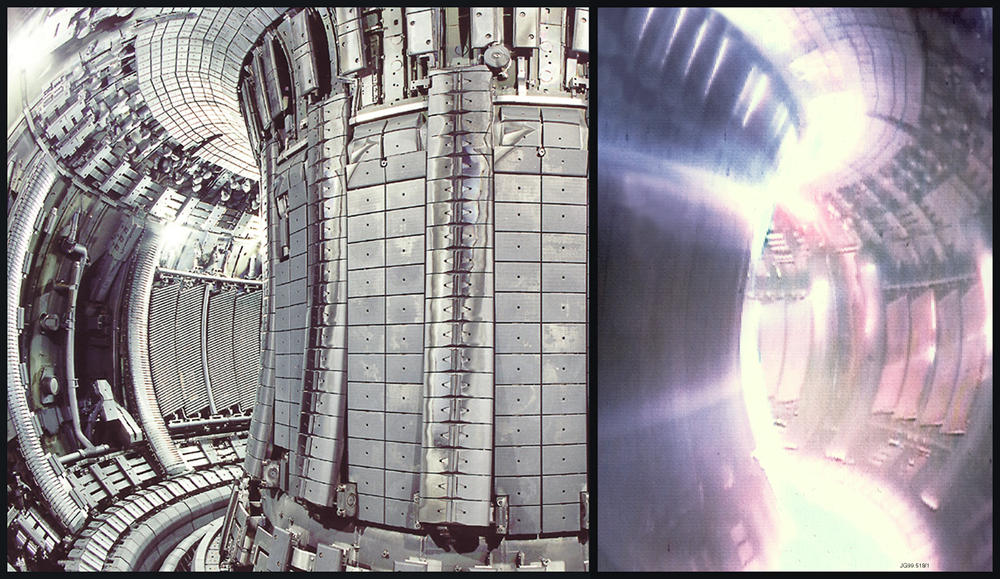

L'Italia è un paese di eccellenze; basta pensare alla lista interminabile di cervelli e artisti che vi hanno avuto natale.

Tuttavia è irrimediabilmente diventata la Terra dei Cachi, la patria dei controsensi e delle contraddizioni.

Sapevate per esempio che uno dei progetti più importanti per la [fusione nucleare](http://it.wikipedia.org/wiki/Fusione_nucleare) (non la fissione) ha avuto origine nel nostro paese? [Wikipedia](http://it.wikipedia.org/wiki/IGNITOR):

*"**IGNITOR** è il nome di un progetto italiano per la realizzazione di un [reattore](http://it.wikipedia.org/wiki/Reattore_nucleare_a_fusione "Reattore nucleare a fusione") sperimentale a [fusione nucleare](http://it.wikipedia.org/wiki/Fusione_nucleare "Fusione nucleare") con confinamento magnetico, all'interno del quale si intende raggiungere l'ignizione (o bruciamento) del [plasma](http://it.wikipedia.org/wiki/Fisica_del_plasma "Fisica del plasma"), ovvero l'autosostentamento della reazione di fusione grazie al [calore](http://it.wikipedia.org/wiki/Calore "Calore") prodotto dalla fusione stessa.*

*Proposto per la prima volta nel 1977 dal prof. [Bruno Coppi](http://it.wikipedia.org/w/index.php?title=Bruno_Coppi&action=edit&redlink=1 "Bruno Coppi (pagina inesistente)") del [Massachusetts Institute of Technology](http://it.wikipedia.org/wiki/Massachusetts_Institute_of_Technology "Massachusetts Institute of Technology"), (già progettista di un altro reattore sperimentale per la fusione nucleare, [Alcator](http://it.wikipedia.org/w/index.php?title=Alcator&action=edit&redlink=1 "Alcator (pagina inesistente)")), il progetto di massima è stato sviluppato principalmente nei laboratori di [Frascati](http://it.wikipedia.org/wiki/Frascati "Frascati") dell'[ENEA](http://it.wikipedia.org/wiki/Ente_per_le_Nuove_Tecnologie,_l%27Energia_e_l%27Ambiente "Ente per le Nuove Tecnologie, l'Energia e l'Ambiente"), con la collaborazione di diverse università italiane. [...]*

*Inoltre, sempre secondo i progettisti, IGNITOR si trova da anni in una fase avanzata di progettazione, tanto che potrebbe partire la costruzione del nocciolo della macchina, essendo stati già realizzati prototipi dei suoi principali componenti negli anni '80 e '90."*

---

E quindi? direte voi. Forse state dimenticando che la ricerca sul nucleare è proibita, almeno qui da noi. Infatti facciamoci due risate:

*"Per ovviare a tale problema il 26 aprile 2010 il [presidente del Consiglio italiano](http://it.wikipedia.org/wiki/Presidente_del_Consiglio_dei_ministri_della_Repubblica_italiana "Presidente del Consiglio dei ministri della Repubblica italiana") [Silvio Berlusconi](http://it.wikipedia.org/wiki/Silvio_Berlusconi "Silvio Berlusconi") ha firmato un memorandum d'intesa con il [Primo ministro](http://it.wikipedia.org/wiki/Primi_ministri_della_Federazione_Russa "Primi ministri della Federazione Russa") [russo](http://it.wikipedia.org/wiki/Russia "Russia") [Vladimir Putin](http://it.wikipedia.org/wiki/Vladimir_Putin "Vladimir Putin") nel quale viene sancita la collaborazione dell'[Italia](http://it.wikipedia.org/wiki/Italia "Italia") con la [Russia](http://it.wikipedia.org/wiki/Russia "Russia") per la realizzazione di un prototipo di IGNITOR sul suolo russo,[[2]](http://it.wikipedia.org/wiki/IGNITOR#cite_note-1)[[3]](http://it.wikipedia.org/wiki/IGNITOR#cite_note-2) aprendo dunque nuove prospettive per il progetto."*

**

(Un [Tokamak](http://it.wikipedia.org/wiki/Tokamak). Non è bellissimo?)

E qui non si sa, come al solito, se ridere, piangere o arrabbiarsi.

Ma questo è niente! Colmo dei colmi, in Italia le centrali nucleari ci sono eccome, solo che non lo sappiamo. E sono pure abbastanza vecchie. Altro che questi gioielli della scienza e della tecnica.

Stiamo parlando dei sommergibili che scorrazzano più o meno felicemente nel Mediterraneo e che attraccano nei porti italiani. Riporto da [qui:](http://www.reset-italia.net/2011/04/05/tre-centrali-nucleari-sotto-il-mare-italiano-la-denuncia-%E2%80%9Cpiu-pericolose-di-fukushima%E2%80%9D-scoperta-del-postviola-com/)

*"**Cos’è questa storia delle centrali nucleari nel Mediterraneo?***

*Ne abbiamo almeno quattro, forse cinque se si aggiunge un’unità britannica di cui però non siamo certi: tre sommergibili Usa (il Provvidence, lo Scranton e il Florida) e una portaerei francese, la Charles De Gaulle. Tutte a propulsione nucleare [...]*

***E approdano nei nostri porti?***

*Sì, certo. Ad Augusta, provincia di Siracusa, attraccano sottomarini a propulsione nucleare (nella foto sopra lo Scranton ad Augusta lo scorso 6 marzo). Augusta è il porto principale per operazioni di rifornimento della VI Flotta Usa, è ed un pull delle Forze Nato. Ma sono coinvolti anche i porti di Napoli, Genova, Livorno, Brindisi, Cagliari. Quello che è grave è che nessun piano di evacuazione delle popolazioni da queste zone è stato mai approntato [...]*

***Intervista di Massimo Malerba** [...] Firmato il comandate CV Francesco Frisone"*

---

Non sono gli italiani che sono scemi... Sono bravi a manipolarli.
