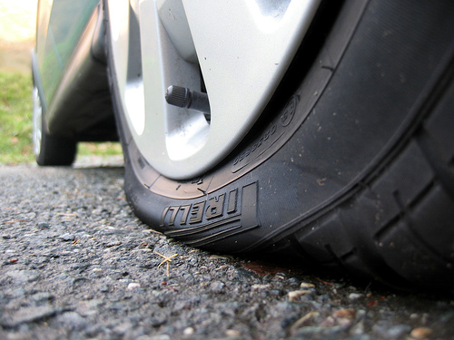

L'altro giorno andavo tranquillamente per la mia strada quando VRAM!! buca incredibile. Speriamo che non si sia storto il cerchio, penso io, solo per accorgermi dopo pochi metri che la macchina fa un rumore strano e dà quella sensazione lì, si quando non potete vederlo con i vostri occhi ma "sentite" che c'è qualcosa che non va. Dopo pochi altri secondi realizzo che un pneumatico mi ha appena lasciato.

*DISDETTA.*

La buca in questione, di cui non abbiamo una diapositiva (anche perché l'hanno sistemata il giorno dopo...) era dovuta alla disgregazione del cemento armato intorno a un tombino. I ferri ne uscivano fuori e praticamente mi è entrato un tondino di armatura dentro la ruota -.-

**COSA FARE**

Chiamate subito i vigili. Non spostate la macchina.\
Nel mio caso sono stati rapidi, dopo 2 minuti è arrivato il vigile e ha fatto le foto alla ruota, alla buca, alla macchina, ha preso tutti i dati eccetera... Dopodiché, altrettanto subitaneamente, andate a fare l'esposto al comune, chiedendo il risarcimento.\
Successivamente dovrete presentare la fattura del gommista (e/o del meccanico e/o carrozziere ecc ecc) per ottenere il rimborso.

Auguri. (E non finite come questo qui sotto mi raccomando!)

