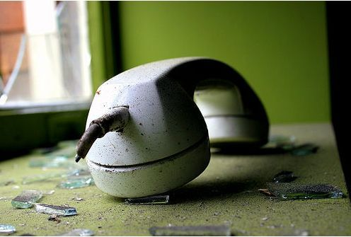

Di nuovo, ci hanno segato l'ADSL.

Per chi non lo sapesse, funziona così: avete un contratto con TELECOM, volete cambiare gestore:

*Poveri illusi!*

Telecom non mollerà mai la connessione internet alla concorrenza (che usa la sua infrastruttura, sola eccezione la fa Fastweb se avete la fortuna di avere le fibre ottiche di loro proprietà sotto i piedi).

Quindi non potete fare altro che rassegnarvi a mesi di isolamento digitale, e forse sarete costretti a richiedere un nuovo contratto a Telecom, **di nuovo.**

(è sempre più chiaro come funziona l'Italia... e perché sempre più gente se ne va, che so, in Germania (a patire il freddo e la nutrizione impropria)).
