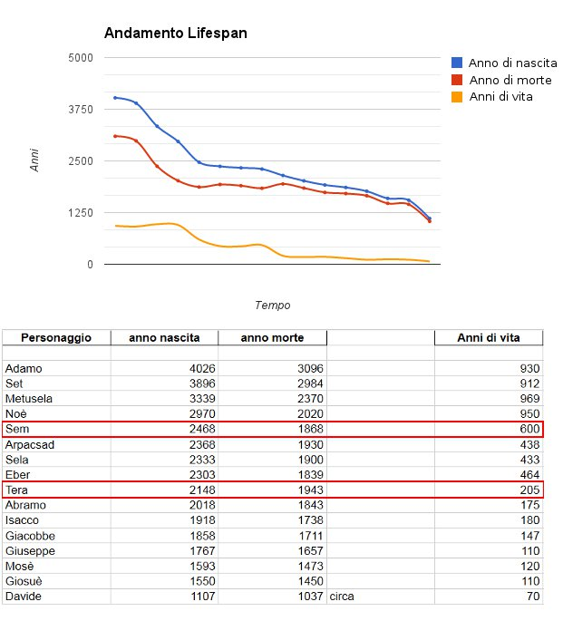

Adamo visse tanti anni più di noi, e così molti altri personaggi della Bibbia. Ma quanto esattamente?

Grafico e tabella sottostante: linea blu si riferisce all'anno di nascita dei personaggi elencati, linea rossa all'anno di morte. La distanza tra le due date è la durata di vita riportata con la linea arancione e nella tabella.

(Notare la caduta di circa il 30% in seguito al Diluvio... come mai? Dopodiché, a parte le *normali-anomalie* - vedi saltino in prossimità di Tera - decresce direi con Y che tende a [Salmo 90:10](http://wol.jw.org/it/wol/b/r6/lp-i/Rbi8/I/1987/19/90#h=1540:0-1541:0 "Leggi il Salmo 90:10"))

Potreste anche [leggere qui](http://wol.jw.org/it/wol/d/r6/lp-i/1200002740 "Durata della Vita").

