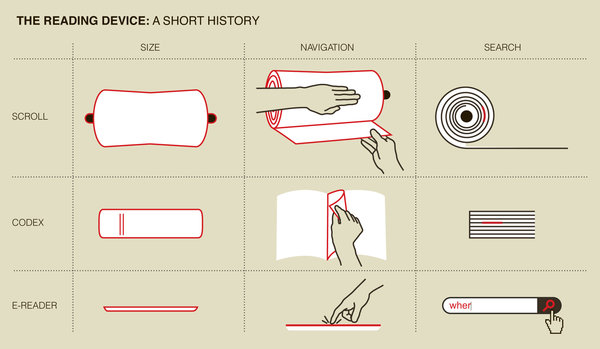

Vogliate perdonare la traduzione parzialmente impropria.

Abbiamo da poco studiato i fattori che contribuirono al successo della predicazione della buona notizia nel primo secolo e nei nostri giorni. Un fattore nel primo secolo fu il codice (codex), che andò a sostituire i rotoli (scrolls). Questo perché più pratico e funzionale alla consultazione, allo studio, al trasporto, in conclusione alla predicazione.

Si è fatto il parallelo ai nostri giorni con le innovazioni tecnologiche nel campo della stampa e telecomunicazione.

Ora, ripensando a quello che la gente dice delle novità tecnologiche, nella fattispecie riguardo al sito internet e alle pubblicazioni digitali, mi è venuta in mente la seguente scena, immaginaria, sottolineo, ma verosimile, soprattutto se facciamo poi un parallelo. Premetto che il rotolo, come vedete sopra, è un gran bell'oggetto. Personalmente lo ritengo esteticamente anche superiore al libro, ma questo è di secondaria importanza.

...

*Siamo appena entrati nel II sec. E.V. I cristiani stanno cominciando ad usare il codice come supporto per le scritture, diffondendo la buona notizia in tutto l'impero romano. Questo oggetto sta entrando nell'uso comune, mentre i rotoli sono ancora molto diffusi. Tutti i manoscritti più antichi delle scritture sono su supporto "scroll". Con tutta probabilità in ogni congregazione (e sinagoga ebraica) sono depositati simili preziosi manufatti. Gesù, quando venne sulla Terra, predicò e insegnò e lesse le scritture usando i rotoli. Similmente fecero tutti gli apostoli. Sono ancora in vita cristiani di età avanzata che hanno conosciuto di persona l'uno o gli altri, o che comunque sono da molti anni nella verità e che hanno sempre considerato il rotolo IL supporto delle Sacre Scritture, in un certo qual senso ufficiale, tradizionale, "vero". A confronto i codici sono sgraziati, goffi, con quelle pagine ritagliate da girare, facili a rovinarsi... con quella cucitura piuttosto grottesca da una parte che tiene insieme i fogli... si dicono che si fa prima a trovare i versetti ma noi che conosciamo i rotoli sappiamo ormai istintivamente fino a che punto scorrere e srotolare e di certo non ci mettiamo di più... ecc ecc.*

...

Tutto plausibilie. Tutto ragionevole.

Peccato che il codice è stato il proto-libro. I suoi vantaggi sono innegabili, a nessuno oggi verrebbe in mente di tornare in massa ai rotoli. Che sono belli, si, però finisce lì.

Dicevo, in maniera analoga, oggi, l'organizzazione di Geova continua a non essere tradizionalista né sentimentale. I vantaggi della tecnologia sono sotto gli occhi di tutti.

Quindi sì, il cartaceo è bello. Sicuramente a casa teniamo i nostri bei volumi, perché sono effettivamente belli, le nostre Bibbie e tutto il resto, che tra l'altro viene prodotto con una qualità sempre maggiore. Però avete capito dove voglio andare a parare.

Il nostro sito jw.org, ad oggi disponibile con pagine o contenuti complessivamente in 726 lingue, ha registrato in soli due anni miliardi di visite, milioni e milioni di riviste e video scaricati, e pensate 100.000 CENTOMILA richieste di studi biblici.

---

Ora tutto questo mi fa venire in mente Daniele 12:4 - *“E in quanto a te, o Daniele, rendi segrete le parole e sigilla il libro, sino al tempo della fine. Molti [lo] scorreranno, e la [vera] conoscenza diverrà abbondante”.*

Questo non solo perché viviamo nel tempo dell'adempimento di questa profezia, in quanto davvero molti oggi scorrono o esaminano la parola di Dio e la vera conoscenza non è mai stata così abbondante.

C'è anche un gioco di parole che ha dato il la a questa breve esposizione. Daniele scriveva su rotoli, a Babilonia. Era quello il tipo di libro che doveva sigillare. E anche se un’opera di consultazione dice che il verbo ebraico qui tradotto “scorrere” dà l’idea di qualcuno che esamina un libro attentamente e approfonditamente, a me fa anche venire in mente l'azione di scorrere srotolando un rotolo, come ai tempi degli scrittori biblici. E non solo. Curioso è che:

— "scroll" in inglese significa sia **rotolo** come quelli di cui abbiamo parlato finora, sia **scorrere** (ad esempio molto usato nelle pagine internet, scroll up, scroll down, per fare cioè su e giù).

— "codice", nell'accezione più comune del termine non riferita agli antichi manoscritti rilegati, è anche ciò che produce sui nostri dispositivi qualsiasi cosa visualizziamo. Anche questa pagina che state leggendo è visualizzata tramite un'applicazione che comprende il codice in cui è memorizzata e trasmessa, e che successivamente la "traduce" in termini grafici.

---

Articolo realizzato consultando e "scrollando" principalmente jw.org e wol.jw.org. Consegnato a voi principalmente tramite codice html e php.
