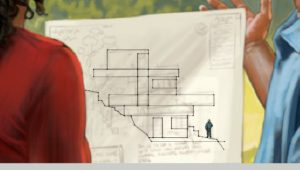
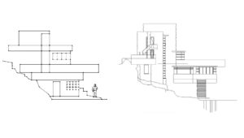
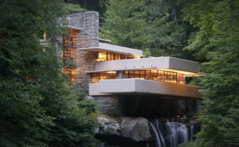

In riferimento allo [studio Torre di Guardia della settimana del 12 ottobre 2015.](http://wol.jw.org/it/wol/d/r6/lp-i/2015605)

Lo [schiavo fedele e discreto](http://www.jw.org/it/pubblicazioni/libri/volont%C3%A0-di-geova/schiavo-fedele-discreto/#?insight[search_id]=74637be9-8efb-46b8-8aa5-687f4c4396e8&insight[search_result_index]=0) ci sta fornendo visioni sempre più dettagliate, precise, organiche, verosimili, credibili, del nuovo mondo. Basta pensare alle ipotesi prospettati nello studio menzionato all'inizio (cliccare sul link o sull'immagine per aprirlo).

Premessa tra parentesi, è interessante quanto riportava il paragrafo 1, i campi in cui affineremo le nostre capacità (e io aggiungerei sia individuali che collettive) sono principalmente 3: al primo posto guarda un po' la **scienza**, poi la **musica** (fra le tante arti) e poi l'**architettura** (che è sia scienza che arte, [discorso a parte]()). Mi sento già a casa.

La deformazione professionale e la passione personale evidente anche in quello che scrivo qui sopra, mi hanno portato a notare qualcosa di... insolito? nuovo?

Ognuno di noi già pensa a cosa vorrà fare, dove vorrà andare... di questo si parlava. Interessante ciò che suggerisce l'immagine sopra, dove marito e moglie osservano una porzione di paesaggio (insediato, non allo stato naturale) nel cui ambito costruiranno la loro casa. Non faranno una cosa a caso (casa cosa a caso: allittero), hanno in mano un progetto. Osservando questo, emergono alcune considerazioni da fare.

- **Pianificazione** - questo è un concetto che stiamo imparando fa parte (e sempre farà) dell'organizzazione di Geova. Lo sviluppo non è casuale, 1 Corinti 14:33 dice "Dio non è [un Dio] di disordine, ma di pace". Molto difficilmente possiamo immaginare il nuovo mondo come frutto e risultante della sommatoria delle iniziative private. Questo del resto è già successo, in Italia ce l'abbiamo ben presente, e si chiama abusivismo.

Quindi anche se come dicevamo ognuno si farà casa come più gli piace, ci saranno certamente delle indicazioni, linee guida, canoni estetici funzionali, regole e standard da rispettare. La bellezza e il piacere, ci insegna Dio tramite l'arte e la natura, risiedono nell'armonia, non nella casualità.

Punto consequenziale:

- **Stile progettuale** - non mi riferisco alla velleità, ma alla sintesi degli aspetti menzionati finora riflessi nel progetto che si intravede nell'illustrazione. Evidenzio le possibili linee principali, aggiungete il declivio roccioso con la vegetazione nella vostra immaginazione:

Senza scendere nei particolari, potremmo fare questa analogia approssimativa, a livello visivo, con il prospetto di un noto edificio di grande pregio:

Senza scendere nei particolari, potremmo fare questa analogia approssimativa, a livello visivo, con il prospetto di un noto edificio di grande pregio. Mi sento di dire che la somiglianza è abbastanza evidente.

L'edificio in questione è [Fallingwater, la famosa Casa sulla Cascata di Frank Lloyd Wright](https://it.wikipedia.org/wiki/Casa_sulla_cascata). Eccone una foto:

Cito da Wikipedia la descrizione sintetica dell'opera: *"Quest'architettura (definita dal suo autore "[architettura organica](https://it.wikipedia.org/wiki/Architettura_organica "Architettura organica")") promuove un'[armonia](https://it.wikipedia.org/wiki/Armonia "Armonia") tra genere umano e natura, la creazione di un nuovo sistema in equilibrio tra l'[ambiente costruito](https://it.wikipedia.org/wiki/Ambiente_costruito "Ambiente costruito") e l'[ambiente naturale](https://it.wikipedia.org/wiki/Ambiente_naturale "Ambiente naturale") attraverso l'integrazione dei vari elementi artificiali (costruzioni, arredi, ecc.) e naturali dell'intorno ambientale del sito. Tutti divengono parte di un unico interconnesso organismo architettonico. Wright adopera per raggiungere la sua architettura organica non solo i materiali del luogo, come la [pietra](https://it.wikipedia.org/wiki/Roccia "Roccia"), ma anche e soprattutto una moderna [tecnologia](https://it.wikipedia.org/wiki/Tecnologia "Tecnologia") espressiva, che nonostante la sua apparente dirompenza si integra meravigliosamente con i suoi volumi nello spazio del luogo."*

Non credo ci sia bisogno di aggiungere altro...

---

Potrebbe interessare anche:
[Visioni dal Nuovo Mondo pt.1]()
[Visioni dal Nuovo Mondo pt.2]()
