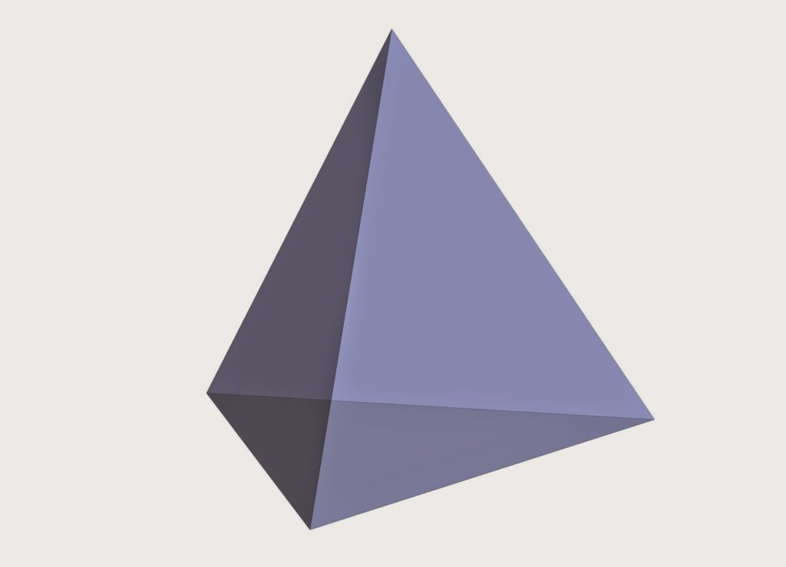
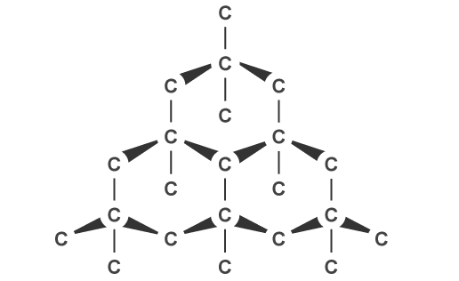
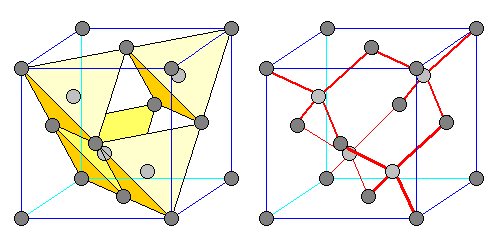

Dio rivela la natura dell'amore, avendo fatto scrivere così tanto al riguardo nella sua parola. Di conseguenza sappiamo che ci sono quattro tipi di, o aspetti riguardo al, amore: agàpe, filèo, storghè, eros (grafia italiana).

Agàpe è il [protocollo di base](), la [portante universale](). Si faccia riferimento ai link. Se di fretta, cito dal *Perspicacia: "Agàpe, perciò, ha il senso di amore guidato e governato da un principio. Può includere o non includere affetto e simpatia."* E: *"è più ampio, abbracciando spec. il giudizio e il deliberato consenso della volontà in materia di principio, dovere e correttezza".*

Filèo rappresenta l'amicizia, o affetto. Può essere provato anche verso cose, ma non ci interessa questo ora.

Storghè è l'attaccamento naturale, tipico dei legami di sangue.

Eros, sebbene non sia  menzionato nelle Scritture Greche, è evidentemente l'amore romantico e sessuale.

---

Come si connettono questi vari aspetti? Certamente non sono mutuamente esclusivi. Ma voglio parlare dell'amore che un cristiano dovrebbe provare e mostrare per il coniuge.

Non c'è bisogno di dire che la prima cosa, o meglio, lo step di livello 0 è essere sintonizzati con l'agàpe. In realtà non possiamo amare davvero nessuno in alcun modo se non riflettiamo questa divina qualità al nostro meglio. Fare ciò comporta [vivere, pensare e sentire]() in armonia con la personalità di Dio. Questo deve essere il vertice del nostro tetraedro: **il sentimento nello spirito**. E gli altri tre seguono, come subordinati.

Potremmo dare agàpe per scontato, eppure è la parte più dificile. Comunque, l'amore coniugale sarebbe incompleto senza gli altri aspetti. L'**eros** è la parte più immediata, e in effetti è fondamentale. Ma non sottovalutiamo gli altri due.

Filèo: risulta che la friendzone sia una condizione necessaria ma non sufficiente per raggiungere un amore duraturo (a meno che non si sia destinati a rimanerci a tempo indefinito). In altre parole: il coniuge deve essere il proprio migliore amico. Oso dire che non ci si può aspettare che lo diventi naturalmente col tempo. Bisogna costruire una vera amicizia prima del matrimonio. Penso alle affinità elettive, alle menti simili. **Il sentimento nella testa.**

Storghè: è richiesto anche affetto, attaccamento. Attenzione a non fraintendere l'attrazione per affetto. L'eros tende ad essere invasivo e ad ingannare il nostro cuore. Penso alle affinità emozionali, ai cuori simili.  **Il sentimento nello stomaco.**

Più sarà completo il nostro tetraedro, più  sarà forte l'amore. Analogia carina:

 Anche la struttura del diamante è un tetraedro. Ovviamente sappiamo collegare tutti l'amore ai diamanti. Ma ora pare che condividano anche la stessa struttura geometrica. Se l'amore è propriamente costruito, condivideranno anche la stessa durezza, e saranno entrambi per sempre.

Quindi i diamanti non sono sopravvalutati, dopo tutto.

---

Cantico dei Cantici 8:6:

*“Mettimi come un sigillo sul tuo cuore, come un sigillo sul tuo braccio, perché l’amore è forte come la morte, e la devozione esclusiva è tenace come la Tomba. Le sue fiamme divampano come un fuoco ardente, come la fiamma di Iah.“*

---

Images credit: http://sciencesolve.blogspot.com/2015/09/diamond-structure.html
