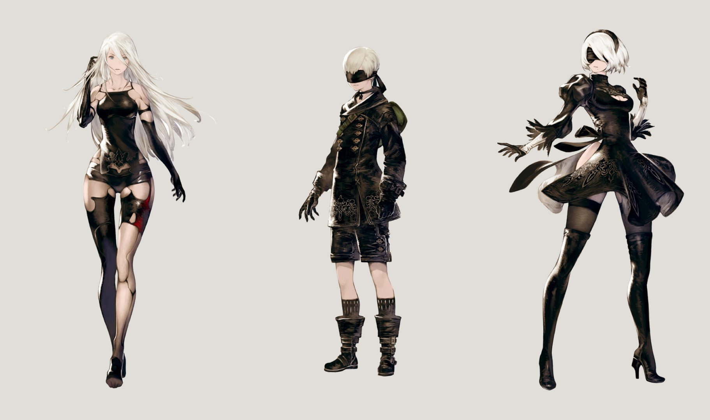

Themes in this game aren't new; the story focuses on the adventures of three androids fighting for the sake mankind, and the player is brought to reflect upon what makes one human and what doesn't.

But the job done has been truly great about ***how*** they tell you the story. This game has in fact rightfully been defined a masterpiece.

How not to mention the inspiring soundtrack, the skillful animations, the dubbing and the dialogues (as for me, listened in Japanese, original language, with subtitles on, as for everything I watch or play to anyway) the incredible characterization of 2B, 9S, A2 and basically every other character in the game..!

I'd like to focus on 2B characterization. At first I did not get exactly why i was liking her so much, I mean she is one in a long list of eye-candy female characters... But it wasn't just *that*.

2B is a machine who knows to be such. This kind of awareness alone should invalidate the definition of machine (or automata)... but let's move on anyway: she fights for what she considers important, and not just because she is bound to, like it would seem at first. These machines do have free will, and this theme will become more prominent as the game goes on.

So 2B starts in the story as a stoic *samurai* (it is not by chance that she wields a katana) serving the android-shogun devoted to the cause of YorHa: For the glory of Mankind. *Mankind.*

Before I go on, i forgot to mention another main theme in the story, which is a typical japanese teme: *giri* and *ninjo*. Giri is the duty, implying suppression of own desires and emotions, namely ninjo.

At the very beginnning she meets another fellow-fighter android, in the guise of a boy, named 9S. The player could get a bit puzzled by the humanity (ninjo) so clearly present in 9S while 2B still sticks to duty (giri) so much.  It almost seems she tries everything she can to look like a merciless machine, slaughtering literally tons of enemy (alien) machines.

Without adding too many spoilers (if you still haven't play the game, just do yourself a favor and go buy it), I SO LOVE the psychological definition and evolution of this mech-girl. We'll watch as she learns the true meaning of her emotions (which she always had) and to recognize them (and accept them) in the machines of foreign origin. And, then again, she and her friends will face the responsibility to make their own choices, trying to understand what is good and bad.

And so the *being* evolves and gets to know friendship and love, experiencing first-hand and by means of other characters' stories happiness and sorrow, and the pain of loss. Thus she ***is very* *human***, in spite of her artificial nature.

-

*Is mankind merely a biological property, or are we more than that?*

*Are good and bad actually relative, or do they exist regardless of our feeble existences?*
