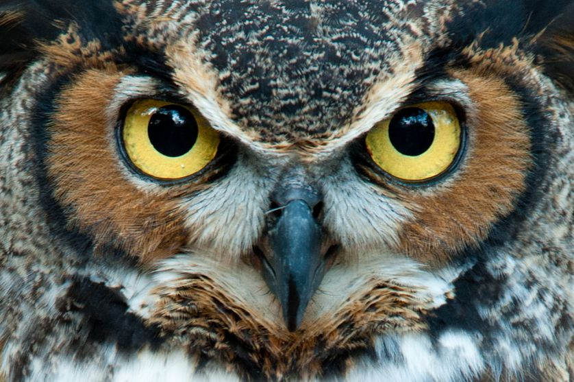

Il **Gufo**: l'occhio che vede, sempre.

Spesso, troppo. A volte, a suo discapito.

The **Owl**: the ever-seeing eye.

Often, too much. Sometimes, at its detriment.

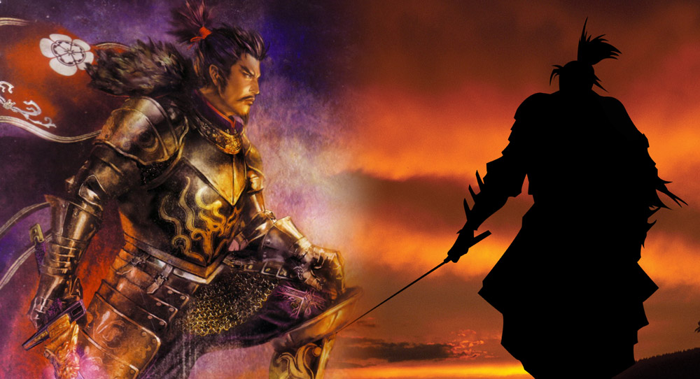

w

Il temibile **Censore**.

The fear-inspiring **Censor**.

Dopo aver insistito per qualche minuto, siamo riusciti a strappargli il permesso di pubblicare una delle sue foto non ufficiali, in cui si mostra in un raro momento di relax...:

Having persisted for several minutes, we've been allowed to publish one of his non-official pics, showing him in one of his few chill out moments…:

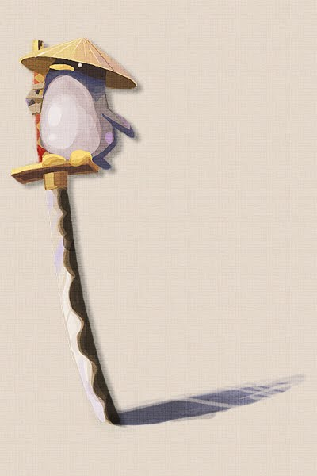

---

Uno dei membri più importanti: la signorina **Musica**

One of the most important: miss **Music**

---

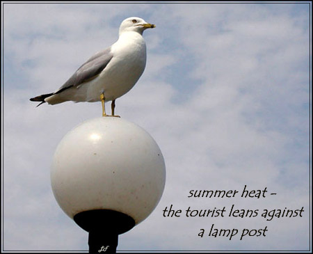

Il **Gabbiano** - costui è l'elemento inconsulto, l'auto-ironico, il buffo, spontaneo. Non si prende troppo sul serio. Quasi sempre gli viene data poca importanza, ma intanto lui sa volare, mentre invece voi...?

The **Seagull** – it is the rash element, self-ironic, funny, spontaneous. He does not take himself too seriously. Almost everytime he's underestimated, but he can fly, while you, instead….?

---

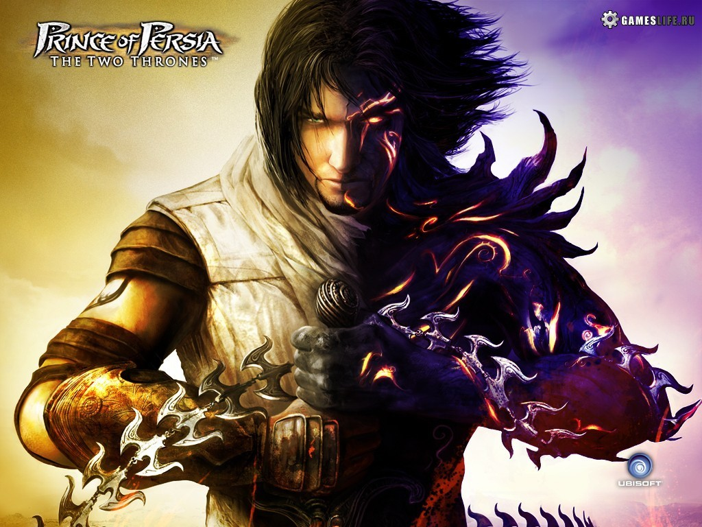

Un altro individuo che partecipa alla stesura di questo blog è il **Principe Guerriero.** A volte, a causa della normale sua natura fallace, presenta degli atteggiamenti un po' conflittuali, tuttavia la sua direzione di base è combattere per il *bene*. L'eroe, il nobile di cuore.
(Sapevate che Darayavaush è il nome persiano riservato ai sovrani? Come Cesare per l'impero romano)

Another guy taking part in writing this blog is the **Warrior Prince**. Sometimes, because of his faulty nature, shows some slightly conflictual attitudes; anyway his core intention is to fight for G*ood*. The noble-hearted hero.

(Did you know "Darayavaush" is th persian name reserved for kings? As Cesar for roman empire.)

---

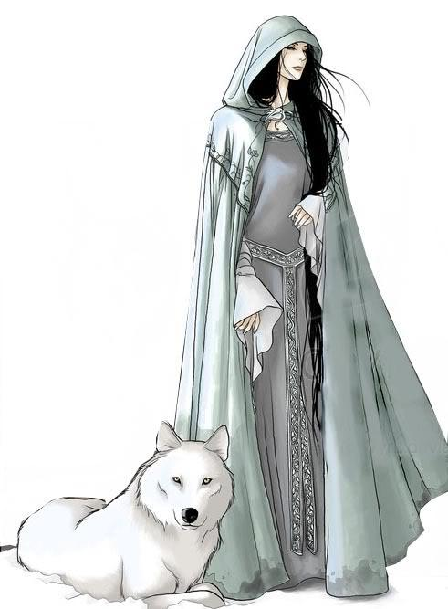

E' il turno della **Poeta;**poetessa suona molto male, del resto potremmo chiamarla direttamente ***Poesia.***

*Sogno Amore Natura*
**Sentimento Serenità Empatia**
***Saggezza Istinto Fedeltà***

It's **Poetry** time.

*Dream Love Nature*
**Feeling Serenity Empathy**
***Wisdom Instict Faithfulness***

---

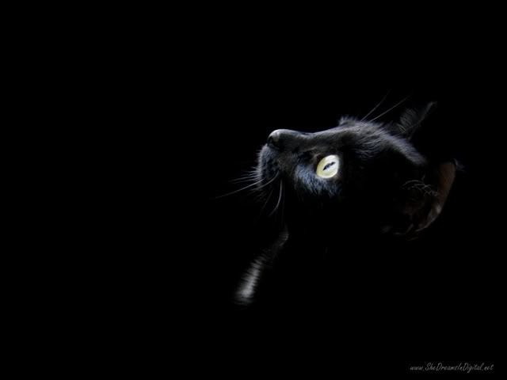

Il **Gattone**! (***nero***) il responsabile delle fusa, coccolone, discreto, un po' pigro, morbido. Ma se ci si pensa è anche elegante, sensuale. E, ovviamente, come tutti i felini di piccola taglia, fa ridere quando si prende tanto sul serio e invece è proprio buffo..!

The **Big (black) Cat!** The one in charge of purr; a petter, discreet, a bit lazy, soft. But thinking it through, it's also elegant, sensual. And, of course, like all little felins, so funny when it takes itself so seriously.

---

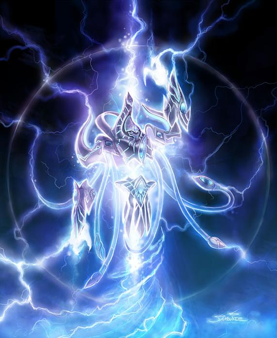

Questo affascinante alieno della razza protoss, costituito prevalentemente di energia mentale, è l'**Arconte. Come potete facilmente intuire, rappresenta il centro di pensiero, l'elaboratore centrale, le capacità di astrazione e filosofica, la *invincibile* logica.**
**(Dicono di averlo visto in atteggiamenti compromettenti insieme a Poesia... E che Signorina Musica sia loro figlia... questo gossip...)**

This fascinating Protoss alien, mainly made of mind-energy, is the **Archon**. As you can easily guess, it represents the centre of tought, the mainframe, the ability to abstract and to philosophize, the *unbeatable* logic.

(They say he has been spotted hanging compromisingly around with **Poetry**… And that Miss **Music** is their daughter… these rumors…)

---

Vi presento miss **Serendipity**.

Cito: *"Serendipità è lo scoprire una cosa non cercata e imprevista mentre se ne sta cercando un'altra. Ma il termine non indica solo fortuna: per cogliere l'indizio che porterà alla scoperta occorre essere aperti e attenti a riconoscere il valore di esperienze che non corrispondono alle originarie aspettative."*

Come direbbe Roy, bisogna fare ogni tanto e regolarmente qualcosa *"a mozzo"*.

O, per citare ancora: *"la serendipità è cercare un ago in un pagliaio e trovarci la figlia del contadino." -* J. H. Comroe

E, citando ancora (sentita al punto di averla erroneamente ritenuta mia): *"La vita è quella cosa che ci accade mentre siamo impegnati a fare altri progetti"* - Mello, Lennon, Wilde (?)

Tutto questo anche perché oggi non mi va di scrivere un saggio sulla mia Serendipity :)

I introduce to you miss **Serendipity**.

Quote: *"Serendipity is to discover a non-searched and unexpected thing while searching for another. Anyway the term does not imply just luck: to catch the clue leading to the discover one has to be open and alert to recognize the value of experiences which do not match original expectations."*

As Roy would say, you have to do something now and then *"a mozzo"*.

Or, quoting again: *"Serendipity is looking in a haystack for a needle and discovering a farmer's daughter.**" –* J. H. Comroe

And, quoting again (having felt it so much to think it was one of mine): *"Life is what happens to you while you're busy making other plans.**"* - Mello, Lennon, Wilde (?)

---

L'**Aristocratico**.

A volte mi chiedo se questo tizio che emerge di tanto in tanto sia più strettamente il *nobile d'animo* nel vero senso della parola, oppure se le sue azioni non celino altro che un orgoglio narcisista, essendo tutte tese a dimostrare la bontà e la superiorità del proprio essere e pensiero.

Probabilmente si tratta di una miscela dei due.

The **Aristocrat**.

Sometimes I do wonder if this guy coming up now and then is really just the *noble of heart*, or if his action are just conceiling a narcisistic pride, aiming just to demonstrate his being and tought excellence and superiority.

Probably a blend of the two.

---

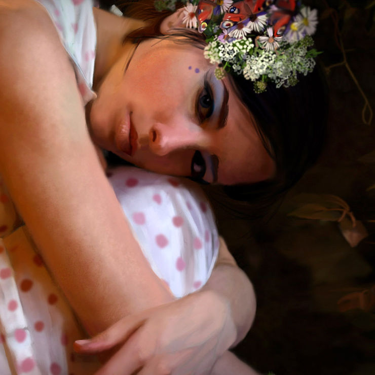

La dolce **Infatuazione**.

Molto spesso si attira le antipatie degli altri componenti... ma che volete farci, lei è fatta così..!

Sweet **Infatuation**. Or, as Paolo sometimes defines her, "disconsolated little girl".

Very often she draws other members' dislike upon her… but what could we do, she's just the way she is…!

---

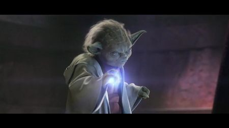

Il **Saggio**.

The **Wise**.

"Molto da apprendere ancora tu hai" - Light Side **rules**

"Much to learn you still have" – Light Side **rules**

---

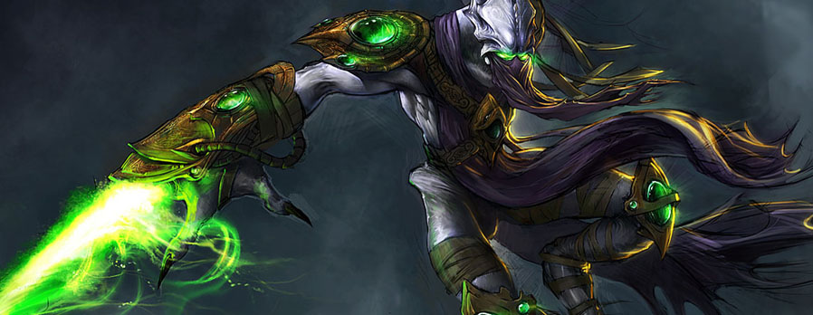

Lo **Zelota** (parente dell'Arconte e amico del Censore).

*"Lo zelo per la tua casa mi divorerà" -* Giovanni 2:17

*"...non ha tollerato alcuna rivalità verso di me..." -* Numeri 25:11

The **Zealot** (Archon's relative and Censor's friend).

*"The zeal for your house will eat me up" –* John 2:17

*"…his tolerating no rivalry at all toward me…" –* Numbers 25:11

---

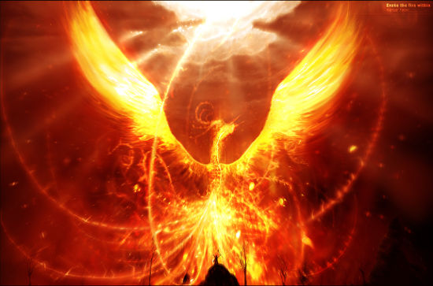

Il **Fuoco**.

Ciò che brucia, consuma, divora, insorge, rivendica, esulta, spazza via.

The **Fire**.

What burns, consumes, devours, arises, claims, exults, wipes out.
